# 📊 Google Sheets to React Dashboard Migration Engine

An enterprise-grade, agent-driven orchestration framework designed to reverse-engineer Google Sheets Canvas dashboards and compile them into standalone, production-ready React applications using **Tailwind CSS v4**, **Shadcn Base UI**, and **Zustand**.

---

## 🚀 System Overview

The engine operates via a **Master Copilot Custom Agent** (`gsheet-to-react-orchestrator`) that drives a deterministic, 11-step pipeline. Progress is persistently tracked in an execution ledger (`plan-follower.md`) to guarantee state resumption across context resets.

| Component | Type | Responsibility |
| :--- | :--- | :--- |
| **`gsheet-to-react-orchestrator`** | Copilot Custom Agent | Manages state transitions, prompts user, and coordinates sub-skills |
| **`gsheet-react-dashboard-reverse`** | Agent Skill | Generates Gemini Canvas prompts to produce AST specs (`CANVAS_IR`) |
| **`html-split`** | Agent Skill | Ephemeral DOM parser extracting inline CSS/JS into modular files |
| **`gsheet-react-dashboard-cloner`** | Agent Skill | 2-Stage compiler transforming 3 IR inputs into React components |

---

## 🧩 Architecture & Component Breakdown

```
.github/
├── agents/
│   └── gsheet-to-react-orchestrator.md   # Master Agent Profile & State Machine Directives
└── skills/
    ├── html-split/                       # Isolated DOM & CSS split skill (jsdom + run-split.sh)
    │   ├── scripts/
    │   │   ├── run-split.sh              # Ephemeral bash runner with trap cleanup
    │   │   ├── split-html.js             # JSDOM parser with @import hoisting & head commenting
    │   │   └── test/                     # Automated manual test suites
    │   └── SKILL.md
    ├── gsheet-react-dashboard-reverse/    # Reverse engineering prompt generator skill
    │   ├── references/
    │   │   └── reverse-prompt-template.md # 7-Tab Markdown & AST specification template
    │   └── SKILL.md
    └── gsheet-react-dashboard-cloner/     # React compilation skill contract
        └── SKILL.md
```

---

## 🔀 Workflow & Skills Integration Flowchart

The diagram below illustrates how the **Master Orchestrator Agent** interacts with the user, Gemini Canvas, and the underlying skills throughout the migration lifecycle:

```mermaid
flowchart TD
    %% Node Styling Definitions
    classDef agent fill:#1e293b,stroke:#38bdf8,stroke-width:2px,color:#f8fafc
    classDef skill fill:#0f172a,stroke:#818cf8,stroke-width:2px,color:#f8fafc
    classDef user fill:#1e1b4b,stroke:#c084fc,stroke-width:2px,color:#f8fafc
    classDef artifact fill:#064e3b,stroke:#34d399,stroke-width:2px,color:#f8fafc

    User([👤 User]):::user -->|1. Request Dashboard Clone| Agent[🤖 gsheet-to-react-orchestrator Agent]:::agent

    subgraph Phase1 [Phase 1: Setup & Prompting]
        Agent -->|2. Ask dashboard-name| User
        Agent -->|3. Invoke Skill| ReverseSkill[🛠️ gsheet-react-dashboard-reverse]:::skill
        ReverseSkill -->|Load Reference Template| PromptTmpl[(📄 reverse-prompt-template.md)]:::artifact
        Agent -->|Output Parameterized Prompt| User
    end

    subgraph Phase2 [Phase 2: Manual User Extractions]
        User -->|Execute Prompt in Gemini Canvas| Gemini[✨ Gemini Canvas]:::user
        Gemini -->|Save Result| SpecFile[/📄 specifications.md/]\:::artifact
        User -->|Export CSV Data| CsvFile[/📊 data.csv/]\:::artifact
        User -->|Copy iFrame HTML| HtmlFile[/🌐 iframe.html/]\:::artifact
    end

    subgraph Phase3 [Phase 3: Automated Asset Processing]
        SpecFile & CsvFile & HtmlFile -->|Staged Files| Agent
        Agent -->|7. Execute Terminal Tool| SplitSkill[🛠️ html-split / run-split.sh]:::skill
        SplitSkill -->|--rendering-only| CleanedDOM[/🎨 index.html + styles.css/]\:::artifact
        Agent -->|8. Request Store Target| User
    end

    subgraph Phase4 [Phase 4: React Compilation & Verification]
        CleanedDOM & SpecFile & CsvFile -->|9. Compile Feature| ClonerSkill[🛠️ gsheet-react-dashboard-cloner]:::skill
        ClonerSkill -->|Generate Architecture| ReactApp[⚛️ React Feature Codebase]:::artifact
        Agent -->|10. Execute npm run build| Terminal[💻 Workspace Terminal]:::agent
        Terminal -->|Validation Pass| Success([✅ Complete & Ready Component]):::artifact
    end
```

---

## 🔄 Orchestrator State Machine Diagram

```mermaid
stateDiagram-v2
    [*] --> Idle: User initiates request

    state Idle {
        [*] --> CheckParams
        CheckParams --> PromptForName: dashboard-name missing
        CheckParams --> CheckPlanFile: dashboard-name present
    }

    PromptForName --> CheckPlanFile: User provides name

    state CheckPlanFile {
        [*] --> PlanExists
        PlanExists --> ResumeState: plan-follower.md found
        PlanExists --> CreatePlan: plan-follower.md missing
    }

    CreatePlan --> Step3_PromptGen: Initialize plan-follower.md (All steps NOT_STARTED)
    ResumeState --> DetermineStep: Parse plan-follower.md for IN_PROGRESS / NOT_STARTED

    state "Step 3: Reverse Prompt Generation" as Step3_PromptGen {
        [*] --> CallReverseSkill
        CallReverseSkill --> DisplayPrompt
    }

    Step3_PromptGen --> Step4_5_6_AwaitExtractions: Update plan-follower.md

    state "Steps 4-6: Manual Extractions (PAUSED)" as Step4_5_6_AwaitExtractions {
        [*] --> AwaitUserFiles
        AwaitUserFiles --> VerifyFiles: User confirms file creation
    }

    Step4_5_6_AwaitExtractions --> Step7_HTMLSplit: Update plan-follower.md

    state "Step 7: HTML & CSS Extraction" as Step7_HTMLSplit {
        [*] --> RunSplitScript
        RunSplitScript --> IsolateScriptJS
    }

    Step7_HTMLSplit --> Step8_StoreTarget: Update plan-follower.md

    state "Step 8: Store Destination Gate (PAUSED)" as Step8_StoreTarget {
        [*] --> AskStoreTarget
        AskStoreTarget --> TargetReceived: User specifies persistence target
    }

    Step8_StoreTarget --> Step9_ReactCompilation: Update plan-follower.md

    state "Step 9: React Code Compilation" as Step9_ReactCompilation {
        [*] --> Stage1_Blueprint
        Stage1_Blueprint --> Stage2_Code Generation
    }

    Step9_ReactCompilation --> Step10_BuildVerify: Update plan-follower.md

    state "Step 10: Build Verification" as Step10_BuildVerify {
        [*] --> ExecNpmBuild
        ExecNpmBuild --> PassBuild
    }

    Step10_BuildVerify --> Step11_FinalHandoff: Update plan-follower.md

    state "Step 11: Final Handoff" as Step11_FinalHandoff {
        [*] --> MarkAllCompleted
        MarkAllCompleted --> HandoffSummary
    }

    Step11_FinalHandoff --> [*]
```

The orchestrator enforces strict state persistence via `sandbox/dashboards/<dashboard-name>/agent/plan-follower.md`. If interrupted, the agent reads the plan file to resume execution:



---

## 📋 Step-by-Step 11-Phase Pipeline

| Step | Action | Execution Type | Primary Output / Artifact |
| :---: | :--- | :---: | :--- |
| **1** | Acknowledge & Initialize | Automated | Initial response greeting |
| **2** | Capture Dashboard Name | Interactive | Creates `sandbox/dashboards/<dashboard-name>/agent/plan-follower.md` |
| **3** | Generate Reverse Prompt | Automated | Displays Gemini Canvas prompt using `gsheet-react-dashboard-reverse` |
| **4** | Retrieve Specifications | User Action | `sandbox/dashboards/<dashboard-name>/specifications.md` |
| **5** | Export CSV Data | User Action | `sandbox/dashboards/<dashboard-name>/<dashboard-name>-data.csv` |
| **6** | Export HTML DOM | User Action | `sandbox/dashboards/<dashboard-name>/iframe-html/<dashboard-name>.html` |
| **7** | Execute HTML Split | Automated | Executed via `run-split.sh --rendering-only` |
| **8** | Store Target Gate | Interactive | Captures `STORE_DESTINATION_TARGET` |
| **9** | React Code Compilation | Automated | Generates full `<FeatureNameClone/>` component tree via `gsheet-react-dashboard-cloner` |
| **10**| Build & Verify | Automated | Executes `npm run build` in workspace terminal |
| **11**| Final Handoff | Automated | Marks `plan-follower.md` completed & provides output paths |

---

## 📁 Staged Artifact Directory Layout

During execution, all input and output files are cleanly isolated inside the sandbox hierarchy:

```text
sandbox/
└── dashboards/
    └── <dashboard-name>/
        ├── agent/
        │   └── plan-follower.md             # Persistent State Machine Tracking Ledger
        │
        ├── specifications.md                 # Input 1: Gemini Canvas 7-Tab Spec (SPEC_IR)
        ├── <dashboard-name>-data.csv         # Input 2: Raw CSV Dataset (DATA_IR)
        ├── styles.css                        # Extracted Tailwind CSS v4 design tokens
        ├── <dashboard-name>.html             # Cleaned DOM layout (Rendering-Only Mode)
        │
        └── iframe-html/                      # Isolated raw HTML & unused JS scripts
            ├── <dashboard-name>.html         # Raw extracted Google Sheets iframe HTML
            └── script.js                     # Quarantined non-React inline script
```
