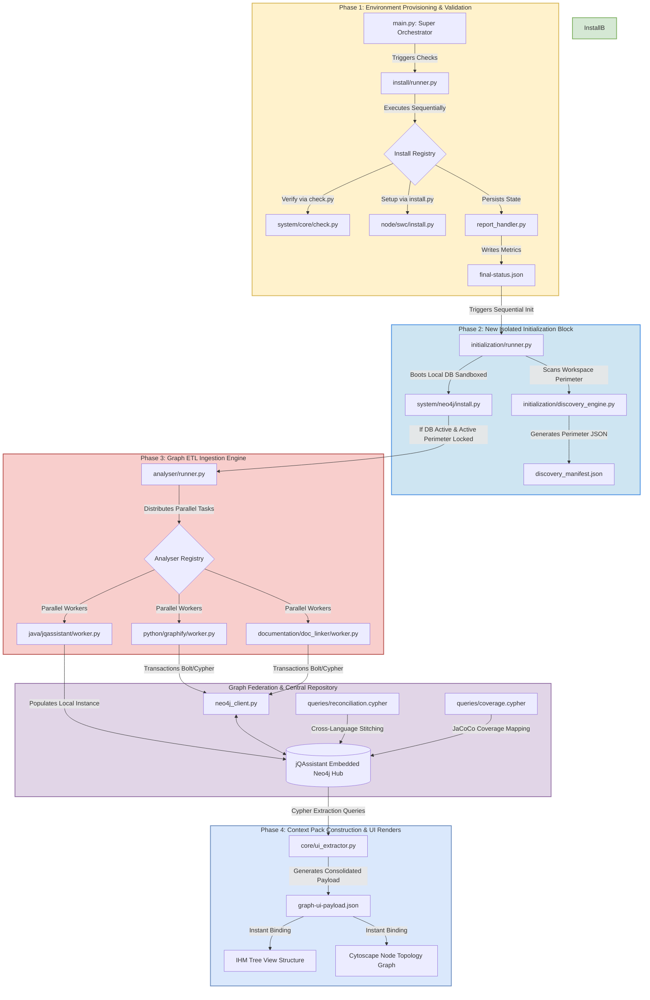

# 🕸️ Graph RAG Explorer - Core Architecture Blueprint

This document details the decoupled, production-grade architecture of the **Graph RAG Explorer** workbench. The system cleanly divides environment safety validation (`install`) from the parallelized data ingestion engine (`analyser`), using **jQAssistant with an embedded Neo4j server instance** as the primary backend orchestration driver.

## 📊 Global System Flowchart

