Bonjour. En tant qu'Architecte Logiciel Principal, j'ai analysé les spécifications de votre prompt d'application (Graphify AI) ainsi que l'état de l'art technique fourni.

Pour répondre à votre besoin d'un MVP **100% déterministe et sans LLM**, l'architecture doit reposer entièrement sur l'analyse syntaxique (AST), la théorie des graphes (traversées d'arbres orientés) et l'exploitation directe des commandes de plomberie de Git.

Voici le diagramme architectural au format Mermaid Flowchart, structuré selon un modèle de ports et adaptateurs (Architecture Hexagonale) pour isoler le moteur de traitement des spécificités de chaque langage.

```mermaid
flowchart TB
    %% Styles globaux
    classDef triggerStyle fill:#f5f5f5,stroke:#333,stroke-width:2px,stroke-dasharray: 5 5;
    classDef discoveryStyle fill:#e1f5fe,stroke:#03a9f4,stroke-width:2px;
    classDef filterStyle fill:#ffe0b2,stroke:#ff9800,stroke-width:2px;
    classDef parallelStyle fill:#e8f5e9,stroke:#4caf50,stroke-width:2px;
    classDef coreStyle fill:#ede7f6,stroke:#673ab7,stroke-width:2px;
    classDef engineStyle fill:#fce4ec,stroke:#e91e63,stroke-width:2px;
    classDef outputStyle fill:#fffde7,stroke:#fbc02d,stroke-width:2px;

    %% 1. DÉCLENCHEMENT & ENTRÉES
    subgraph Triggers [Configuration et Evenements]
        A[Ouverture Workspace / Sauvegarde Fichier / Commit]:::triggerStyle
        Settings[Settings VS Code : Graph RAG Explorer <br/> Paths, Options, Include/Exclude]:::triggerStyle
    end

    %% 2. DISCOVERY PHASE
    subgraph Discovery [Etape 1 - Phase de Decouverte]
        Disc_Engine[Moteur de Reconnaissance Python]:::discoveryStyle
        Disc_Engine -->|Scan des marqueurs| Detect_Mod{Detection des Modules}:::discoveryStyle
        Detect_Mod -->|pom.xml / gradle| M_Java[Module Java]:::discoveryStyle
        Detect_Mod -->|package.json| M_TS[Module TS / JS]:::discoveryStyle
        Detect_Mod -->|requirements.txt| M_Py[Module Python]:::discoveryStyle
    end

    %% 3. CUMULATIVE FILTER ENGINE (VETO LOGIC)
    subgraph FilterEngine [Etape 2 - Moteur de Filtrage Selectif]
        Path_In[Chemin de Fichier Decouvert]:::filterStyle
        Check_Exclude{Match <br/> excludePatterns ?}:::filterStyle
        Check_Include{Match <br/> includePatterns ?}:::filterStyle

        Path_In --> Check_Exclude
        Check_Exclude -->|Oui : VETO ABSOLU| F_Drop[Fichier Ignore / Exclu]:::filterStyle
        Check_Exclude -->|Non| Check_Include

        Check_Include -->|Oui : Prioritaire| F_Keep[Fichier Valide pour Analyse]:::filterStyle
        Check_Include -->|Non : Si liste vide| F_Keep
        Check_Include -->|Non : Si liste valorisee| F_Drop
    end

    %% 4. PARALLEL NATIVE PIPELINES
    subgraph ParallelOrchestrator [Etape 3 - Execution Parallele]
        direction LR
        P_Java[Pipeline Java <br/> Injection Profil Maven <br/> + jQAssistant / ArchUnit]:::parallelStyle
        P_TS[Pipeline TS/JS <br/> Invocation npx <br/> + Dependency-Cruiser / Knip]:::parallelStyle
        P_Py[Pipeline Python <br/> AST Natif / Emerge-viz]:::parallelStyle
    end

    %% 5. CORE CONSOLIDATION & RECONCILIATION
    subgraph CoreDomain [Etape 4 - Consolidation et Reconciliation]
        Norm[Normalisateur de Schema <br/> Standardisation des payloads JSON]:::coreStyle

        subgraph Reconciliation [Module de Reconciliation Polyglotte]
            Extract_API[Extraction Routes HTTP Java <br/> ex: @GetMapping / API_ENDPOINT]:::coreStyle
            Extract_Fetch[Extraction Appels Client TS <br/> ex: http.get / CALLS_API]:::coreStyle
            Linker[Pont de Liaison <br/> Pattern Matching d URI]:::coreStyle

            Extract_API & Extract_Fetch --> Linker
        end

        subgraph GraphStorage [Base de Graphe Locale]
            NX_Graph[(Graphe NetworkX In-Memory)]:::coreStyle
            Cache_File[Stockage Persistant Local <br/> .codegraph/graph.json]:::coreStyle
            NX_Graph <--> Cache_File
        end
    end

    %% 6. INCREMENTAL ANALYSIS (GIT DELTA)
    subgraph BlastRadiusEngine [Etape 5 - Analyse de Delta et Blast Radius]
        Git_Diff[Plomberie Git : git diff -U0]:::engineStyle
        TS_Parser[Parser Local Tree-sitter <br/> Mapping Lignes Modifiees ↔ Symbole AST]:::engineStyle
        NX_Traverser[Algorithme de Traversee NetworkX <br/> Recherche Inverse : Upstream / Downstream]:::engineStyle

        Git_Diff --> TS_Parser
        TS_Parser --> NX_Traverser
    end

    %% 7. OUTPUTS / UI PRESENTATION
    subgraph Presentation [Etape 6 - Restitution et UI]
        Vis_Format[Convertisseur DOT / JSON <br/> Pre-calcul des coordonnees geodesiques]:::outputStyle
        Prompt_Gen[Generateur de Rapports Textuels <br/> .codegraph/blast_radius.md <br/> Prompt contextuel Phase 2 Pret]:::outputStyle

        subgraph Webview [Webview HTML5 Canvas]
            VisJS[Rendu Dynamique Vis.js <br/> Neighborhood Highlight & Coloration]:::outputStyle
            Tree_View[Explorateur d Arbre Multi-Angles <br/> Vues: Fichier / Classe / Methode]:::outputStyle
        end
    end

    %% FLUX INTER-COUCHE (CONNEXIONS PRINCIPALES)
    A & Settings --> Disc_Engine
    F_Keep --> ParallelOrchestrator

    %% Distribution du Discovery filtré vers les pipelines
    M_Java -->|Si valide| P_Java
    M_TS -->|Si valide| P_TS
    M_Py -->|Si valide| P_Py

    %% Mapping des fichiers physiques vers le filtre
    Discovery --> Path_In

    %% Sorties des pipelines vers la consolidation
    P_Java & P_TS & P_Py --> Norm
    Norm --> Reconciliation
    Linker --> NX_Graph

    %% Lien entre stockage de graphe et moteur d'impact
    NX_Graph --> NX_Traverser

    %% Liaisons vers la restitution
    NX_Traverser --> Prompt_Gen & Vis_Format
    NX_Graph --> Vis_Format

    Vis_Format --> VisJS & Tree_View

    %% Assignation des classes de style
    class A,Settings triggerStyle;
    class Disc_Engine,Detect_Mod,M_Java,M_TS,M_Py discoveryStyle;
    class Path_In,Check_Exclude,Check_Include,F_Drop,F_Keep filterStyle;
    class P_Java,P_TS,P_Py parallelStyle;
    class Norm,Extract_API,Extract_Fetch,Linker,NX_Graph,Cache_File coreStyle;
    class Git_Diff,TS_Parser,NX_Traverser engineStyle;
    class Vis_Format,Prompt_Gen,VisJS,Tree_View outputStyle;

```

---

## Description Technique du Fonctionnement Étape par Étape

### 1. Extraction Sémantique Multi-Langages (Ingestion)

* **Java** : Utilise un parseur AST (comme Tree-sitter) pour mapper les classes, méthodes, et les liaisons d'héritage. Le moteur embarque un résolveur sémantique pour lier statiquement les interfaces aux classes concrètes qui les implémentent (simulant le comportement d'un `@Autowired` ou `@Inject` de Spring).
* **TypeScript/JavaScript** : Résout les arbres d'imports physiques en prenant en compte les alias de chemins virtuels configurés dans le fichier `tsconfig.json`.
* **Python** : Parse l'arbre de syntaxe via le module natif `ast` pour extraire les définitions de fonctions, classes et appels de méthodes.
* **HTML/CSS** : Extrait les liaisons d'assets (`<link href="...">`, `@import`) et les interdépendances structurelles basiques.

### 2. Normalisation et Base de Graphe Locale

Chaque parseur produit un payload JSON standardisé vers le `Normalisateur`. Ce dernier transforme le code en deux structures génériques :

* `GraphNode` : Représente une entité (`FILE`, `CLASS`, `METHOD`, `FUNCTION`).
* `GraphEdge` : Représente la relation typée (`IMPORTS`, `CALLS`, `EXTENDS`, `IMPLEMENTS`).
  Le tout est stocké localement au sein d'une structure de données associative en mémoire (dictionnaire/map optimisé) ou d'une base SQLite indexée pour garantir des requêtes instantanées en local.

### 3. Calcul Déterministe du Blast Radius (Impact Git)

Lors d'une modification de code :

1. Le **Processeur Git Delta** exécute un `git diff` et extrait les fichiers impactés ainsi que les numéros de lignes précis.
2. Le **Sélecteur d'Impact Local** croise ces lignes avec les coordonnées physiques (`range`: lignes de début/fin) des méthodes stockées dans le graphe pour identifier précisément le symbole rompu ou modifié.
3. L'**Algorithme de Traversée** applique une recherche de chemin inverse (remontée vers les parents via les arcs `CALLS` et `IMPORTS`) pour lister de manière récursive toutes les classes amont impactées.

### 4. Restitution sans LLM

* **Le Prompt / Rapport Contextuel** : Il s'agit d'une génération de chaîne de caractères par template de texte (Markdown). Le système liste de façon ordonnée les fichiers cibles modifiés, l'explication logique du lien (ex: *"La méthode X est appelée par la classe Y"*), et les suites de tests unitaires associés à exécuter en priorité.
* **L'interface Vis.js** : Le graphe complet ou le sous-graphe d'impact est sérialisé en format JSON compatible avec `vis.network.convertDot()`. L'UI webview utilise le rendu HTML5 Canvas pour afficher dynamiquement les fichiers sous plusieurs angles (Vue haut niveau dossier/fichier ou vue micro méthodes/fonctions) avec des filtres d'opacité contextuels en cas de clic sur un nœud.

### Key-points de cette architecture mis à jour :

1. **Découverte Inteligente (0 & 1)** : L'extension s'initialise sans hypothèse préconçue sur le projet. Le script Python mappe la topologie des modules (Java, TS, Python) à l'aide des fichiers marqueurs de build.
2. **Double barrière de filtrage cumulatif (2)** : Le moteur applique de manière stricte votre politique d'accès. Tout chemin qui correspond à un `excludePatterns` reçoit un veto immédiat (il est jeté même s'il était éligible à un pattern d'inclusion).
3. **Pipelines parallèles orchestrés (3)** : Les traitements lourds d'extractions sémantiques profondes (`jQAssistant` pour Java, `Dependency-Cruiser` pour TypeScript) sont lancés en parallèle dans des sous-processus managés par Python pour maximiser l'usage du CPU de la machine locale.
4. **Module de réconciliation unifié (4)** : Les frontières réseau et physiques s'effacent. Les dépendances d'appels d'API du frontend TypeScript (`CALLS_API`) sont automatiquement rattachées aux points d'entrées d'API exposés par vos contrôleurs Java (`API_ENDPOINT`) grâce au calculateur de motifs d'URL en Python.
5. **Analyse incrémentale "Blast Radius" (5)** : En cours de développement, l'outil n'a plus besoin de relancer les scans profonds. `git diff` fournit les lignes, un coup de parser `Tree-sitter` (ultra-léger) les associe au nœud de méthode du graphe, et `NetworkX` remonte l'arbre des appelants à contre-courant.
6. **Prêt pour le RAG (Phase 2)** : Le générateur de rapport exporte un fichier `.codegraph/blast_radius.md` structuré selon le cahier des charges de votre moteur de contexte, prêt à alimenter directement un LLM local ou distant avec un jeu de données déterministe d'une fidélité absolue.
