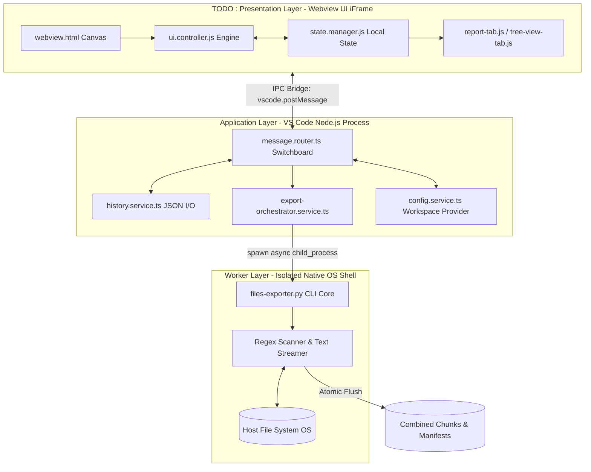

# 🏗️ System Architecture & SOLID Blueprints

This document outlines the software engineering principles and component separations applied across the **RAG Graph Explorer** architecture.

## 🗺️ High-Level Component Topology

To ensure that processing gigabytes of text files never freezes the editor, the application is strictly decoupled into three layers:

---

## 🧩 Architectural Layer Responsibilities

### 1. Presentation Layer (WebView Framework)

Runs inside a sandbox environment managed by VS Code.

* **Strict Theme Compliance**: `webview.html` avoids hardcoded hex color codes. It utilizes standard VS Code theme tokens (e.g., `var(--vscode-editor-background)`) to ensure the tool adapts perfectly to light, dark, or high-contrast user setups.
* **State Encapsulation**: `state.manager.js` retains a lightweight in-memory mirror of the parameters currently visible on screen.
* **Component Isolation**: Each workspace section ...

### 2. Application Layer (TypeScript Host Services)

Operates inside the core extension process.

* **`message.router.ts`**: Implements a decoupled messaging pattern. It receives JSON data packets from the webview, unpacks them, and routes the work to specific services.
* **`history.service.ts`**: Manages profile persistence. It reads and writes profile data atomically using `JSON.stringify`, preventing corruption if an export run is canceled midway.
* **`export-orchestrator.service.ts`**: Validates form inputs, maps UI options into rigorous terminal line parameters, and prepares the command context.

### 3. Worker Execution Layer (Python Engine)

Operates as an independent native operating system sub-process.

* **Memory Safety & Efficiency**: The Python `xxxxx.py`  ??????

---

## 🔄 Two-Way Asynchronous State Synchronization

Maintaining clean data synchronization between the visual iFrame window and the backend host process is vital. Here is how the bidirectional pipeline works:

1. When a user types a path or clicks a setting, a `change` event fires, updating `state.manager.js`.
2. The UI pushes a `syncPaths` packet across the Inter-Process Communication (IPC) bridge.
3. The TypeScript backend catches this packet and immediately updates its internal workspace tracking state (`ExtensionState`).
