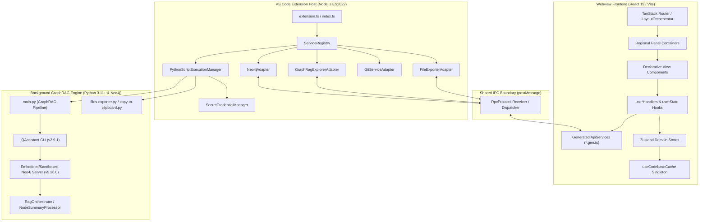

# 🏛️ Token Razor — System Architecture Spine

---

## 🗺️ High-Level System Design

**Token Razor** operates on a tri-layer hybrid architecture combining a **VS Code Extension Host Backend** (TypeScript/Node.js ES2022), a modern **React Webview Frontend** (React 19, Tailwind CSS, shadcn/ui, Zustand), and a background **GraphRAG Analysis Engine** (Python 3.11+, Neo4j, jQAssistant, tree-sitter).


```mermaid
flowchart TD
    subgraph ExtensionHost["VS Code Extension Host (Node.js ES2022)"]
        Entry["extension.ts / index.ts"] --> Reg["ServiceRegistry"]
        Reg --> FileExpAdapter["FileExporterAdapter"]
        Reg --> GitAdapter["GitServiceAdapter"]
        Reg --> GraphRagAdapter["GraphRagExplorerAdapter"]
        Reg --> Neo4jAdapter["Neo4jAdapter"]
        Reg --> ProcMgr["PythonScriptExecutionManager"]
        ProcMgr --> SecMgr["SecretCredentialManager"]
    end

    subgraph IPCLayer["Shared IPC Boundary (postMessage)"]
        Protocol["RpcProtocol Receiver / Dispatcher"]
    end

    subgraph WebviewUI["Webview Frontend (React 19 / Vite)"]
        Router["TanStack Router / LayoutOrchestrator"] --> Panels["Regional Panel Containers"]
        Panels --> Components["Declarative View Components"]
        Components --> Hooks["use*Handlers & use*State Hooks"]
        Hooks --> ZustandStores["Zustand Domain Stores"]
        ZustandStores --> CacheSingleton["useCodebaseCache Singleton"]
        Hooks --> ApiServices["Generated ApiServices (*.gen.ts)"]
    end

    subgraph BackgroundEngine["Background GraphRAG Engine (Python 3.11+ & Neo4j)"]
        ProcMgr --> PyExporters["files-exporter.py / copy-to-clipboard.py"]
        ProcMgr --> GraphRagMain["main.py (GraphRAG Pipeline)"]
        GraphRagMain --> JQAssistant["jQAssistant CLI (v2.9.1)"]
        JQAssistant --> Neo4jServer["Embedded/Sandboxed Neo4j Server (v5.26.0)"]
        Neo4jServer --> RagOrchestrator["RagOrchestrator / NodeSummaryProcessor"]
    end

    FileExpAdapter <--> Protocol
    GraphRagAdapter <--> Protocol
    Neo4jAdapter <--> Protocol
    Protocol <--> ApiServices
```

---

## 🧩 Vertical Slice Modules

The codebase is organized into strict vertical slices across Webview UI domain modules (`./webview/src/features/sdlc/domains/`), backend domain adapters (`./src/services/`), and shared contracts (`./shared/services/`):

1. **`codebase-context`** (`./webview/src/features/sdlc/domains/codebase-context/`):
   - **Purpose**: AST graph topology visualization (Cytoscape.js), transitive blast radius impact calculations (`callersDepth`, `calleesDepth`), and treeview file selection.
   - **Key Components**: `CodebaseExplorerPanel`, `useCytoscapeInstance`, `useGraphTopology`, `useCodebaseDomainState`.

2. **`instructions`** (`./webview/src/features/sdlc/domains/instructions/`):
   - **Purpose**: Prompt engineering strategy management (BMAD, SpecKit, GSD, Vibe Coding) and instruction preset selection.
   - **Key Components**: `InstructionsPanel`, `useInstructionState`, `useInstructionHandlers`.

3. **`llm-chat`** (`./webview/src/features/sdlc/domains/llm-chat/`):
   - **Purpose**: Multi-provider LLM chat sessions (Ollama, Gemini, GitHub Copilot SDK), prompt tuning, and model comparison tables.
   - **Key Components**: `LlmChatPanel`, `useLlmChatState`, `useLlmDomainState`.

4. **`exporter`** (`./webview/src/features/exporter/`):
   - **Purpose**: Multi-card export configuration (destination, format serialization in XML, JSON, YAML, Markdown, and clipboard packaging).
   - **Key Components**: `ExporterPanel`, `OutputFormattingSection`, `useExporterHandlers`, `useExporterStore`.

5. **`references`** (`./webview/src/features/references/`):
   - **Purpose**: Ingestion, management, and context augmentation for project and global reference specifications (`shared/services/reference`).
   - **Key Components**: `ReferencesPanel`, `useReferencesState`, `useReferencesHandlers`.

6. **`transformer`** (`./webview/src/features/transformer/`):
   - **Purpose**: Anonymization and inverse de-anonymization regex replacement rules for sensitive codebase tokens (`DEFAULT_ANONYMIZATION_RULES`).
   - **Key Components**: `TransformerPanel`, `useTransformerHandlers`.

---

## 🔄 Data Flow & State Management

```text
[User Interaction in View Component]
           │
           ▼
[use*Handlers Hook (Event & Validation)]
           │
           ▼
[Generated ApiService (AbstractApiService)]
           │
           ▼
[RpcProtocol postMessage Bridge]
           │
           ▼
[Backend Service Adapter (AbstractServiceAdapter)]
           │
           ▼
[FileSystem / SecretStorage / Python Process / Neo4j]
```

* **Memory Safety & OOM Protection**: Heavy AST graph objects (`CodebaseData`) are isolated inside a dedicated `useCodebaseCache` singleton outside reactive Zustand stores to prevent Webview Out-Of-Memory crashes.
* **RPC Timeout & Exception Handlers**: RPC requests time out gracefully and return structured `{ id, error: string }` error payloads if backend script execution fails, preventing hung promises.

---

## 🛡️ Invariants & Architectural Decisions (ADs)

### AD-1 — Strict Parameterized Process Execution
* **Binds**: All external shell script and tool invocations across backend delegates and adapters.
* **Prevents**: Shell command injection vulnerabilities (STRIDE: Elevation of Privilege / Tampering).
* **Rule**: Never use raw string interpolation (`execSync`, `exec`). Always use parameterized argument arrays (`child_process.execFile` or `spawn`) with `shell: false`.

### AD-2 — Process Tree Lifecycle & Zombie Termination
* **Binds**: `PythonScriptExecutionManager` and background child process spawners.
* **Prevents**: Zombie Python child process accumulation and memory leaks on extension deactivation.
* **Rule**: Configure spawned child processes with `{ detached: true }`, register process handles with `vscode.Disposable` / Webview `onDidDispose`, and execute `tree-kill` (`SIGKILL` on process groups) during cleanup.

### AD-3 — SecretStorage Isolation for API Keys
* **Binds**: LLM API key credentials (`geminiApiKey`).
* **Prevents**: Plaintext key leaks in `.vscode/settings.json` or public git commits.
* **Rule**: Never define API keys as public configuration settings in `package.json`. Always store and retrieve keys via VS Code's native `context.secrets` API (`SecretStorage`).

### AD-4 — Immutable Code Generation Boundary
* **Binds**: All files ending with `.gen.ts` or `.gen.tsx`.
* **Prevents**: Manual edit overrides and RPC contract drift.
* **Rule**: Auto-generated files must never be edited manually. Re-generate via `npm run generate:code` and enforce CI zero-diff verification via `npm run verify:generated`.

### AD-5 — Workspace Boundary Path Containment
* **Binds**: `FileSystemAdapter` and Python script path resolution routines.
* **Prevents**: Arbitrary file system access outside authorized workspace boundaries.
* **Rule**: Always enforce a `isPathInsideWorkspace(targetPath, workspaceRoot)` containment check (`path.relative`) before reading or writing disk files.

---

## 📐 Ratified Consistency Conventions

| Concern | Convention & Standard | Example / Enforcement |
| :--- | :--- | :--- |
| **Webview UI Layering** | Strict 4-layer separation: View (`[Feature].component.tsx`), Handlers (`use[Feature]Handlers.ts`), State (`use[Feature]State.ts`), Store (`[feature].store.ts`). | No inline regex parsing or multi-step async dispatch inside JSX render bodies. |
| **UI Form Primitives** | Mandatory shadcn/ui components (`@/components/ui/*`). Raw HTML form tags (`<input>`, `<select>`, `<button>`) are forbidden. | `<Input />`, `<Select />`, `<Checkbox />`, `<Switch />`, `<Button />`. |
| **Tooltip Standard** | Use `data-tooltip` attribute with HTML markup support instead of native `title` attributes. | `data-tooltip="<strong>Format:</strong> <em>JSON Payload</em>"` |
| **Logging Isolation** | No raw `console.log`. Frontend uses `@/services/view/log-view.service.wrapper`; Backend uses `../../utils/utils-log`. | `logInfo('[Feature] Event triggered', { payload })` |
| **Temp File Hygiene** | Temporary files in `os.tmpdir()` must be created and unlinked inside `try ... finally` blocks. | `try { fs.writeFileSync(tmp); ... } finally { fs.unlinkSync(tmp); }` |
| **IPC Payload Streaming** | AST graph payloads exceeding 1 MB must be chunked or paginated across `postMessage`. | `streamGraphDataToWebview(webview, codebaseData)` |
| **CSS Design Tokens** | Use semantic CSS theme variables (`var(--primary)`) instead of hardcoded hex colors for Cytoscape node styles. | `background-color: var(--primary)` |
| **Legacy Code Depreciation**| `src/features/explorer-old/` is deprecated. All active codebase context logic belongs under `src/features/sdlc/domains/codebase-context/`. | Delete legacy folder; migrate references. |

---

## 📦 Pinned Stack & Structural Seed

### Backend Extension Host & Build Engine

| Technology | Version | Purpose |
| :--- | :--- | :--- |
| **VS Code Extension Engine** | `^1.125.0` | Extension Host API runtime requirement |
| **Node.js Target** | `ES2022` | Backend JavaScript runtime |
| **TypeScript** | `^5.3.3` (Backend) / `^5.1.3` (Webview) | Static type safety |
| **esbuild** | `^0.28.2` | Fast Extension Host backend bundling |
| **js-yaml** | `^5.4.1` | YAML configuration parsing |
| **neo4j-driver** | `^6.2.0` | Direct Bolt connection to Neo4j graph database |
| **@github/copilot-sdk** | `1.0.13` | GitHub Copilot LLM integration |

### Webview UI Frontend

| Technology | Version | Purpose |
| :--- | :--- | :--- |
| **React** | `^19.2.8` | Declarative UI framework |
| **Vite** | `^8.1.5` | Webview frontend development & bundling |
| **Tailwind CSS** | `^4.3.3` | Utility-first CSS styling engine |
| **shadcn** | `^4.17.0` | Component library design system |
| **Zustand** | `^5.0.15` | Micro state management store |
| **@tanstack/react-router** | `^1.170.32` | Webview routing & breadcrumb navigation |
| **@tanstack/react-table** | `^9.2.4` | Virtualized data table rendering |
| **Cytoscape.js** | `^3.34.2` | AST graph topology visualization |
| **cytoscape-fcose** | `^2.2.0` | Fast Compound Spring Embedder graph layout |
| **cytoscape-dagre** | `^4.0.1` | Directed acyclic graph layout |
| **Lucide React** | `^1.38.0` | UI icon set |
| **Vitest** | `^3.0.0` | Frontend & backend unit test runner |

### Background Analysis & Database Stack

| Technology | Version | Purpose |
| :--- | :--- | :--- |
| **Python** | `3.11+` | Background GraphRAG & script execution runtime |
| **Neo4j Community Server** | `5.26.0` | Local embedded/sandboxed graph database server |
| **jQAssistant CLI** | `2.9.1` | Bytecode & class structure scanner |
| **sentence-transformers** | `all-MiniLM-L6-v2` | GraphRAG semantic embedding model |

### Structural Seed Layout

```text
./
├── backend/                      # Extension Host Source
│   ├── esbuild.js                # Backend bundler configuration
│   └── src/
│       ├── config/               # Service & RPC registrators (*.gen.ts)
│       ├── core/                 # ServiceRegistry & AbstractServiceAdapter
│       ├── managers/             # Process & Settings managers
│       └── services/             # Domain adapters & Python script bridges
│
├── webview/                      # React Frontend Source
│   ├── vite.config.ts            # Vite bundler configuration
│   └── src/
│       ├── components/           # App layout wrappers (TopMiddleBottomPanel)
│       ├── features/             # Vertical slice domains
│       │   ├── sdlc/domains/     # Core SDLC domains (codebase-context, instructions, llm-chat)
│       │   ├── exporter/         # Context export panel
│       │   ├── references/       # Context references manager
│       │   └── transformer/      # Regex anonymization rules
│       ├── services/api/         # Generated API RPC clients (*.gen.ts)
│       └── store/                # App-wide Zustand stores
│
├── shared/                       # Cross-Boundary Contracts
│   ├── config/                   # Service & RPC enums (*.gen.ts)
│   ├── rpc/                      # RpcProtocol postMessage bridge
│   └── services/                 # Shared DTOs & port interfaces
│
└── dev-tools/
    └── generate-all.js           # Build-time code generation orchestrator
```

---

## 🗺️ Capability → Architecture Map

| Capability / Feature | Implemented In | Governed By |
| :--- | :--- | :--- |
| **AST Topology Graph Canvas** | `webview/src/features/sdlc/domains/codebase-context/` | AD-4, `useCytoscapeInstance`, Cytoscape.js |
| **Transitive Impact Analysis** | `backend/src/services/graph-rag-explorer/` | `GraphRagExplorerAdapter`, Cypher BFS queries |
| **Background Script Lifecycles** | `backend/src/managers/PythonScriptExecution.manager.ts` | AD-2 (`tree-kill`, `SIGKILL`) |
| **Shell Commands Execution** | `backend/src/services/file-exporter/delegate/` | AD-1 (Parameterized `execFile`) |
| **Secret API Keys Persistence** | `backend/src/managers/SecretCredentialManager.ts` | AD-3 (VS Code `context.secrets`) |
| **IPC Message Dispatching** | `shared/rpc/rpc-protocol.ts` | RPC Exception Boundaries & DTO Validation |
| **Code Generation Integrity** | `dev-tools/generate-all.js` | AD-4 (`npm run verify:generated`) |
| **Workspace File Access** | `backend/src/services/file-system/` | AD-5 (`isPathInsideWorkspace`) |
