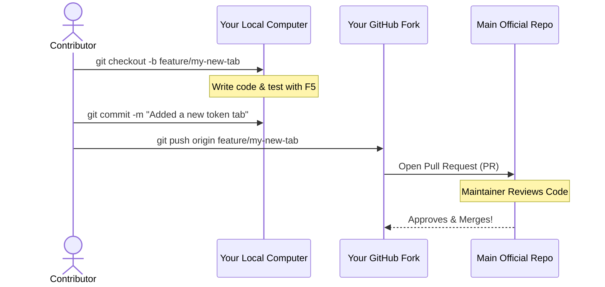

# 🤝 Contributor Guide & Development Manual

First off, welcome! Thank you for considering contributing to the **RAG Graph Explorer** extension. Whether you are fixing a bug, adding a new feature, or improving the documentation, your help is incredibly valuable.

This guide is written specifically to be **beginner-friendly**. Even if this is your first time contributing to a VS Code extension or an Open Source project, just follow these steps, and you will be up and running in no time!

---

## 🛠️ 1. Prerequisites (What you need installed)
Before writing any code, make sure your computer has the following tools installed:
* **Visual Studio Code**: The editor itself (version 1.80.0 or higher).
* **Node.js & npm**: Needed to install dependencies and compile TypeScript. (Download from [nodejs.org](https://nodejs.org/)).
* **Python 3.8+**: The engine that powers the fast file extraction.
* **Git**: To download the code and share your changes.

---

## 🏗️ 2. Local Setup (Getting the code running)

To safely make changes without affecting the main project immediately, you need to create a local copy on your machine.

### Step-by-Step Installation
1. **Fork the Repository**: Go to the project's GitHub page and click the **Fork** button in the top right corner. This creates a copy of the project under your own GitHub account.
2. **Clone your Fork**: Open your computer's terminal and download your copy:
   ```bash
   git clone https://github.com/YOUR-USERNAME/vscode-rag-graph-explorer.git
   cd vscode-rag-graph-explorer
   ```
3. **Install Dependencies**: Tell `npm` to download all the necessary background packages:
   ```bash
   npm install
   ```
4. **Compile the Code**: Translate the TypeScript files into JavaScript so VS Code can read them:
   ```bash
   npm run compile
   ```

### How to Test the Extension Locally
You don't need to install your modified extension to test it! VS Code has a brilliant testing mode:
1. Open the `vscode-rag-graph-explorer` folder in VS Code.
2. Press **`F5`** on your keyboard (or go to the top menu: `Run` -> `Start Debugging`).
3. A **new** VS Code window will pop up. This is the **Extension Development Host**. It acts like a sandbox where your modified version of the extension is temporarily installed.
4. In this new window, open any coding project, press `Cmd+Shift+P` (Mac) or `Ctrl+Shift+P` (Windows), type **RAG Graph Explorer: Open UI**, and see your changes live!

---

## 🗺️ 3. Project Structure (Where things live)
To avoid getting lost, here is a quick map of the project. We use a "Decoupled Architecture" (see `architecture.md` for details).

* 🖥️ **User Interface (Frontend)**: Look inside `src/webview/`.
  * `webview.html`: The visual layout (buttons, text boxes).
  * `main.js`: The Javascript that makes the buttons do things.
  * `components/`: Smaller pieces of the UI (like `report-tab.js` or `tree-view-tab.js`).
* 🧠 **VS Code Logic (Backend)**: Look inside `src/`.
  * `extension.ts`: The main starting point of the plugin.
  * `handlers/message.router.ts`: The post office that passes messages between the UI and the computer.
* ⚙️ **The File Scanner (Python Engine)**: Look inside `scripts/`.
  * `files-exporter.py`: The heavy-lifter that actually reads your hard drive and generates the exported text files.

---

## 🔄 4. The Git Contribution Workflow

To keep the project organized, we use a standard Open Source workflow called "Feature Branching".



### Step-by-Step Contribution:
1. **Create a Branch**: Always create a new branch for your work. Never code directly on `main`.
   ```bash
   git checkout -b feature/your-feature-name
   # OR if fixing a bug:
   git checkout -b fix/your-bug-name
   ```
2. **Make your changes**: Write your code. *Tip: If you are altering the UI, use the AI Prompt workflow described in `scenario.md`!*
3. **Commit your changes**: Save your work with a clear, descriptive message.
   ```bash
   git add .
   git commit -m "feat: added tokens estimation tab to webview"
   ```
4. **Push to your Fork**: Send your branch up to your GitHub account.
   ```bash
   git push origin feature/your-feature-name
   ```
5. **Open a Pull Request (PR)**: Go to the main official repository on GitHub. You will see a green button saying "Compare & pull request". Click it, explain what you added, and submit!

---

## 🧑‍⚖️ 5. Coding Guidelines & Rules
To ensure the project remains high-quality and easy to read for everyone, please adhere to these rules:

1. **SOLID Principles**: Keep things separated. If you add a new UI Tab, create a new file in `src/webview/components/` (e.g., `my-new-tab.js`). Do not dump thousands of lines of code into `main.js`.
2. **No UI Freezes**: Never read massive files or folders directly inside the TypeScript/JavaScript backend. Always pass heavy file-reading tasks to the Python engine (`files-exporter.py`).
3. **Design System**: When adding buttons or text boxes to `webview.html`, use the official Microsoft `<vscode-button>` and `<vscode-text-field>` tags. Do not use hardcoded colors (like `#FFFFFF`); always use CSS variables (like `var(--vscode-editor-background)`).
    * cf [https://microsoft.github.io/vscode-codicons/dist/codicon.html](https://microsoft.github.io/vscode-codicons/dist/codicon.html)
4. **AI-Assisted Coding**: We highly encourage using LLMs (like Gemini, ChatGPT, Claude) to write your PRs! Just make sure to use the **Files Exporter** itself to generate the context you feed to the AI (as outlined in `scenario.md`).

Thank you for helping us build an amazing tool for the developer community! 🚀
