# 🏗️ Blueprint — Evidence-Driven AI Software Architecture Auditor (V3.2 - Enterprise Master Edition)

> **Status: Target Architecture Blueprint / Complete Production Specification**
>
> This document specifies an automated, evidence-driven software architecture auditor, static analysis platform, cross-stack contract aligner, and enterprise documentation generator (**Doc-as-Code**).
>
> The system is fully modular and language-agnostic via the **Language Driver SPI**, supporting **Java / Spring Boot**, **React / TypeScript**, **Python (FastAPI / Django / Pydantic)**, and future stacks.
>
> The core architectural doctrine is **"Deterministic First, SCIP-Guided Cross-Stack Lineage, LLM Second"**. Deterministic tools — AST parsers, SCIP indexers, OpenRewrite type-solvers, ts-morph, LibCST, ArchUnit, Semgrep, and static graph analyzers — execute objective checks. AI models enter the pipeline strictly when semantic interpretation, multi-component reasoning, reverse business rule extraction, or documentation synthesis adds verified value.
>
> The platform operates natively as a **Dual Engine**:
> 1. **Quality, Security & Architecture Audit Engine**: Performs cross-stack code analysis, contract alignment verification, deterministic counter-evidence validation, and targeted finding generation.
> 2. **Enterprise Documentation-as-Code Engine (DocGen)**: Automatically extracts and maintains technical documentation (`Architecture.md` with C4 diagrams, OpenAPI specs, Data Dictionaries), reverse-engineers business rules (`Business-Rules.md`, Decision Tables), and generates onboarding/user assets.
>
> The system is **100% provider-neutral** and unifies its execution runtime in **Java 21+**, utilizing **Neo4j** for complex Semantic Graph traversal, **PostgreSQL** for evidence and workflow state, and exposing standard interfaces via the **Model Context Protocol (MCP)** as a first-class integration boundary.

---

# 🗺️ 0. System Overview & Detailed Flowchart

The following flowchart details the end-to-end audit, cross-stack contract verification, documentation generation, and governance execution pipeline. It explicitly specifies integration conditions, cache checks, confidence thresholds, and decision gates, utilizing distinct colors per logical execution phase.

```mermaid
flowchart TD
    %% ==========================================
    %% STYLES & PASTEL CLASS DEFINITIONS
    %% ==========================================
    classDef default fill:#FFFFFF,stroke:#333333,stroke-width:1.5px,color:#1E293B,rx:6px;
    classDef triggerNode fill:#E0EEFF,stroke:#85B8FF,stroke-width:1.5px,color:#1E293B;
    classDef parseNode fill:#E2F7F2,stroke:#70D6BF,stroke-width:1.5px,color:#1E293B;
    classDef dualNode fill:#FFF2E2,stroke:#FFC887,stroke-width:1.5px,color:#1E293B;
    classDef llmNode fill:#F3E8FF,stroke:#C084FC,stroke-width:1.5px,color:#1E293B;
    classDef valNode fill:#FFFBEB,stroke:#FCD34D,stroke-width:1.5px,color:#1E293B;
    classDef outNode fill:#E6F4EA,stroke:#82C99B,stroke-width:1.5px,color:#1E293B;
    classDef storageNode fill:#E2E8F0,stroke:#94A3B8,stroke-width:2px,color:#1E293B,shape:cylinder;
    classDef decisionNode fill:#FEF3C7,stroke:#F59E0B,stroke-width:2px,color:#1E293B,shape:rhombus;

    %% ==========================================
    %% SUBGRAPH 1: TRIGGER & SCOPE DISCOVERY
    %% ==========================================
    subgraph Trigger ["🚀 1. Trigger & Multi-Stack Scope Discovery"]
        direction LR
        A1(["⚡ Trigger: CI/CD PR, Nightly,<br/>or IDE LSP"]) --> A2{"Is Multi-Repo /<br/>Multi-Stack Target?"}
        A2 -- Yes --> A3["Ingest Cross-Repo Targets:<br/>Java/Python Backend + React Frontend"]
        A2 -- No --> A4["Ingest Single Repository Target"]
        A3 --> A5["Load Target Architecture Contract<br/>& DocGen Config YAML"]
        A4 --> A5

        class A1,A3,A4,A5 triggerNode;
        class A2 decisionNode;
    end
    style Trigger fill:#F4F8FF,stroke:#A5C7F9,stroke-width:2px,stroke-dasharray: 4 4

    %% ==========================================
    %% SUBGRAPH 2: PARSING & CODE GRAPH
    %% ==========================================
    subgraph CoreParsing ["🧩 2. Language Driver SPI & Code Graph (DAG Engine)"]
        direction LR
        A5 --> B1["Language Driver SPI Auto-Detection:<br/>Java, React/TS, Python"]
        B1 --> B2{"SCIP Index<br/>Cache Hit?"}
        B2 -- Yes --> B4[("💾 Load Neo4j Semantic Graph<br/>& PostgreSQL Evidence Store")]
        B2 -- No --> B3["Execute Tree-Sitter &<br/>SCIP Cross-Stack Indexer"]
        B3 --> B4
        B4 --> B5["OpenTelemetry Trace Hydration:<br/>Merge Runtime Traces with Static Graph"]
        B5 --> B6["Execute AST & Config Analyzers:<br/>OpenRewrite, TS-Morph, LibCST"]
        B6 --> B7["Cross-Stack API Alignment Check:<br/>Backend Controllers vs React Query/Axios Types"]

        class B1,B3,B5,B6,B7 parseNode;
        class B4 storageNode;
        class B2 decisionNode;
    end
    style CoreParsing fill:#F0FBF8,stroke:#8EE0CE,stroke-width:2px,stroke-dasharray: 4 4

    %% ==========================================
    %% SUBGRAPH 3: DUAL EXECUTION ENGINE SPLIT
    %% ==========================================
    subgraph DualPath ["🔀 3. Dual Execution Engine Split"]
        direction LR
        B7 --> C1{"Engine Mode<br/>Selector"}
        C1 -->|Quality & Arch Audit| D1["Static Rule Evaluation &<br/>Evidence Aggregation"]
        C1 -->|Doc Generation| E1["DocGen Pipeline: C4 Diagrams,<br/>OpenAPI, Business Rule Inversion"]

        class D1,E1 dualNode;
        class C1 decisionNode;
    end
    style DualPath fill:#FFF8F0,stroke:#FCD09F,stroke-width:2px,stroke-dasharray: 4 4

    %% ==========================================
    %% SUBGRAPH 4: LLM GATEWAY & CONTEXT ENGINE
    %% ==========================================
    subgraph LLM_Gateway ["🧠 4. MCP Gateway & Context Engine"]
        direction LR
        D1 --> F1{"Finding Confidence >= 0.85<br/>& Deterministic?"}
        F1 -- Yes --> F2["Mark Finding as<br/>DETERMINISTIC_VERIFIED"]
        F1 -- No --> F3["Build Context: RASA +<br/>AST Skeleton Minification"]

        E1 --> F3
        F3 --> F4["MCP Gateway &<br/>Grammar-Guided Decoder"]
        F4 --> F5{"Data Policy Requires<br/>Zero-Trust Anonymization?"}
        F5 -- Yes --> F6["Zero-Trust Anonymization Enclave"]
        F5 -- No --> F7["Direct Prompt Assembly with<br/>Prefix Prompt Caching"]
        F6 --> F7
        F7 --> F8{"Task Complexity<br/>& Routing"}
        F8 -- Low / Medium --> F9["Execute Local LLM:<br/>Ollama/vLLM / Fine-Tuned Model"]
        F8 -- High / Expert --> F10["Execute Cloud LLM:<br/>Anthropic / OpenAI"]

        class F2,F3,F4,F6,F7,F9,F10 llmNode;
        class F1,F5,F8 decisionNode;
    end
    style LLM_Gateway fill:#FAF5FF,stroke:#D8B4FE,stroke-width:2px,stroke-dasharray: 4 4

    %% ==========================================
    %% SUBGRAPH 5: ADVERSARIAL LOOP & VALIDATION
    %% ==========================================
    subgraph Validation ["🧪 5. Counter-Evidence & Synthetic Test Bench"]
        direction LR
        F2 --> G1[("📥 Candidate Pool")]
        F9 --> G1
        F10 --> G1
        G1 --> G2{"Subjective Violation<br/>or Rule Extracted?"}
        G2 -- Yes --> G3["Deterministic Counter-Evidence Engine:<br/>Search for Compensating Patterns in Neo4j"]
        G2 -- No --> G4{"Executable Validation<br/>Feasible?"}
        G3 --> G4
        G4 -- Yes --> G5["Generate JUnit 5 / Testcontainers /<br/>Synthetic Edge-Case Bench"]
        G5 --> G6{"Verification Test<br/>Reproduces Issue?"}
        G6 -- Yes --> G7["Mark as EMPIRICALLY_VERIFIED"]
        G6 -- No --> G8["Mark as REJECTED / UNCERTAIN"]
        G4 -- No --> G9["Mark as HEURISTICALLY_VALIDATED"]

        class G3,G5,G7,G8,G9 valNode;
        class G1 storageNode;
        class G2,G4,G6 decisionNode;
    end
    style Validation fill:#FFFDF0,stroke:#FDE047,stroke-width:2px,stroke-dasharray: 4 4

    %% ==========================================
    %% SUBGRAPH 6: GOVERNANCE & OUTPUTS
    %% ==========================================
    subgraph Outputs ["📊 6. Governance, Reporting & DocGen Output"]
        direction LR
        G7 --> H1[("🗄️ Normalized Finding<br/>& Doc Store")]
        G9 --> H1
        H1 --> H2["Regulatory Compliance Mapping:<br/>GDPR, ISO 27001, SOC2"]
        H2 --> H4["OPA Governance Evaluation:<br/>Quality Gate + Doc-Freshness Gate"]
        H4 --> H5{"OPA Evaluation<br/>Passed?"}
        H5 -- No --> H6["Set Pipeline Status:<br/>BLOCKED / CI_FAILURE"]
        H5 -- Yes --> H7["Set Pipeline Status:<br/>PASSED"]
        H1 --> H8{"Auto-Remediation or<br/>Doc Creation Available?"}
        H8 -- Yes --> H9["Write Architecture / README Docs<br/>(Auto-Fix PRs Deferred to Ph.4)"]
        H8 -- No --> H10["Generate Step-by-Step Guidance"]
        H6 --> I1["Emit SARIF 2.1.0, Markdown Docs,<br/>Business Impact Alerts & IDE LSP"]
        H7 --> I1
        H9 --> I1
        H10 --> I1
        I1 --> I2(["🔄 Feedback Store & Model<br/>Fine-Tuning Distillation Pipeline"])

        class H2,H4,H6,H7,H9,H10,I1,I2 outNode;
        class H1 storageNode;
        class H5,H8 decisionNode;
    end
    style Outputs fill:#F2F9F4,stroke:#A3E0B5,stroke-width:2px,stroke-dasharray: 4 4
```



---

# 🎯 1. Vision, Objectives & Core Principles

## 1.1 Main Objective
Build a multi-stack, modular software architecture auditor, cross-stack contract aligner, and enterprise documentation generator. The platform accepts any repository and operates as an **Evidence-Driven Dual Engine**:

1. **Quality & Architecture Audit Engine**: Produces zero-hallucination architectural reports, SARIF output for CI/CD gates, and OPA compliance verdicts. Code remediation (auto-fix PRs) is purposefully deferred to later phases to prioritize deterministic finding accuracy.
2. **Enterprise Documentation-as-Code Engine (DocGen)**: Continuously extracts technical architecture (`Architecture.md` with C4 diagrams, OpenAPI specs), reverse-engineers business rules, generates business impact diff alerts on PRs, and publishes user onboarding assets.

## 1.2 Core Guiding Principles
- **Deterministic First**: 80-90% of structural analysis is executed deterministically. AI models perform targeted reasoning strictly when evidence justifies semantic interpretation.
- **MCP as a First-Class Boundary**: The Model Context Protocol (MCP) is the native integration layer. The core does not tightly couple to any LLM vendor SDK.
- **Evidence over Hallucination**: The `Evidence Store` precedes the `Finding Store`. An observation (a deterministic fact) must exist before a rule triggers reasoning.
- **Rejection of Unbounded Agents**: Autonomous multi-agent debates are strictly rejected. Validation is handled by a predictable, logic-based **Counter-Evidence Engine**.
- **Pragmatic Runtime Strategy**: Unifies on **Java 21+** (leveraging Virtual Threads for high-concurrency DAG execution). Premature optimizations like full Rust rewrites are deferred.

## 1.3 Cost & Performance Targets
- **Sub-Second Incremental DAG Execution**: Node-level hashing ensures only changed files and their dependent SCIP graph nodes are re-evaluated.
- **Neo4j Semantic Traversal**: Utilizing Neo4j prevents exponential SQL CTE performance degradation when querying complex, multi-layered architectural boundaries.
- **85% Context Reduction**: AST skeleton minification and SCIP symbol graphs minimize LLM context overhead.
- **90% API Cost Savings**: Prefix prompt caching reuses architectural schemas and module skeletons across sub-tasks.

---

# 🧩 2. Modular Architectural Principles & Unified Execution Runtime

## 2.1 Unified Java 21+ Runtime (Rust Deferred)
To eliminate the latency and inter-process IPC overhead of mixing Node.js, Python, and Java runtimes, the core orchestration, AST parsing, and graph evaluation run within a single unified **Java 21+** runtime. The JVM's Virtual Threads (Project Loom) provide ideal parallelism for parsing thousands of ASTs simultaneously. A Rust rewrite is explicitly deferred to avoid premature optimization and maintain MVP velocity.

```text
┌──────────────────────────────────────────────────────────┐
│                     AUDIT CLI / API                      │
└───────────────────────────┬──────────────────────────────┘
                            │
                            ▼
┌──────────────────────────────────────────────────────────┐
│              INCREMENTAL DAG WORKFLOW ENGINE             │
│        deterministic workflow, state, transitions        │
└───────────────────────────┬──────────────────────────────┘
                            │
                            ▼
┌──────────────────────────────────────────────────────────┐
│                    LANGUAGE DRIVER SPI                   │
│       Java / Spring - React / TS - Python Drivers        │
└───────────────┬───────────────────────────┬──────────────┘
                │                           │
                ▼                           ▼
┌──────────────────────────┐    ┌─────────────────────────┐
│ DETERMINISTIC ANALYZERS  │    │     LLM GATEWAY (MCP)   │
│ Tree-Sitter / SCIP / AST │    │ Local / Cloud / BYOK    │
│ OpenRewrite / TS-Morph   │    │                         │
└──────────────┬───────────┘    └─────────────┬───────────┘
               │                              │
               └──────────────┬───────────────┘
                              │
                              ▼
                    ┌────────────────────┐
                    │ NEO4J SEMANTIC GRPH│
                    │ & EVIDENCE STORE   │
                    └─────────┬──────────┘
                              │
                              ▼
                    ┌────────────────────┐
                    │ COUNTER-EVIDENCE   │
                    │ VALIDATION ENGINE  │
                    └─────────┬──────────┘
                              │
                              ▼
                    ┌────────────────────┐
                    │ REPORT & DOCGEN    │
                    └────────────────────┘
```

## 2.2 Incremental DAG Execution Engine
Workflows are modeled as Directed Acyclic Graphs (DAGs) with node-level input/output hashing (similar to Bazel or Nx):

```text
[Git Diff Input] ──→ [Diff Analyzer DAG Node]
                            │
                 ┌──────────┴──────────┐
                 ▼                     ▼
      [Modified Class Node]    [Unmodified Class Node]
                 │                     │
                 ▼                     ▼
       [Re-run SCIP & Rules]    [Load Cached Findings]
```

## 2.3 Neo4j Semantic Graph & PostgreSQL Evidence Store
The architecture explicitly splits data storage by workload suitability:
- **Neo4j (Semantic Graph)**: Handles structural paths and relationships (`(Class)-[:CALLS]->(Method)`). Neo4j natively resolves deep, recursive queries (e.g., finding infrastructure leakage through 4 layers of interfaces) that would otherwise cripple a standard SQL database with complex CTEs.
- **PostgreSQL (Evidence & Findings)**: Handles metadata, raw deterministic observations, workflow states, and final validated findings.
- **Tree-Sitter & SCIP**: Form the ingestion layer, standardizing cross-file definitions before pushing to Neo4j.

## 2.4 Deep Symbol Resolution via OpenRewrite, TS-Morph & LibCST
Pure AST parsers miss type hierarchies and indirect framework dependencies.
- Java: OpenRewrite's `TypeSolver` resolves full class hierarchies, method signatures, and annotations.
- TypeScript: `ts-morph` wraps the TypeScript Compiler API for full symbol and type resolution.
- Python: `LibCST` and `Griffe` resolve type annotations and function signatures.

---

# 🔌 3. Language Driver SPI Architecture (Multi-Stack)

To support any technology stack without duplicating orchestrator logic, the system defines an extensible **Language Driver SPI** (`com.company.auditor.core.spi.LanguageDriver`).

```text
                              ┌───────────────────────────────────┐
                              │     CORE AUDIT & DOC ENGINE       │
                              └─────────────────┬─────────────────┘
                                                │
                                                ▼
                              ┌───────────────────────────────────┐
                              │       LANGUAGE DRIVER SPI         │
                              └─┬───────────────┬───────────────┬─┘
                                │               │               │
            ┌────────────────────┘               │               └────────────────────┐
            ▼                                    ▼                                    ▼
┌───────────────────────┐            ┌───────────────────────┐            ┌───────────────────────┐
│ Spring Boot Driver    │            │ React / TS Driver     │            │ Python Driver         │
├───────────────────────┤            ├───────────────────────┤            ├───────────────────────┤
│ • Spoon / OpenRewrite │            │ • ts-morph / ESLint   │            │ • LibCST / Ruff       │
│ • ArchUnit            │            │ • dependency-cruiser  │            │ • Griffe / PyLint     │
│ • JPA / Kafka / YAML  │            │ • Component Tree      │            │ • FastAPI / Pydantic  │
└───────────────────────┘            └───────────────────────┘            └───────────────────────┘
```

## 3.1 Driver Specifications

### 1. Spring Boot Driver (`java-springboot-driver`)
- **Static Analysis**: OpenRewrite, Spoon, ArchUnit, Semgrep.
- **Target Checks**: Layer isolation (Hexagonal/Clean), Spring `@Transactional` boundaries, JPA N+1 queries, Kafka transactional outbox, Redis TTL/serialization, and Spring Boot configuration property merging (`application.yml`).

### 2. React / TypeScript Driver (`react-typescript-driver`)
- **Static Analysis**: `ts-morph` (TypeScript Compiler API), ESLint AST parsers, `dependency-cruiser`.
- **Target Checks**:
  - **API Layer Isolation**: Direct `fetch`/`axios` calls forbidden inside presentation components; enforces custom hook or React Query encapsulation.
  - **Memory Leaks & Subscriptions**: Unhandled `useEffect` cleanup functions, un-subscribed RxJS/EventSource connections.
  - **Performance & Re-renders**: Excessive inline object definitions in JSX, missing `useMemo`/`useCallback` on heavy child components.
  - **Architecture Boundaries**: Enforces Atomic Design (`atoms/molecules/organisms/pages`) or Feature-Sliced Design (`app/pages/widgets/features/entities/shared`).

### 3. Python Driver (`python-driver`)
- **Static Analysis**: `LibCST`, `Ruff`, `Griffe` type-signature analyzer.
- **Target Checks**:
  - **Framework Boundaries**: FastAPI / Django / Flask layer isolation (Pydantic schemas vs SQLAlchemy / Django ORM entities).
  - **Async Anti-Patterns**: Blocking synchronous I/O (`requests.get`, `time.sleep`) inside `async def` route handlers.
  - **Type Completeness**: Static typing coverage across public function arguments and return signatures (`mypy` compliance).

## 3.2 Accelerated Cross-Stack API Contract Alignment (Phase 2)
Moving frontend-to-backend API drift detection to Phase 2 captures the highest immediate value for engineering teams.
1. **Endpoint Extraction**: Backend drivers extract controller route mappings (`@GetMapping("/api/v1/orders/{id}")` or `@app.get("/api/v1/orders/{id}")`) and response DTO schemas.
2. **Client Route & Type Mapping**: Frontend drivers extract React Query / Axios call signatures and TypeScript response interfaces.
3. **Drift Detection**: Flags mismatched field names, type mismatches (e.g., `Long` vs `string`), missing query parameters, or deprecated endpoint invocations.
4. **Contract-as-Code Generation**: Generates **Pact** contract specifications or **MSW (Mock Service Worker)** mocks automatically.

---

# 🌲 4. Code Graph, Multi-Repo Lineage & OpenTelemetry Hydration

## 4.1 Multi-Repo End-to-End Lineage
For microservice or multi-repo architectures, the SCIP/Neo4j graph correlates relationships across distinct repositories:

```text
[PostgreSQL Column: orders.total_amount]
                │ (JPA / SQLAlchemy Entity Field)
                ▼
[Backend DTO: OrderResponseDTO.totalAmount]
                │ (REST Controller Endpoint)
                ▼
[Frontend API Client: fetchOrderSummary()]
                │ (React Query Hook)
                ▼
[UI Component: <OrderSummaryCard />]
```

This end-to-end lineage enables cross-stack impact analysis: modifying a database column immediately flags affected backend DTOs, frontend TypeScript types, and UI components across repositories.

## 4.2 Trace-Driven Static Analysis (OpenTelemetry Integration)
The code graph ingests runtime execution traces from **OpenTelemetry** (Jaeger / Zipkin):
- **Dead Code Identification**: Suppresses false positives on un-instantiated legacy classes with zero runtime traffic.
- **High-Traffic Prioritization**: Escalates rule severity for performance anti-patterns (e.g., JPA N+1 queries) located on high-throughput runtime trace paths.

## 4.3 Temporal Architectural Drift & Git Churn
Combines Git history metrics with static analysis:
$$\text{Impact Score} = \text{Git Churn (90 days)} \times \text{Rule Severity Weight}$$
High-churn files with active architectural violations are prioritized at the top of remediation queues.

---

# 🧠 5. Modern LLM Gateway, MCP & Context Engine

## 5.1 Model Context Protocol (MCP) as First-Class Boundary
The architecture strictly aligns internal Tool contracts with the **Model Context Protocol (MCP)**. This avoids throwaway code and allows the auditor to seamlessly expose its context or consume external tools without a core rewrite as the ecosystem standardizes.

```text
┌──────────────────────────────────────────────────────────┐
│                  AUDIT & DOC ORCHESTRATOR                │
│                  (MCP Client Host)                       │
└───────────────┬──────────────────────────┬───────────────┘
                │                          │
                ▼                          ▼
┌──────────────────────────┐    ┌──────────────────────────┐
│   MCP Tool Server        │    │  MCP Model Gateway       │
│ (SCIP, Graph, OpenRewrite│    │ (Ollama, vLLM, OpenAI,   │
│  ts-morph, DocGen Tools) │    │  Anthropic Adapters)     │
└──────────────────────────┘    └──────────────────────────┘
```

## 5.2 Grammar-Guided Decoding & Constrained Sampling
Employs JSON Schema grammar-guided sampling (Outlines, SGLang, vLLM) at the token sampling level. LLMs strictly generate structured JSON matching target schemas, eliminating JSON syntax errors and retry loops.

## 5.3 Model Classification & Routing Engine
Models are requested by abstract capability class rather than hardcoded provider names:

```yaml
model_classes:
  tiny:
    provider: ollama
    model: qwen2.5-coder:3b
  small:
    provider: vllm
    model: qwen2.5-coder:7b-instruct
  medium:
    provider: vllm
    model: deepseek-coder-v2:16b
  expert:
    provider: anthropic
    model: claude-3-7-sonnet-20250219
    supports_prompt_caching: true
```

## 5.4 RASA (Retrieval-Augmented Static Analysis) & AST Minification
- **AST Skeletons**: Removes method bodies, non-exported comments, and internal logic when evaluating high-level architecture, preserving only signatures, annotations, and structural types.
- **RASA Hybrids**: Combines Neo4j graph neighbor traversal with vector similarity search over AST node embeddings to build ultra-compact, high-relevance context windows.

## 5.5 Prefix Prompt Caching Strategy
Large architectural rule definitions, project contract schemas, and module skeletons are placed at the beginning of the LLM prompt. Providers supporting prefix caching (Anthropic, vLLM) cache these tokens across thousands of sub-task prompts.

## 5.6 Zero-Trust Anonymization Enclave
For cloud model escalations, the `ZeroTrustEnclave` redacts proprietary symbols, package names, string literals, and PII before transmission, re-hydrating responses transparently upon return.

```text
Raw Code ──→ [Enclave Redactor] ──→ Redacted Prompt ──→ Cloud LLM
                                                           │
Real Code ◄── [Enclave De-anonymizer] ◄── Redacted Response ◄┘
```

## 5.7 Continuous Local Model Distillation Pipeline
Developer feedback, ADRs (*Architecture Decision Records*), and verified findings are captured in a `FeedbackStore` to fine-tune lightweight local models (Qwen 7B / Llama 3 Coder). Over time, local model accuracy improves, continually reducing Cloud LLM API expenditure.

---

# 📚 6. Enterprise Documentation-as-Code Engine (`DocGen`)

The platform operates a native **DocGen Engine** that transforms static analysis, Neo4j graphs, and LLM reasoning into complete, enterprise-grade documentation maintained as Git Markdown assets.

## 6.1 Technical Architecture Documentation
- **`Architecture.md`**: Generates **C4 Model** diagrams (Context, Container, Component) in **Mermaid** or **PlantUML** format directly from realized code structures and SCIP graphs.
- **`API-Spec.yaml` / `OpenAPI.json`**: Synthesizes OpenAPI 3.1 specifications from Spring controllers, FastAPI routes, and TypeScript API clients, capturing undocumented routes and parameters.
- **`Data-Dictionary.md`**: Reconstructs database schemas, field constraints, nullability, and relationships from JPA entities, Pydantic models, or SQL DDL migrations.

## 6.2 Reverse Business Rule Inversion
- **`Business-Rules.md`**: Inverts code logic into human-readable business rules tailored for Product Owners.
- **Decision Tables**: Converts complex conditional trees (`if/else`, `switch`, strategy patterns) into Markdown decision matrices.
- **Ubiquitous Language Glossary**: Extracts domain concepts, value objects, and aggregate boundaries into a Domain-Driven Design (DDD) glossary.

## 6.3 Business Impact Diff Alerting
When a PR modifies domain logic, the engine computes a Git diff of the reverse-engineered `Business-Rules.md` and posts a plain-language summary on the PR (e.g., *"⚠️ PR modifies loan approval threshold from 18 to 21 years old"*).

## 6.4 User Onboarding & Support Assets
- **`README.md`**: Produces standardized project READMEs detailing setup prerequisites, environment variable requirements (extracted from `application.yml` or `.env`), and run commands.
- **`User-Guide.md`**: Outlines supported functional use cases and user journeys inferred from REST endpoints and React UI routes.
- **`FAQ.md`**: Generates troubleshooting guides from exception handlers (`@ControllerAdvice`, try-catch blocks), validation constraints, and error response codes.

---

# 🔬 7. Double-Loop Validation & Executable Benchmarks

## 7.1 Deterministic Counter-Evidence Engine (Replacing Multi-Agent Debate)
Unbounded LLM agent debates are a recipe for unpredictable latency and hallucinations. The "Code Advocate" role is downgraded from an autonomous LLM agent to a predictable, logic-based **Counter-Evidence Engine**.
If Rule `KAFKA-001` triggers an anomaly (missing outbox), the Counter-Evidence Engine executes a predefined Neo4j Cypher query to search for compensating patterns:
*Is there a `KafkaTransactionManager` configured in the Spring context?*
*Is Debezium/CDC active?*
*Is there an `@AfterCommit` event publisher attached to the transaction?*
If found, the finding is safely rejected without any LLM hallucination.

## 7.2 Executable Validation & Synthetic Test Bench
- **Testcontainers Validation**: For resilience and concurrency issues, the system generates micro-tests in JUnit 5 (Java) or pytest (Python) using Testcontainers.
- **Synthetic Test Bench**: Generates synthetic edge-case datasets derived from extracted business rule conditions to verify boundary behavior under test.

---

# 🛡️ 8. Governance, Compliance, Financial Risk & Remediation

## 8.1 Decoupled Governance via Open Policy Agent (OPA / Rego)
Evaluation results are passed to an OPA engine executing `policy.rego`:

```rego
package architecture.governance

default allow = false

# Quality Gate
allow {
    count(critical_violations) == 0
    count(high_unverified_violations) == 0
    doc_freshness_passed
}

# Doc-Freshness Gate: Block PR if domain code changed without doc update
doc_freshness_passed {
    input.domain_code_changed == false
}
doc_freshness_passed {
    input.domain_code_changed == true
    input.documentation_updated == true
}

critical_violations[f] {
    f := input.results[_]
    f.properties.severity == "CRITICAL"
}
```

## 8.2 Regulatory Compliance Mapping (GDPR, ISO 27001, SOC2)
Scans data entities and API schemas for PII (Personally Identifiable Information). Verifies encryption annotations, logging masks, and access controls, mapping findings directly to GDPR, ISO 27001, and SOC2 compliance controls.

## 8.3 Architectural Debt Financial Risk Matrix
Translates technical violations into estimated financial impact metrics:
$$\text{Financial Risk} = (\text{Estimated Refactoring Hours} \times \text{Hourly Rate}) + \text{Surplus Cloud Infrastructure Cost/Month}$$
Enables tech leads to justify refactoring initiatives with concrete ROI figures.

## 8.4 Deferred Auto-Remediation
Modifying enterprise code automatically without a proven, trusted deterministic engine is an unacceptable risk for a V1 product. Focusing strictly on finding generation and evidence building builds user trust first. Auto-Fix PR generation (OpenRewrite/ts-morph) is explicitly deferred to Phase 4.

## 8.5 IDE Integration via LSP Server (Language Server Protocol)
The engine packages as a standard LSP Server. As developers code in IntelliJ, VSCode, or Eclipse, local AST checks and background LLM evaluations publish real-time diagnostic warnings and QuickFix actions directly to the editor.

---

# 🔍 9. Comprehensive Multi-Stack Rule Catalog

## 🏛️ 9.1 Hexagonal & Layered Architecture (Multi-Stack)

| Rule ID | Name | Target Stacks | Default Severity |
|---|---|---|---|
| `HEX-001` | Domain Isolation | Java, Python | `CRITICAL` |
| `HEX-002` | Dependency Direction | Java, TS, Python | `HIGH` |
| `HEX-003` | External Ports Boundary | Java, Python | `HIGH` |
| `HEX-004` | Persistence Entity Leakage | Java, Python | `HIGH` |
| `HEX-005` | Messaging Adapter Isolation | Java, Python | `MEDIUM` |
| `HEX-006` | Cache Adapter Isolation | Java, TS, Python | `MEDIUM` |
| `HEX-007` | Web Layer Leakage | Java, TS, Python | `HIGH` |
| `HEX-008` | Infrastructure Exception Leakage | Java, TS, Python | `MEDIUM` |
| `HEX-009` | Application Service Boundary | Java, Python | `MEDIUM` |
| `HEX-010` | Contract Drift | Java, TS, Python | `HIGH` |

## 📨 9.2 Event-Driven Messaging & Kafka

| Rule ID | Name | Target Stacks | Default Severity |
|---|---|---|---|
| `KAFKA-001` | Transactional Outbox | Java, Python | `CRITICAL` |
| `KAFKA-002` | Producer Resilience | Java, Python | `HIGH` |
| `KAFKA-003` | Producer Idempotence | Java, Python | `HIGH` |
| `KAFKA-004` | Consumer Idempotence | Java, Python, TS | `HIGH` |
| `KAFKA-005` | DLQ Error Strategy | Java, Python | `HIGH` |
| `KAFKA-006` | Message Ordering Safety | Java, Python | `MEDIUM` |
| `KAFKA-007` | Rebalance Safety | Java, Python | `HIGH` |
| `KAFKA-008` | Consumer Concurrency Tuning | Java, Python | `LOW` |
| `KAFKA-009` | Dead Letter Strategy | Java, Python | `MEDIUM` |
| `KAFKA-010` | Schema Compatibility | Java, Python, TS | `HIGH` |

## 🗄️ 9.3 Database & ORM (PostgreSQL / JPA / SQLAlchemy)

| Rule ID | Name | Target Stacks | Default Severity |
|---|---|---|---|
| `DB-001` | Explicit Transaction Boundary | Java, Python | `HIGH` |
| `DB-002` | N+1 Query Anti-Pattern | Java, Python | `HIGH` |
| `DB-003` | Foreign Key Indexing | Java, Python | `HIGH` |
| `DB-004` | Optimistic Concurrency Control | Java, Python | `HIGH` |
| `DB-005` | Connection Pool Sizing | Java, Python | `MEDIUM` |
| `DB-006` | Long Transaction Risk | Java, Python | `CRITICAL` |
| `DB-007` | Lazy Loading Outside Session | Java, Python | `HIGH` |
| `DB-008` | ORM Entity API Leakage | Java, Python | `MEDIUM` |
| `DB-009` | Unindexed Full-Text Query | Java, Python | `MEDIUM` |
| `DB-010` | Schema Migration Alignment | Java, Python | `HIGH` |

## 🧠 9.4 Redis Caching

| Rule ID | Name | Target Stacks | Default Severity |
|---|---|---|---|
| `REDIS-001` | Mandatory TTL Configuration | Java, TS, Python | `HIGH` |
| `REDIS-002` | Invalidation Logic | Java, TS, Python | `HIGH` |
| `REDIS-003` | Cache Stampede Protection | Java, TS, Python | `MEDIUM` |
| `REDIS-004` | Fallback Resilience | Java, TS, Python | `HIGH` |
| `REDIS-005` | Insecure Serialization Risk | Java, Python | `CRITICAL` |
| `REDIS-006` | Key Namespacing | Java, TS, Python | `LOW` |
| `REDIS-007` | Memory Eviction Strategy | Java, TS, Python | `MEDIUM` |
| `REDIS-008` | Distributed Lock Timeout | Java, TS, Python | `HIGH` |

## 🌐 9.5 External API Resilience & Cross-Stack Alignment

| Rule ID | Name | Target Stacks | Default Severity |
|---|---|---|---|
| `API-001` | Explicit Timeout Configuration | Java, TS, Python | `CRITICAL` |
| `API-002` | Retry Backoff Strategy | Java, TS, Python | `HIGH` |
| `API-003` | Circuit Breaker Protection | Java, TS, Python | `HIGH` |
| `API-004` | Bulkhead Isolation | Java, TS, Python | `MEDIUM` |
| `API-005` | Unsafe Retry Operations | Java, TS, Python | `CRITICAL` |
| `API-006` | Exception Status Mapping | Java, TS, Python | `MEDIUM` |
| `API-007` | Rate Limiting Configuration | Java, TS, Python | `MEDIUM` |
| `API-008` | HTTP Pool Sizing | Java, TS, Python | `HIGH` |
| `API-011` | Cross-Stack Type Mismatch | Java + TS, Python + TS | `CRITICAL` |
| `API-012` | Deprecated Endpoint Invocation | Java + TS, Python + TS | `HIGH` |

## ⚛️ 9.6 React & TypeScript Frontend

| Rule ID | Name | Target Stacks | Default Severity |
|---|---|---|---|
| `REACT-001` | Presentation/API Layer Leak | React / TS | `HIGH` |
| `REACT-002` | Unhandled Effect Cleanup | React / TS | `HIGH` |
| `REACT-003` | Excessive Inline Prop Re-renders | React / TS | `MEDIUM` |
| `REACT-004` | State Management Leak | React / TS | `HIGH` |
| `REACT-005` | Atomic Design Violation | React / TS | `MEDIUM` |

## 🐍 9.7 Python & FastAPI / Django

| Rule ID | Name | Target Stacks | Default Severity |
|---|---|---|---|
| `PY-001` | Async Blocking I/O | Python | `CRITICAL` |
| `PY-002` | Pydantic / ORM Leakage | Python | `HIGH` |
| `PY-003` | Missing Public Type Annotations | Python | `MEDIUM` |

## 🔐 9.8 Security, PII & Regulatory Compliance

| Rule ID | Name | Target Stacks | Default Severity |
|---|---|---|---|
| `SEC-001` | Hardcoded Secrets | All Stacks | `CRITICAL` |
| `SEC-002` | Missing Endpoint Authorization | All Stacks | `CRITICAL` |
| `SEC-003` | SQL Injection Risk | All Stacks | `CRITICAL` |
| `SEC-004` | SSRF Vulnerability | All Stacks | `CRITICAL` |
| `SEC-005` | Sensitive Data Logging | All Stacks | `HIGH` |
| `SEC-006` | Insecure CORS Policy | All Stacks | `HIGH` |
| `SEC-007` | Input Validation Missing | All Stacks | `HIGH` |
| `SEC-008` | Vulnerable Dependencies | All Stacks | `HIGH` |
| `SEC-009` | Actuator / Admin Exposure | All Stacks | `CRITICAL` |
| `SEC-011` | Unencrypted PII Storage (GDPR) | All Stacks | `CRITICAL` |
| `SEC-012` | Unmasked PII Logging | All Stacks | `HIGH` |

## 🌱 9.9 Spring Boot Core

| Rule ID | Name | Target Stacks | Default Severity |
|---|---|---|---|
| `SPRING-001` | Field Injection Risk | Java / Spring | `MEDIUM` |
| `SPRING-002` | Prototype Bean in Singleton | Java / Spring | `HIGH` |
| `SPRING-003` | Async Uncaught Exception | Java / Spring | `HIGH` |
| `SPRING-004` | Transaction Self-Invocation Bypass | Java / Spring | `CRITICAL` |
| `SPRING-005` | Circular Dependency | Java / Spring | `HIGH` |
| `SPRING-006` | Global Exception Handling Missing | Java / Spring | `MEDIUM` |
| `SPRING-007` | Custom ThreadPool Async Missing | Java / Spring | `HIGH` |
| `SPRING-008` | Profile-Specific Bean Isolation | Java / Spring | `LOW` |
| `SPRING-009` | Clustered Scheduled Lock Missing | Java / Spring | `HIGH` |
| `SPRING-010` | Heavy SpringBootTest in Slices | Java / Spring | `LOW` |

---

# ⚙️ 10. Declarative Rule & Policy Specifications

## 10.1 Java Rule Example (`KAFKA-001.yaml`)

```yaml
id: KAFKA-001
name: Transactional Outbox Pattern Verification
category: architecture/messaging
severity: HIGH

description: >
  Database modifications followed by Kafka event publications must use the
  Transactional Outbox pattern or a synchronized Spring transaction manager to prevent data inconsistencies.

applies_when:
  - has_dependency: "org.springframework.kafka:spring-kafka"
  - has_dependency: "org.springframework.boot:spring-boot-starter-data-jpa"

observations:
  required:
    - method_writes_database
    - method_publishes_kafka

deterministic_checks:
  - type: openrewrite_ast
    recipe: "com.company.rules.FindDirectKafkaSendInJpaTransaction"
  - type: spring_config_check
    property: "spring.kafka.producer.transaction-id-prefix"
    condition: "IS_NULL"

llm_triage:
  enabled: true
  when_confidence_below: 0.85
  model_class: small
  context_strategy: rasa_skeleton

counter_evidence_queries:
  - cypher: "MATCH (c:Class)-[:USES]->(tm:TransactionManager) WHERE c.name = 'KafkaTransactionManager' RETURN tm"
  - pattern_search: "DebeziumConnector"
  - annotation_search: "@AfterCommit"

executable_validation:
  enabled: true
  test_template: "templates/outbox-test-template.java.ftl"
  requires_containers:
    - postgresql
    - kafka

auto_remediation:
  enabled: false # Deferred to Phase 4
  recipe_class: "com.company.recipes.ImplementOutboxPatternRecipe"
```

## 10.2 React / TypeScript Rule Example (`REACT-001.yaml`)

```yaml
id: REACT-001
name: Presentation / API Layer Isolation
category: frontend/architecture
severity: HIGH

description: >
  Presentation components must not make direct HTTP requests via fetch or axios.
  All API interactions must be encapsulated inside custom React hooks or React Query / RTK Query slices.

applies_when:
  - file_pattern: "src/components/**/*.tsx"

deterministic_checks:
  - type: ts_morph_ast
    check: "detect_direct_api_imports_or_calls"

llm_triage:
  enabled: true
  when_confidence_below: 0.85
  model_class: tiny

counter_evidence_queries:
  - ast_search: "is_wrapped_in_custom_hook"
  - ast_search: "is_server_component"

auto_remediation:
  enabled: false # Deferred to Phase 4
  script: "scripts/refactor-api-to-hook.ts"
```

## 10.3 Python Rule Example (`PY-001.yaml`)

```yaml
id: PY-001
name: Async Blocking I/O Detection
category: python/performance
severity: CRITICAL

description: >
  FastAPI / async route handlers must not execute synchronous blocking I/O calls
  such as requests.get() or time.sleep(). Use httpx.AsyncClient or asyncio.sleep().

applies_when:
  - file_pattern: "app/api/**/*.py"

deterministic_checks:
  - type: libcst_ast
    check: "detect_sync_io_in_async_def"

counter_evidence_queries:
  - ast_search: "is_executed_in_threadpool"

auto_remediation:
  enabled: false # Deferred to Phase 4
  script: "scripts/convert_sync_to_async_httpx.py"
```

---

# 🤖 11. Detailed Agent Taxonomy & Roles

The platform coordinates 12 specialized agent roles. Unlike autonomous agents, these are constrained, single-purpose capabilities invoked deterministically by the DAG Engine.

1. **Codebase Architect**: Indexes multi-repo codebases, builds Tree-Sitter/SCIP abstractions, and orchestrates the Neo4j bulk ingestion.
2. **Language Driver Agents**: Stack-specific static analyzers leveraging OpenRewrite (`Spring Boot`), ts-morph (`React/TS`), or LibCST (`Python`).
3. **Cross-Stack Aligner**: Verifies API contracts, DTO types, and generates Pact/MSW specifications by correlating frontend/backend route ASTs.
4. **DocGen Architect**: Extracts Neo4j structural paths to synthesize C4 diagrams, OpenAPI specifications, and Data Dictionaries.
5. **Reverse Business Rule Agent**: Traverses AST conditional trees (`if/switch`) and invokes LLM formatting to output human-readable business rules and decision tables.
6. **Security & PII Compliance Agent**: Identifies vulnerabilities (Semgrep) and maps PII handling annotations to GDPR/ISO 27001/SOC2 matrices.
7. **Deterministic Counter-Evidence Engine**: Executes predefined Neo4j Cypher queries or AST searches to find compensating patterns (e.g., verifying if a missing outbox is compensated by Debezium CDC).
8. **Testcontainers & Synthetic Bench Agent**: Synthesizes JUnit/pytest execution tests and edge-case test datasets based on rule requirements.
9. **Auto-Remediation Specialist (Phase 4)**: Generates OpenRewrite recipes and `ts-morph` patches to produce fully automated fix PRs.
10. **Financial Risk Evaluator**: Calculates architectural debt ROI based on Git Churn and rule severity matrices.
11. **Doc-Freshness Auditor**: A deterministic OPA evaluator that verifies documentation synchronization against domain code changes for CI/CD quality gates.
12. **Model Distillation Manager**: Collects developer feedback (false positives/fixes) from the Postgres Evidence Store and prepares JSONL datasets for local LLM fine-tuning.

---

# 🔄 12. Concrete Step-by-Step Scenario Walkthroughs

## Scenario 1 — Audit: Transactional Outbox Pattern Verification
1. **Detection**: `OpenRewriteAnalyzer` flags a `@Transactional` JPA method calling `KafkaTemplate.send()`.
2. **Configuration Check**: `SpringFusionAnalyzer` inspects `application.yml` and verifies `spring.kafka.producer.transaction-id-prefix` is missing.
3. **Observation Logging**: The raw facts are written to the `Postgres Evidence Store`.
4. **Counter-Evidence Engine**: The engine runs a Cypher query on Neo4j to check for a `KafkaTransactionManager` bean or an `@AfterCommit` publisher. None are found.
5. **Context Assembly**: `AstSkeletonizer` extracts the service method signature and repository call graph, passing a minified 15-line prompt to the local LLM (`qwen2.5-coder:7b`).
6. **LLM Triage**: LLM confirms no outbox table entity exists in the module's domain (`confidence: 0.92`).
7. **Executable Validation**: `TestcontainerValidator` generates a JUnit 5 test utilizing Testcontainers (PostgreSQL + Kafka) to simulate a failure during message transmission. The database commit succeeds while Kafka fails, confirming data loss (`EMPIRICALLY_VERIFIED`).
8. **Reporting**: The Finding is logged and emitted via SARIF. (Auto-Remediation patch generation is deferred to Phase 4).

## Scenario 2 — DocGen: Reverse Business Rule Extraction
1. **AST Parsing**: `BusinessRuleInverter` scans `LoanApplicationService.java` or `loan_evaluator.py`.
2. **Tree Traversal**: Extracts conditional branches evaluating applicant age, income, credit score, and debt ratio.
3. **LLM Synthesis**: An LLM agent synthesizes the AST conditional logic into plain-language business rules:
   > "Rule LOAN-001: Applicants under 21 years old are rejected automatically. Applicants with a credit score < 650 require a co-signer."
4. **Decision Table Generation**: Renders a Markdown matrix mapping inputs (Age, Credit Score, Debt Ratio) to outcomes (Approved, Rejected, Review).
5. **Output**: Writes or updates `docs/business/Business-Rules.md`.

## Scenario 3 — Cross-Stack: Spring Boot + React API Drift
1. **Backend Extraction**: `JavaSpringDriver` parses `@GetMapping("/api/v1/users/{id}")` returning `UserDTO` with field `birthDate: LocalDate`.
2. **Frontend Extraction**: `ReactTypeScriptDriver` parses `useFetchUser(id)` returning interface `User` with field `dateOfBirth: string`.
3. **Alignment Audit**: `CrossStackAligner` queries the Neo4j cross-repo lineage graph and flags field name mismatch (`birthDate` vs `dateOfBirth`) and type representation drift.
4. **Contract-as-Code**: Generates an updated `pact-contract.json` and a MSW handler mock in `src/mocks/handlers.ts`.

---

# 🧱 13. Complete Project Directory Structure

```text
ai-architecture-auditor/
├── .github/
│   └── workflows/
│       ├── audit-ci.yml
│       └── docgen-ci.yml
├── docs/
│   ├── architecture/
│   │   ├── blueprint.md
│   │   └── review-v3.1.md
│   └── rules/
├── rules/
│   ├── hexagonal/
│   ├── kafka/
│   ├── database/
│   ├── react/
│   ├── python/
│   ├── security/
│   └── api/
├── schemas/
│   ├── finding.schema.json
│   └── evidence.schema.json
├── policies/
│   └── governance.rego
├── src/
│   ├── main/
│   │   ├── java/
│   │   │   └── com/company/auditor/
│   │   │       ├── Main.java
│   │   │       ├── core/
│   │   │       │   ├── dag/
│   │   │       │   │   ├── DagEngine.java
│   │   │       │   │   ├── DagNode.java
│   │   │       │   │   └── CacheManager.java
│   │   │       │   ├── domain/
│   │   │       │   │   ├── Finding.java
│   │   │       │   │   ├── AnalysisContext.java
│   │   │       │   │   ├── Rule.java
│   │   │       │   │   ├── Observation.java
│   │   │       │   │   └── ArchitectureContract.java
│   │   │       │   ├── scip/
│   │   │       │   │   ├── ScipIndexer.java
│   │   │       │   │   └── TreeSitterParser.java
│   │   │       │   ├── graph/
│   │   │       │   │   ├── Neo4jSemanticGraphClient.java
│   │   │       │   │   └── PostgresEvidenceStore.java
│   │   │       │   └── spi/
│   │   │       │       ├── LanguageDriver.java
│   │   │       │       ├── DocumentGenerator.java
│   │   │       │       └── BusinessRuleExtractor.java
│   │   │       ├── drivers/
│   │   │       │   ├── java/
│   │   │       │   │   ├── JavaSpringDriver.java
│   │   │       │   │   └── OpenRewriteRunner.java
│   │   │       │   ├── react/
│   │   │       │   │   ├── ReactTypeScriptDriver.java
│   │   │       │   │   └── TsMorphRunner.java
│   │   │       │   └── python/
│   │   │       │       ├── PythonDriver.java
│   │   │       │       └── LibCstRunner.java
│   │   │       ├── docgen/
│   │   │       │   ├── C4DiagramGenerator.java
│   │   │       │   ├── OpenApiGenerator.java
│   │   │       │   ├── BusinessRuleInverter.java
│   │   │       │   └── UserGuideGenerator.java
│   │   │       ├── analyzers/
│   │   │       │   ├── crossstack/
│   │   │       │   │   └── CrossStackAligner.java
│   │   │       │   ├── rasa/
│   │   │       │   │   ├── RasaIndexEngine.java
│   │   │       │   │   └── AstSkeletonizer.java
│   │   │       │   └── mcp/
│   │   │       │       ├── McpClientGateway.java
│   │   │       │       ├── McpLlmProvider.java
│   │   │       │       ├── GrammarConstrainedSampler.java
│   │   │       │       └── ZeroTrustEnclave.java
│   │   │       ├── validation/
│   │   │       │   ├── DeterministicCounterEvidenceEngine.java
│   │   │       │   └── TestcontainerValidator.java
│   │   │       ├── remediation/
│   │   │       │   ├── OpenRewriteRecipeGenerator.java
│   │   │       │   └── PullRequestService.java
│   │   │       ├── governance/
│   │   │       │   └── OpaPolicyEvaluator.java
│   │   │       └── lsp/
│   │   │           └── AuditorLspServer.java
│   │   └── resources/
│   │       ├── templates/
│   │       │   ├── junit-testcontainers.ftl
│   │       │   └── business-rules-markdown.ftl
│   │       └── application.yml
│   └── test/
│       ├── java/
│       └── resources/
│           └── fixtures/
├── pom.xml
└── README.md
```

---

# 📝 14. Core Interface Specifications & Code Snippets

## 14.1 `LanguageDriver.java`

```java
package com.company.auditor.core.spi;

import com.company.auditor.core.domain.AnalysisContext;
import com.company.auditor.core.domain.Observation;
import java.nio.file.Path;
import java.util.List;

public interface LanguageDriver {

    String id();

    boolean supports(Path repositoryPath);

    /** Executes AST parsing and pushes facts to Neo4j / Postgres */
    void buildCodeGraph(Path repositoryPath);

    /** Evaluates deterministic rules against the current graph state */
    List<Observation> executeStaticRules(AnalysisContext context);
}
```

## 14.2 `DocumentGenerator.java`

```java
package com.company.auditor.core.doc;

import com.company.auditor.core.domain.AnalysisContext;

public interface DocumentGenerator {

    DocType type();

    GeneratedDocument generate(AnalysisContext context);

    record GeneratedDocument(
        String filename,
        String relativePath,
        String content
    ) {}

    enum DocType {
        TECHNICAL_ARCHITECTURE,
        BUSINESS_RULES,
        API_SPECIFICATION,
        DATA_DICTIONARY,
        README,
        USER_GUIDE,
        FAQ
    }
}
```

## 14.3 `BusinessRuleExtractor.java`

```java
package com.company.auditor.core.doc.business;

import com.company.auditor.core.domain.AnalysisContext;
import java.util.List;

public interface BusinessRuleExtractor {

    record BusinessRule(
        String domain,
        String name,
        String description,
        List<String> conditions,
        List<String> sourceLocations
    ) {}

    List<BusinessRule> extractRules(AnalysisContext context);
}
```

## 14.4 `Finding.java`

```java
package com.company.auditor.core.domain;

import java.util.List;

public record Finding(
    String id,
    String ruleId,
    String category,
    Severity severity,
    double confidence,
    Status status,
    String component,
    List<Location> locations,
    List<EvidenceRef> evidence,
    String expected,
    String observed,
    String impact,
    String recommendation,
    ValidationResult validation
) {
    public enum Severity { CRITICAL, HIGH, MEDIUM, LOW, INFO }
    public enum Status {
        DETERMINISTIC_VERIFIED,
        EMPIRICALLY_VERIFIED,
        HEURISTICALLY_VALIDATED,
        UNCERTAIN,
        REJECTED
    }

    public record Location(String file, int lineStart, int lineEnd, String symbol) {}
    public record EvidenceRef(String observationId, String detail) {}
    public record ValidationResult(String method, String detail, boolean reproducedDefect) {}
}
```

## 14.5 `DeterministicCounterEvidenceEngine.java`

```java
package com.company.auditor.validation;

import com.company.auditor.core.domain.Finding;
import com.company.auditor.core.domain.Rule;
import java.util.List;

public interface DeterministicCounterEvidenceEngine {

    /**
     * Executes Cypher queries or AST searches defined in the Rule YAML
     * to find compensating patterns that invalidate the candidate finding.
     */
    boolean findCounterEvidence(Finding candidate, Rule rule);
}
```

## 14.6 `McpLlmProvider.java`

```java
package com.company.auditor.analyzers.mcp;

import com.company.auditor.core.domain.AnalysisContext;
import java.util.concurrent.CompletableFuture;

public interface McpLlmProvider {

    record LlmRequest(
        String modelClass,
        String systemPrompt,
        String userPrompt,
        AnalysisContext context,
        String jsonSchemaGrammar,
        boolean enablePrefixCaching
    ) {}

    record LlmResponse(
        String contentJson,
        String modelUsed,
        String provider,
        int inputTokens,
        int outputTokens,
        long latencyMs
    ) {}

    CompletableFuture<LlmResponse> generateConstrainedOutput(LlmRequest request);
}
```

---

# 🧮 15. Token Economics, Cost Control & Observability

Every LLM call logs detailed metrics to the PostgreSQL workflow tracker:

```json
{
  "auditId": "audit-2026-0920-001",
  "dagNode": "kafka-outbox-check",
  "provider": "anthropic",
  "model": "claude-3-7-sonnet-20250219",
  "tokens": {
    "inputRaw": 14200,
    "inputMinifiedAst": 2100,
    "cachedPrefixTokens": 1800,
    "output": 340
  },
  "costUsd": 0.0042,
  "latencyMs": 850
}
```

- **Local vs Cloud Target Ratio**: 85% local model execution (`Ollama/vLLM`), 15% cloud escalation (`Anthropic/OpenAI`).
- **Spend Guards**: Hard budget caps per audit/docgen run (e.g., max $2.50 per execution).
- **Model Distillation Feedback**: Every developer validation trains local models to further reduce cloud API reliance over time.

---

# 🧪 16. Testing & Quality Strategy

1. **Unit Tests**: Test static rule analyzers, AST minifiers, and context rankers.
2. **Contract Tests**: Verify MCP provider responses against JSON Schema definitions.
3. **Golden Test Repositories**: Maintain intentionally flawed sample repositories (`sample-spring-boot`, `sample-react-app`, `sample-python-api`) to verify expected finding detection rates.
4. **DocGen Verification Benchmarks**: Compare generated `Architecture.md` and `Business-Rules.md` files against reference baseline documents to ensure no hallucinated domain logic.

---

# 🛣️ 17. Roadmap & Implementation Phases

```text
Phase 1: Core Modular Runtime & Neo4j Integration (Weeks 1-4)
├── Build Java 21+ Virtual Thread DAG Engine
├── Implement Neo4j Semantic Graph & Postgres Evidence Store
├── Implement LanguageDriver SPI & Tree-Sitter/SCIP Indexer
└── Deploy Spring Boot Driver & Deterministic Counter-Evidence Engine

Phase 2: MCP Gateway & Cross-Stack Alignment (Weeks 5-8)
├── Implement MCP Client Host & Grammar-Guided JSON Sampler
├── Deploy React/TS and Python Drivers
├── Implement Cross-Stack API Contract Aligner & Pact/MSW generator
└── Integrate Zero-Trust Anonymization Enclave

Phase 3: DocGen Engine & Governance (Weeks 9-12)
├── Implement C4 Mermaid Diagram & OpenAPI Generators
├── Build Business Rule Inversion Engine (Business-Rules.md)
├── Implement OPA Governance & Doc-Freshness Quality Gate
└── Integrate Regulatory Compliance Mapping (GDPR/ISO27001)

Phase 4: Auto-Remediation & Distillation (Deferred / Weeks 13-16)
├── Build OpenRewrite & ts-morph Auto-Fix PR generator
├── Deploy Web-based Interactive Architecture Canvas
├── Deploy Local Model Distillation & Fine-Tuning Pipeline
└── Deliver IDE LSP Server package
```

---

# 🏁 18. Decision Tree & Guiding Principles Summary

```text
┌───────────────────────────────────────────────────────────┐
│                 USE DETERMINISTIC FIRST                   │
├───────────────────────────────────────────────────────────┤
│                                                           │
│  1. Can OpenRewrite / SCIP / Neo4j / ts-morph answer it?  │
│     ├── YES ──→ Execute Static Check (Cost: $0.00)       │
│     └── NO  ──↓                                           │
│                                                           │
│  2. Is Context minimal & AST skeletonized?                │
│     ├── NO  ──→ Minify AST & Apply RASA Filter            │
│     └── YES ──↓                                           │
│                                                           │
│  3. Can Local Model (Grammar-Guided) triage/extract it?   │
│     ├── YES ──→ Run Local Ollama / vLLM (Cost: $0.00)     │
│     └── NO  ──↓                                           │
│                                                           │
│  4. Escalated Cloud LLM required?                         │
│     └── Yes ──→ Anonymize ──→ Prefix Cached Cloud Call   │
│                               │                           │
│  5. Validate Finding / Doc    │                           │
│     └── Run Counter-Evidence Logic / Executable Test      │
│                               │                           │
│  6. Governance & Remediation  ▼                           │
│     └── OPA Evaluation ──→ Write Architecture & DocGen    │
│                         ──→ (Auto-Fix Deferred to Ph.4)   │
└───────────────────────────────────────────────────────────┘
```