# 🏗️ Blueprint — Evidence-Driven AI Software Architecture Auditor (V3.4 - Enterprise Master Edition - Deep Technical Spec)

> **Status: Target Architecture Blueprint / Complete Production Specification**
>
> This document specifies an automated, evidence-driven software architecture auditor, static analysis platform, cross-stack contract aligner, and enterprise documentation generator (**Doc-as-Code**).
>
> The system is fully modular and language-agnostic via the **Language Driver SPI**, supporting **Java / Spring Boot**, **React / TypeScript**, **Python (FastAPI / Django / Pydantic)**, and future stacks via **WebAssembly (Wasm) Sandboxing**.
>
> The core architectural doctrine is **"Deterministic First, SCIP-Guided Cross-Stack Lineage, LLM Second"**. Deterministic tools — AST parsers, SCIP indexers, OpenRewrite type-solvers, ts-morph, LibCST, ArchUnit, Semgrep, and static graph analyzers — execute objective checks. AI models enter the pipeline strictly when semantic interpretation, multi-component reasoning, reverse business rule extraction, or documentation synthesis adds verified value.
>
> The platform operates natively as a **Dual Engine**:
> 1. **Quality, Security & Architecture Audit Engine**: Performs cross-stack code analysis, contract alignment verification, deterministic counter-evidence validation, Semantic Mutation Testing, VEX (Vulnerability Exploitability eXchange) generation, and Shadow-Mode Auto-Remediation.
> 2. **Enterprise Documentation-as-Code Engine (DocGen)**: Automatically extracts and maintains technical documentation (`Architecture.md` with C4 diagrams, OpenAPI specs), reverse-engineers business rules, maps Event Storming sessions, and powers a Collaborative CRDT Architecture Canvas.
>
> The system is **100% provider-neutral** and unifies its execution runtime in **Java 21+**, utilizing **Neo4j** for complex Semantic Graph traversal, **PostgreSQL** for evidence and workflow state, and exposing standard interfaces via the **Model Context Protocol (MCP)** as a first-class integration boundary.

---

# 🗺️ 0. System Overview & Detailed Flowchart

The following flowchart details the end-to-end audit, cross-stack contract verification, documentation generation, and governance execution pipeline. It explicitly specifies integration conditions, cache checks, confidence thresholds, and decision gates, utilizing distinct colors per logical execution phase.

```mermaid
flowchart TD
    %% ==========================================
    %% STYLES & PASTEL CLASS DEFINITIONS
    %% ==========================================
    classDef default fill:#FFFFFF,stroke:#333333,stroke-width:1.5px,color:#1E293B,rx:6px;
    classDef triggerNode fill:#E0EEFF,stroke:#85B8FF,stroke-width:1.5px,color:#1E293B;
    classDef parseNode fill:#E2F7F2,stroke:#70D6BF,stroke-width:1.5px,color:#1E293B;
    classDef dualNode fill:#FFF2E2,stroke:#FFC887,stroke-width:1.5px,color:#1E293B;
    classDef llmNode fill:#F3E8FF,stroke:#C084FC,stroke-width:1.5px,color:#1E293B;
    classDef valNode fill:#FFFBEB,stroke:#FCD34D,stroke-width:1.5px,color:#1E293B;
    classDef outNode fill:#E6F4EA,stroke:#82C99B,stroke-width:1.5px,color:#1E293B;
    classDef storageNode fill:#E2E8F0,stroke:#94A3B8,stroke-width:2px,color:#1E293B,shape:cylinder;
    classDef decisionNode fill:#FEF3C7,stroke:#F59E0B,stroke-width:2px,color:#1E293B,shape:rhombus;

    %% ==========================================
    %% SUBGRAPH 1: TRIGGER & SCOPE DISCOVERY
    %% ==========================================
    subgraph Trigger ["🚀 1. Trigger & Multi-Stack Scope Discovery"]
        direction LR
        A1(["⚡ Trigger: CI/CD PR, Nightly,<br/>or IDE LSP"]) --> A2{"Is Multi-Repo /<br/>Multi-Stack Target?"}
        A2 -- Yes --> A3["Ingest Cross-Repo Targets:<br/>Java/Python Backend + React Frontend"]
        A2 -- No --> A4["Ingest Single Repository Target"]
        A3 --> A5["Load Target Architecture Contract<br/>& DocGen Config YAML"]
        A4 --> A5

        class A1,A3,A4,A5 triggerNode;
        class A2 decisionNode;
    end
    style Trigger fill:#F4F8FF,stroke:#A5C7F9,stroke-width:2px,stroke-dasharray: 4 4

    %% ==========================================
    %% SUBGRAPH 2: PARSING & CODE GRAPH
    %% ==========================================
    subgraph CoreParsing ["🧩 2. Language Driver SPI & Code Graph (DAG Engine)"]
        direction LR
        A5 --> B1["Language Driver SPI Auto-Detection:<br/>Java, React/TS, Python (Wasm Sandboxed)"]
        B1 --> B2{"SCIP Index<br/>Cache Hit?"}
        B2 -- Yes --> B4[("💾 Load Neo4j Semantic Graph<br/>& PostgreSQL Evidence Store")]
        B2 -- No --> B3["Execute Tree-Sitter &<br/>SCIP Cross-Stack Indexer"]
        B3 --> B4
        B4 --> B5["Live Infrastructure Hydration:<br/>Otel Traces + K8s Manifests Correlated"]
        B5 --> B6["Execute AST & Config Analyzers:<br/>OpenRewrite, TS-Morph, LibCST"]
        B6 --> B7["Cross-Stack API Alignment Check:<br/>Backend Controllers vs React Query/Axios Types"]

        class B1,B3,B5,B6,B7 parseNode;
        class B4 storageNode;
        class B2 decisionNode;
    end
    style CoreParsing fill:#F0FBF8,stroke:#8EE0CE,stroke-width:2px,stroke-dasharray: 4 4

    %% ==========================================
    %% SUBGRAPH 3: DUAL EXECUTION ENGINE SPLIT
    %% ==========================================
    subgraph DualPath ["🔀 3. Dual Execution Engine Split"]
        direction LR
        B7 --> C1{"Engine Mode<br/>Selector"}
        C1 -->|Quality & Arch Audit| D1["Static Rule Evaluation &<br/>Evidence Aggregation"]
        C1 -->|Doc Generation| E1["DocGen Pipeline: C4 Diagrams,<br/>OpenAPI, Business Rule Inversion"]

        class D1,E1 dualNode;
        class C1 decisionNode;
    end
    style DualPath fill:#FFF8F0,stroke:#FCD09F,stroke-width:2px,stroke-dasharray: 4 4

    %% ==========================================
    %% SUBGRAPH 4: LLM GATEWAY & CONTEXT ENGINE
    %% ==========================================
    subgraph LLM_Gateway ["🧠 4. MCP Gateway & Context Engine"]
        direction LR
        D1 --> F1{"Finding Confidence >= 0.85<br/>& Deterministic?"}
        F1 -- Yes --> F2["Mark Finding as<br/>DETERMINISTIC_VERIFIED"]
        F1 -- No --> F3["Build Context: RASA +<br/>AST Skeleton Minification"]

        E1 --> F3
        F3 --> F4["MCP Gateway &<br/>Grammar-Guided Decoder"]
        F4 --> F5{"Data Policy Requires<br/>Zero-Trust Anonymization?"}
        F5 -- Yes --> F6["Zero-Trust Anonymization Enclave"]
        F5 -- No --> F7["Direct Prompt Assembly with<br/>Prefix Prompt Caching"]
        F6 --> F7
        F7 --> F8{"Task Complexity<br/>& Routing"}
        F8 -- Low / Medium --> F9["Execute Local LLM:<br/>Ollama/vLLM / Fine-Tuned Model"]
        F8 -- High / Expert --> F10["Execute Cloud LLM:<br/>Anthropic / OpenAI"]

        class F2,F3,F4,F6,F7,F9,F10 llmNode;
        class F1,F5,F8 decisionNode;
    end
    style LLM_Gateway fill:#FAF5FF,stroke:#D8B4FE,stroke-width:2px,stroke-dasharray: 4 4

    %% ==========================================
    %% SUBGRAPH 5: ADVERSARIAL LOOP & VALIDATION
    %% ==========================================
    subgraph Validation ["🧪 5. Counter-Evidence & Synthetic Test Bench"]
        direction LR
        F2 --> G1[("📥 Candidate Pool")]
        F9 --> G1
        F10 --> G1
        G1 --> G2{"Subjective Violation<br/>or Rule Extracted?"}
        G2 -- Yes --> G3["Deterministic Counter-Evidence Engine:<br/>Search for Compensating Patterns in Neo4j"]
        G2 -- No --> G4{"Executable Validation<br/>Feasible?"}
        G3 --> G4
        G4 -- Yes --> G5["Generate JUnit 5 / Testcontainers /<br/>Synthetic Edge-Case Bench"]
        G5 --> G6{"Verification Test<br/>Reproduces Issue? (Shadow Mode)"}
        G6 -- Yes --> G7["Mark as EMPIRICALLY_VERIFIED"]
        G6 -- No --> G8["Mark as REJECTED / UNCERTAIN"]
        G4 -- No --> G9["Mark as HEURISTICALLY_VALIDATED"]

        class G3,G5,G7,G8,G9 valNode;
        class G1 storageNode;
        class G2,G4,G6 decisionNode;
    end
    style Validation fill:#FFFDF0,stroke:#FDE047,stroke-width:2px,stroke-dasharray: 4 4

    %% ==========================================
    %% SUBGRAPH 6: GOVERNANCE & OUTPUTS
    %% ==========================================
    subgraph Outputs ["📊 6. Governance, Reporting & DocGen Output"]
        direction LR
        G7 --> H1[("🗄️ Normalized Finding<br/>& Doc Store")]
        G9 --> H1
        H1 --> H2["Regulatory Mapping: GDPR, ISO 27001<br/>+ VEX (Vulnerability Reachability)"]
        H2 --> H4["OPA Governance Evaluation:<br/>Quality Gate + Doc-Freshness Gate"]
        H4 --> H5{"OPA Evaluation<br/>Passed?"}
        H5 -- No --> H6["Set Pipeline Status:<br/>BLOCKED / CI_FAILURE"]
        H5 -- Yes --> H7["Set Pipeline Status:<br/>PASSED"]
        H1 --> H8{"Auto-Remediation or<br/>Doc Creation Available?"}
        H8 -- Yes --> H9["Write Architecture / README Docs<br/>& Publish to CRDT Canvas"]
        H8 -- No --> H10["Generate Step-by-Step Guidance"]
        H6 --> I1["Emit SARIF 2.1.0, Markdown Docs,<br/>Business Impact Alerts & IDE LSP"]
        H7 --> I1
        H9 --> I1
        H10 --> I1
        I1 --> I2(["🔄 Feedback Store & Model<br/>Fine-Tuning Distillation Pipeline"])

        class H2,H4,H6,H7,H9,H10,I1,I2 outNode;
        class H1 storageNode;
        class H5,H8 decisionNode;
    end
    style Outputs fill:#F2F9F4,stroke:#A3E0B5,stroke-width:2px,stroke-dasharray: 4 4
```



---

# 🎯 1. Vision, Objectives & Core Principles

## 1.1 Main Objective
Build a multi-stack, modular software architecture auditor, cross-stack contract aligner, and enterprise documentation generator. The platform accepts any repository and operates as an **Evidence-Driven Dual Engine**:

1. **Quality & Architecture Audit Engine**: Produces zero-hallucination architectural reports, SARIF output for CI/CD gates, and OPA compliance verdicts.
2. **Enterprise Documentation-as-Code Engine (DocGen)**: Continuously extracts technical architecture (`Architecture.md` with C4 diagrams, OpenAPI specs), reverse-engineers business rules, generates business impact diff alerts on PRs, and publishes user onboarding assets.

## 1.2 Core Guiding Principles
- **Deterministic First**: 80-90% of structural analysis is executed deterministically. AI models perform targeted reasoning strictly when evidence justifies semantic interpretation.
- **MCP as a First-Class Boundary**: The Model Context Protocol (MCP) is the native integration layer. The core does not tightly couple to any LLM vendor SDK.
- **Evidence over Hallucination**: The `Evidence Store` precedes the `Finding Store`. An observation (a deterministic fact) must exist before a rule triggers reasoning.
- **Rejection of Unbounded Agents**: Autonomous multi-agent debates are strictly rejected. Validation is handled by a predictable, logic-based **Counter-Evidence Engine**.

## 1.3 Cost & Performance Targets
- **Sub-Second Incremental DAG Execution**: Node-level hashing ensures only changed files and their dependent SCIP graph nodes are re-evaluated.
- **Neo4j Semantic Traversal**: Utilizing Neo4j prevents exponential SQL CTE performance degradation when querying complex, multi-layered architectural boundaries.
- **85% Context Reduction**: AST skeleton minification and SCIP symbol graphs minimize LLM context overhead.
- **90% API Cost Savings**: Prefix prompt caching reuses architectural schemas and module skeletons across sub-tasks.

---

# 🧩 2. Modular Architectural Principles & Unified Execution Runtime

## 2.1 Unified Java 21+ Runtime with Wasm Sandboxing
To eliminate latency and inter-process IPC overhead, the core orchestration, AST parsing, and graph evaluation run within a single unified **Java 21+** runtime using Project Loom (Virtual Threads) for massive IO concurrency.

To securely execute third-party Language Drivers and Python/Node AST scripts without compromising the host environment or requiring bloated Docker sidecars, the engine leverages **WebAssembly (Wasm) Sandboxing** (via GraalVM Wasm or Chicory). This allows running `Ruff` (Python) or `ts-morph` (Node) logic natively inside the Java process with strict memory and file-system isolation.

```text
┌──────────────────────────────────────────────────────────┐
│                     AUDIT CLI / API                      │
└───────────────────────────┬──────────────────────────────┘
                            │
                            ▼
┌──────────────────────────────────────────────────────────┐
│              INCREMENTAL DAG WORKFLOW ENGINE             │
│        deterministic workflow, state, transitions        │
└───────────────────────────┬──────────────────────────────┘
                            │
                            ▼
┌──────────────────────────────────────────────────────────┐
│             WASM-SANDBOXED LANGUAGE DRIVER SPI           │
│       Java / Spring - React / TS - Python Drivers        │
└───────────────┬───────────────────────────┬──────────────┘
                │                           │
                ▼                           ▼
┌──────────────────────────┐    ┌─────────────────────────┐
│ DETERMINISTIC ANALYZERS  │    │     LLM GATEWAY (MCP)   │
│ Tree-Sitter / SCIP / AST │    │ Local / Cloud / BYOK    │
│ OpenRewrite / TS-Morph   │    │                         │
└──────────────┬───────────┘    └─────────────┬───────────┘
               │                              │
               └──────────────┬───────────────┘
                              │
                              ▼
                    ┌────────────────────┐
                    │ NEO4J SEMANTIC GRPH│
                    │ & EVIDENCE STORE   │
                    └─────────┬──────────┘
```

## 2.2 Incremental DAG & Predictive Blast Radius (ML)
Workflows are modeled as Directed Acyclic Graphs (DAGs). A **Predictive Blast Radius** model evaluates historical Git churn against the Neo4j SCIP graph to predict *exactly* which test suites and architectural rules need to run. If a developer modifies a private utility function not exposed to the API layer, the engine immediately prunes API-level rule execution from the DAG.

## 2.3 Storage Subsystem: Neo4j & PostgreSQL
- **Neo4j (Semantic Graph)**: Handles structural paths and relationships (`(Class)-[:CALLS]->(Method)`). Resolves deep, recursive queries (e.g., finding infrastructure leakage through 4 layers of interfaces) that would otherwise cripple a standard SQL database.
- **PostgreSQL (Evidence & Findings)**: Handles metadata, raw deterministic observations, workflow states, and final validated findings using JSONB for unstructured evidence trails.

## 2.4 Deep Symbol Resolution via OpenRewrite, TS-Morph & LibCST
Pure AST parsers miss type hierarchies and indirect framework dependencies. The system utilizes OpenRewrite's `TypeSolver` (Java), `ts-morph` (TypeScript), and `LibCST`/`Griffe` (Python) to definitively resolve variable types, superclasses, and implemented interfaces.

---

# 🔌 3. Language Driver SPI Architecture (Multi-Stack)

To support any technology stack, the system defines an extensible **Language Driver SPI**.

## 3.1 Driver Specifications
- **Spring Boot Driver**: Analyzes Layer isolation, JPA N+1, Kafka outbox patterns, and merges `@ConfigurationProperties` with active `application.yml` profiles.
- **React / TypeScript Driver**: Analyzes API isolation, hook memory leaks, re-renders, and component hierarchy bounds (Atomic Design).
- **Python Driver**: Analyzes FastAPI/Pydantic boundaries, async blocking I/O, and mypy static typing compliance.

## 3.2 Accelerated Cross-Stack API Contract Alignment
1. **Endpoint Extraction**: Backend drivers extract controller route schemas and OpenAPI definitions.
2. **Client Mapping**: Frontend drivers extract React Query / Axios call signatures and inferred return types.
3. **Drift Detection**: The engine queries Neo4j for cross-repo edges, flagging mismatched field names and type representation drift (e.g., Spring `LocalDateTime` mapped to TypeScript `number` instead of `string`).
4. **Contract-as-Code**: Generates **Pact** or **MSW (Mock Service Worker)** mocks automatically to guarantee integration alignment without E2E test suites.

---

# 🌲 4. Code Graph, Telemetry & Infrastructure Hydration

## 4.1 Multi-Repo End-to-End Lineage
The SCIP/Neo4j graph correlates relationships across distinct repositories, enabling end-to-end lineage:
`PostgreSQL Table` → `JPA Entity` → `Spring DTO` → `REST JSON` → `TypeScript Interface` → `React Component`.

## 4.2 Kubernetes (K8s) Operator Integration
The platform integrates a **K8s Operator / Manifest Analyzer**. It correlates static codebase configurations with live Helm/Kustomize manifests. For example, if the Java code expects `SPRING_DATASOURCE_URL`, the analyzer verifies that the production `Deployment` YAML actually injects it, failing the CI gate if drift occurs.

## 4.3 Trace-Driven Static Analysis (OpenTelemetry)
The code graph ingests runtime execution traces from **OpenTelemetry** (Jaeger / Zipkin) to:
- **Dead Code Identification**: Suppresses false positives on un-instantiated legacy classes with zero runtime traffic.
- **High-Traffic Prioritization**: Escalates rule severity for performance anti-patterns (e.g., JPA N+1 queries) located on high-throughput critical paths.

---

# 🧠 5. Modern LLM Gateway, MCP & Context Engine

## 5.1 Model Context Protocol (MCP) as First-Class Boundary
The architecture strictly aligns internal Tool contracts with the **Model Context Protocol (MCP)**. This abstracts the underlying LLM provider SDKs (OpenAI, Anthropic, Ollama) and allows the auditor to easily plug into enterprise MCP servers for additional context (e.g., querying Jira for ADRs).

## 5.2 Natural Language to Cypher (NL2Cypher) Chatbot
A specialized MCP Tool allows architects to query the Neo4j semantic graph using natural language (e.g., *"Which REST controllers bypass the domain layer and call repositories directly?"*). The LLM uses Few-Shot prompting with the Neo4j schema to generate Cypher, executes it deterministically against Neo4j, and formats the results.

## 5.3 Grammar-Guided Decoding & RASA Minification
Employs JSON Schema grammar-guided sampling. Combines Neo4j graph traversal with vector similarity search over AST node embeddings (RASA) to build ultra-compact context windows, preventing the LLM from processing irrelevant files.

---

# 📚 6. Enterprise Documentation-as-Code Engine (`DocGen`)

## 6.1 Technical Architecture Documentation
Generates **C4 Model** diagrams, OpenAPI 3.1 specifications, and Database Dictionaries directly from the Neo4j code graph, writing them to the `docs/` folder.

## 6.2 Collaborative CRDT Architecture Canvas
Generated diagrams are exposed in a Web-based multiplayer canvas using **CRDTs (Conflict-free Replicated Data Types, e.g., Yjs)**. Architects can review findings and visually drag-and-drop component boundaries. Moving a service to a different bounded context in the UI emits a corresponding OpenRewrite refactoring PR to move the Java packages.

## 6.3 Event Storming & BDD Alignment
Maps exported Event Storming diagrams (Miro/JSON) and Gherkin scenarios to the implemented AST/Neo4j graph, verifying that Domain Events defined by the business actually exist as concrete classes in the codebase.

---

# 🔬 7. Double-Loop Validation & Executable Benchmarks

## 7.1 Deterministic Counter-Evidence Engine
Unbounded LLM agent debates are rejected. The Counter-Evidence Engine executes predefined Neo4j Cypher queries to search for compensating patterns.
*Example:* If a missing Kafka outbox is detected, the engine queries Neo4j for `@AfterCommit` publishers or Debezium CDC configurations. If found, the finding is safely rejected.

## 7.2 Semantic Mutation Testing
Periodically injects architectural mutations (e.g., artificially bypassing a service layer in a shadow branch, or removing a `@Transactional` annotation) to ensure the deterministic rules actually catch architectural regressions. This guarantees the auditor's test suite remains effective.

## 7.3 Shadow Mode Auto-Remediation Validation
Before presenting an Auto-Fix PR (generated via OpenRewrite) to a developer, the engine clones the Git branch, applies the patch in a "Shadow Mode" CI sandbox, compiles the code, and runs unit tests. If the build breaks, the patch is discarded, ensuring developers only review guaranteed-working fixes.

---

# 🛡️ 8. Governance, Compliance, Security & Green IT

## 8.1 Automated VEX (Vulnerability Exploitability eXchange) Generation
Correlates SBOMs (Software Bill of Materials) with the Neo4j call graph. If a dependency has a CVE (e.g., Log4Shell or a Jackson deserialization flaw), the engine performs **Reachability Analysis**. If the vulnerable function is *never actually called* by the application's AST paths, it automatically generates a VEX document to silence the false-positive security alert in downstream scanners.

## 8.2 Green IT / Carbon Footprint Profiler
Detects energy-intensive architectural anti-patterns:
- Unbounded database `SELECT *` without pagination limits.
- Deeply nested synchronous loops making external HTTP calls.
- Missing computational caching (`@Cacheable`) on CPU-heavy routes.
It flags these with an estimated Carbon Footprint / Memory Inefficiency severity metric.

## 8.3 Decoupled Governance via Open Policy Agent (OPA / Rego)
Evaluation results are passed to an OPA engine executing `policy.rego` to block or allow CI/CD pipelines based on enterprise standards.

---

# 🔍 9. Comprehensive Multi-Stack Rule Catalog (V3.4 Updates)

## 🏛️ 9.1 Hexagonal & Layered Architecture
| Rule ID | Name | Description | Target Stacks | Severity |
|---|---|---|---|---|
| `HEX-001` | Domain Isolation | Domain must not import infrastructure or framework packages. | Java, Python | `CRITICAL` |
| `HEX-002` | Dependency Direction | Infrastructure must depend on Application/Domain, never vice versa. | Java, TS, Python | `HIGH` |
| `HEX-003` | External Ports Boundary | Outbound communications must use explicit interfaces in Application layer. | Java, Python | `HIGH` |
| `HEX-004` | Persistence Entity Leakage | JPA entities must not leak into Domain entities or API responses. | Java, Python | `HIGH` |
| `HEX-005` | Messaging Adapter Isolation | Kafka logic must reside strictly in Infrastructure adapters. | Java, Python | `MEDIUM` |
| `HEX-006` | Cache Adapter Isolation | Cache clients/annotations must not exist in Domain layers. | Java, TS, Python | `MEDIUM` |
| `HEX-007` | Web Layer Leakage | Controllers/Routers must not leak into Application logic. | Java, TS, Python | `HIGH` |
| `HEX-008` | Infrastructure Exception Leak | Framework exceptions must be translated at Adapter boundaries. | Java, TS, Python | `MEDIUM` |
| `HEX-009` | Application Service Boundary | App services must orchestrate use cases without containing domain rules. | Java, Python | `MEDIUM` |
| `HEX-010` | Contract Drift | Detects divergence between implementation and `architecture.yaml`. | Java, TS, Python | `HIGH` |
| `HEX-011` | Event Storming Drift | Verifies business Domain Events map to concrete classes. | Java, Python | `MEDIUM` |

## 📨 9.2 Event-Driven Messaging & Kafka
| Rule ID | Name | Description | Target Stacks | Severity |
|---|---|---|---|---|
| `KAFKA-001` | Transactional Outbox | DB write + Kafka send must use Outbox or synchronized transaction. | Java, Python | `CRITICAL` |
| `KAFKA-002` | Producer Resilience | Producer must configure explicit retries and timeouts. | Java, Python | `HIGH` |
| `KAFKA-003` | Producer Idempotence | Producer `enable.idempotence` must be true. | Java, Python | `HIGH` |
| `KAFKA-004` | Consumer Idempotence | Consumer must implement explicit deduplication table/check. | Java, Python, TS | `HIGH` |
| `KAFKA-005` | DLQ Error Strategy | Consumer must configure Dead Letter Queue and exponential backoff. | Java, Python | `HIGH` |
| `KAFKA-006` | Message Ordering Safety | Keyed topics must ensure partition key consistency. | Java, Python | `MEDIUM` |
| `KAFKA-007` | Rebalance Safety | Long-running processing must not trigger poll timeout rebalance loops. | Java, Python | `HIGH` |
| `KAFKA-008` | Consumer Concurrency Tuning | `concurrency` setting must match topic partition count. | Java, Python | `LOW` |
| `KAFKA-009` | Dead Letter Strategy | DLQ consumers must have explicit monitoring/retry. | Java, Python | `MEDIUM` |
| `KAFKA-010` | Schema Compatibility | Avro/JSON Schema updates must maintain backward compatibility. | Java, Python, TS | `HIGH` |
## 🗄️ 9.3 Database & ORM
| Rule ID | Name | Description | Target Stacks | Severity |
|---|---|---|---|---|
| `DB-001` | Explicit Transaction Boundary | Service methods modifying state must have explicit transaction demarcation. | Java, Python | `HIGH` |
| `DB-002` | N+1 Query Anti-Pattern | Detects EAGER fetching or un-indexed queries inside loops. | Java, Python | `HIGH` |
| `DB-003` | Foreign Key Indexing | Foreign key columns must have corresponding DB indexes. | Java, Python | `HIGH` |
| `DB-004` | Optimistic Concurrency Control | Concurrent update entities must include a `@Version` field. | Java, Python | `HIGH` |
| `DB-005` | Connection Pool Sizing | HikariCP/SQLAlchemy pool settings must align with available connections. | Java, Python | `MEDIUM` |
| `DB-006` | Long Transaction Risk | External API calls must not occur inside active transaction blocks. | Java, Python | `CRITICAL` |
| `DB-007` | Lazy Loading Outside Session | Serializers must not access lazy-loaded collections outside tx boundaries. | Java, Python | `HIGH` |
| `DB-008` | ORM Entity API Leakage | Persistence entities must not be returned directly by API endpoints. | Java, Python | `MEDIUM` |
| `DB-009` | Unindexed Full-Text Query | Query with `LIKE '%term%'` flagged for full-text search index. | Java, Python | `MEDIUM` |
| `DB-010` | Schema Migration Alignment | Liquibase/Flyway/Alembic scripts must match current ORM entity mappings. | Java, Python | `HIGH` |
## 🧠 9.4 Redis Caching
| Rule ID | Name | Description | Target Stacks | Severity |
|---|---|---|---|---|
| `REDIS-001` | Mandatory TTL Configuration | Cacheable operations must set explicit TTL values. | Java, TS, Python | `HIGH` |
| `REDIS-002` | Invalidation Logic | Entity update methods must declare explicit invalidation logic. | Java, TS, Python | `HIGH` |
| `REDIS-003` | Cache Stampede Protection | High-traffic cached methods must use mutual exclusion locks. | Java, TS, Python | `MEDIUM` |
| `REDIS-004` | Fallback Resilience | Redis failure must gracefully fall back to DB lookup without crashing caller. | Java, TS, Python | `HIGH` |
| `REDIS-005` | Insecure Serialization Risk | Must use JSON/Protobuf instead of native language serialization (e.g., JDK). | Java, Python | `CRITICAL` |
| `REDIS-006` | Key Namespacing | Redis keys must use structured namespaces. | Java, TS, Python | `LOW` |
| `REDIS-007` | Memory Eviction Strategy | Instance eviction policy must align with transient cache vs persistent store. | Java, TS, Python | `MEDIUM` |
| `REDIS-008` | Distributed Lock Timeout | Distributed locks must set explicit lease times to prevent deadlocks. | Java, TS, Python | `HIGH` |

## 🌐 9.5 External API Resilience & Cross-Stack Alignment
| Rule ID | Name | Description | Target Stacks | Severity |
|---|---|---|---|---|
| `API-001` | Explicit Timeout Configuration | HTTP clients must set connect and read timeouts. | Java, TS, Python | `CRITICAL` |
| `API-002` | Retry Backoff Strategy | Retries must specify exponential backoff and jitter. | Java, TS, Python | `HIGH` |
| `API-003` | Circuit Breaker Protection | Remote calls must be wrapped in a Circuit Breaker. | Java, TS, Python | `HIGH` |
| `API-004` | Bulkhead Isolation | Critical remote calls must isolate thread/semaphore pools. | Java, TS, Python | `MEDIUM` |
| `API-005` | Unsafe Retry Operations | Non-idempotent HTTP methods (POST) must not use automatic retries without keys. | Java, TS, Python | `CRITICAL` |
| `API-006` | Exception Status Mapping | Remote HTTP status codes must map to domain-specific business exceptions. | Java, TS, Python | `MEDIUM` |
| `API-007` | Rate Limiting Configuration | Inbound and outbound integrations must define rate limits. | Java, TS, Python | `MEDIUM` |
| `API-008` | HTTP Pool Sizing | Clients must configure explicit underlying HTTP connection pool sizes. | Java, TS, Python | `HIGH` |
| `API-011` | Cross-Stack Type Mismatch | Flags type/field mismatch between Backend DTO and Frontend Interface. | Java+TS, Py+TS | `CRITICAL` |
| `API-012` | Deprecated Endpoint Invocation | Flags frontend clients calling endpoints marked as `@Deprecated`. | Java+TS, Py+TS | `HIGH` |

## ⚛️ 9.6 React & TypeScript Frontend
| Rule ID | Name | Description | Target Stacks | Severity |
|---|---|---|---|---|
| `REACT-001` | Presentation/API Layer Leak | `fetch`/`axios` calls forbidden directly inside JSX/presentation components. | React / TS | `HIGH` |
| `REACT-002` | Unhandled Effect Cleanup | `useEffect` missing cleanup functions (risk of memory leak). | React / TS | `HIGH` |
| `REACT-003` | Excessive Inline Prop Re-renders | Excessive inline object definitions in JSX without `useMemo`/`useCallback`. | React / TS | `MEDIUM` |
| `REACT-004` | State Management Leak | Global state (Redux/Zustand) improperly mutated outside reducers/actions. | React / TS | `HIGH` |
| `REACT-005` | Atomic Design Violation | Enforcement of Atomic/Feature-Sliced Design folder and import boundaries. | React / TS | `MEDIUM` |

## 🐍 9.7 Python & FastAPI / Django
| Rule ID | Name | Description | Target Stacks | Severity |
|---|---|---|---|---|
| `PY-001` | Async Blocking I/O | Blocking synchronous I/O inside `async def` route handlers. | Python | `CRITICAL` |
| `PY-002` | Pydantic / ORM Leakage | Isolation between Pydantic schemas and SQLAlchemy / Django ORM entities. | Python | `HIGH` |
| `PY-003` | Missing Public Type Annotations | Static typing coverage missing on public function arguments/returns (`mypy`). | Python | `MEDIUM` |
## 🔐 9.8 Security, PII & Regulatory Compliance
| Rule ID | Name | Description | Target Stacks | Severity |
|---|---|---|---|---|
| `SEC-001` | Hardcoded Secrets | Detects API keys, passwords, and private keys in code/config. | All Stacks | `CRITICAL` |
| `SEC-002` | Missing Endpoint Authorization | Endpoints missing `@PreAuthorize` or equivalent routing guards. | All Stacks | `CRITICAL` |
| `SEC-003` | SQL Injection Risk | Native queries using string concatenation instead of parameterized bindings. | All Stacks | `CRITICAL` |
| `SEC-004` | SSRF Vulnerability | External URLs constructed directly from unvalidated user inputs. | All Stacks | `CRITICAL` |
| `SEC-005` | Sensitive Data Logging | PII/Passwords printed in log statements. | All Stacks | `HIGH` |
| `SEC-006` | Insecure CORS Policy | CORS configuration using wildcard (`*`) origins with credentials. | All Stacks | `HIGH` |
| `SEC-007` | Input Validation Missing | Controller arguments missing validation annotations. | All Stacks | `HIGH` |
| `SEC-008` | Vulnerable Dependencies | Maven/npm dependencies with active CVEs (without reachability context). | All Stacks | `HIGH` |
| `SEC-009` | Actuator / Admin Exposure | Sensitive endpoints (`/env`, `/heapdump`) publicly accessible. | All Stacks | `CRITICAL` |
| `SEC-011` | Unencrypted PII Storage (GDPR) | PII fields lacking `@Convert(converter = CryptoConverter.class)` or equivalent. | All Stacks | `CRITICAL` |
| `SEC-012` | Unmasked PII Logging | PII objects serialized to logs without masking filters. | All Stacks | `HIGH` |
| `SEC-013` | CVE Reachability (VEX) | Determines if a vulnerable dependency CVE is actually reachable via call graph. | All Stacks | `HIGH` |

## 🌱 9.9 Spring Boot Core & Green IT
| Rule ID | Name | Description | Target Stacks | Severity |
|---|---|---|---|---|
| `SPRING-001` | Field Injection Risk | Discourages `@Autowired` on fields; enforces constructor injection. | Java / Spring | `MEDIUM` |
| `SPRING-002` | Prototype Bean in Singleton | Injection of prototype-scoped beans into singleton beans without Lookup. | Java / Spring | `HIGH` |
| `SPRING-003` | Async Uncaught Exception | `@Async` void methods must configure `AsyncUncaughtExceptionHandler`. | Java / Spring | `HIGH` |
| `SPRING-004` | Transaction Self-Invocation Bypass | `@Transactional` method called from within the same class bypassing proxy. | Java / Spring | `CRITICAL` |
| `SPRING-005` | Circular Dependency | Detects circular bean references requiring `@Lazy` workarounds. | Java / Spring | `HIGH` |
| `SPRING-006` | Global Exception Handling Missing | Application missing `@ControllerAdvice` for unhandled runtime exceptions. | Java / Spring | `MEDIUM` |
| `SPRING-007` | Custom ThreadPool Async Missing | `@Async` must specify explicit custom `Executor` bean name. | Java / Spring | `HIGH` |
| `SPRING-008` | Profile-Specific Bean Isolation | Environment-dependent beans must declare `@Profile` annotations. | Java / Spring | `LOW` |
| `SPRING-009` | Clustered Scheduled Lock Missing | `@Scheduled` tasks in clustered instances must use ShedLock. | Java / Spring | `HIGH` |
| `SPRING-010` | Heavy SpringBootTest in Slices | Unnecessary `@SpringBootTest` usage where light slice tests suffice. | Java / Spring | `LOW` |
| `GREEN-001` | Unbounded Data Fetching | Unbounded DB queries without pagination leading to high energy/memory use. | Java, TS, Python | `MEDIUM` |
| `GREEN-002` | Missing Compute Cache | Heavy compute/aggregate routes without caching (`@Cacheable`). | Java, Python | `LOW` |

## 🌐 9.10 Resilience & Green IT
| Rule ID | Name | Target Stacks | Default Severity |
|---|---|---|---|
| `API-001` | Explicit Timeout Configuration | Java, TS, Python | `CRITICAL` |
| `GREEN-001` | Unbounded Data Fetching | Java, TS, Python | `MEDIUM` |
| `GREEN-002` | Missing Compute Cache | Java, Python | `LOW` |


---

# ⚙️ 10. Declarative Rule & Policy Specifications (YAML)

## 10.1 Java Rule Example (`KAFKA-001.yaml`)

```yaml
id: KAFKA-001
name: Transactional Outbox Pattern Verification
category: architecture/messaging
severity: HIGH

description: >
  Database modifications followed by Kafka event publications must use the
  Transactional Outbox pattern or a synchronized Spring transaction manager to prevent data inconsistencies.

applies_when:
  - has_dependency: "org.springframework.kafka:spring-kafka"
  - has_dependency: "org.springframework.boot:spring-boot-starter-data-jpa"

observations:
  required:
    - method_writes_database
    - method_publishes_kafka

deterministic_checks:
  - type: openrewrite_ast
    recipe: "com.company.rules.FindDirectKafkaSendInJpaTransaction"
  - type: spring_config_check
    property: "spring.kafka.producer.transaction-id-prefix"
    condition: "IS_NULL"

llm_triage:
  enabled: true
  when_confidence_below: 0.85
  model_class: small
  context_strategy: rasa_skeleton

counter_evidence_queries:
  - cypher: "MATCH (c:Class)-[:USES]->(tm:TransactionManager) WHERE c.name = 'KafkaTransactionManager' RETURN tm"
  - pattern_search: "DebeziumConnector"
  - annotation_search: "@AfterCommit"

executable_validation:
  enabled: true
  test_template: "templates/outbox-test-template.java.ftl"
  requires_containers:
    - postgresql
    - kafka

auto_remediation:
  enabled: false # Deferred to Phase 4
  recipe_class: "com.company.recipes.ImplementOutboxPatternRecipe"
```

## 10.2 React / TypeScript Rule Example (`REACT-001.yaml`)

```yaml
id: REACT-001
name: Presentation / API Layer Isolation
category: frontend/architecture
severity: HIGH

description: >
  Presentation components must not make direct HTTP requests via fetch or axios.
  All API interactions must be encapsulated inside custom React hooks or React Query / RTK Query slices.

applies_when:
  - file_pattern: "src/components/**/*.tsx"

deterministic_checks:
  - type: ts_morph_ast
    check: "detect_direct_api_imports_or_calls"

llm_triage:
  enabled: true
  when_confidence_below: 0.85
  model_class: tiny

counter_evidence_queries:
  - ast_search: "is_wrapped_in_custom_hook"
  - ast_search: "is_server_component"

auto_remediation:
  enabled: false # Deferred to Phase 4
  script: "scripts/refactor-api-to-hook.ts"
```

## 10.3 Python Rule Example (`PY-001.yaml`)

```yaml
id: PY-001
name: Async Blocking I/O Detection
category: python/performance
severity: CRITICAL

description: >
  FastAPI / async route handlers must not execute synchronous blocking I/O calls
  such as requests.get() or time.sleep(). Use httpx.AsyncClient or asyncio.sleep().

applies_when:
  - file_pattern: "app/api/**/*.py"

deterministic_checks:
  - type: libcst_ast
    check: "detect_sync_io_in_async_def"

counter_evidence_queries:
  - ast_search: "is_executed_in_threadpool"

auto_remediation:
  enabled: false # Deferred to Phase 4
  script: "scripts/convert_sync_to_async_httpx.py"
```
## 10.4 VEX Generation Rule Example (`SEC-013.yaml`)

```yaml
id: SEC-013
name: CVE Reachability Analysis
category: security/supply-chain
severity: HIGH

description: >
  Evaluates if a known CVE in a third-party dependency is actually reachable
  via the application's semantic call graph.

applies_when:
  - has_vulnerable_dependency: true

deterministic_checks:
  - type: neo4j_reachability
    cypher: >
      MATCH p = shortestPath((entry:Method {isPublic: true})-[:CALLS*]->(vuln:DependencyMethod {cve: $cveId}))
      RETURN p

outputs:
  generate_vex_statement: true
```

## 10.2 Advanced Enterprise Configuration (`auditor-config.yaml`)

```yaml
version: "3.4"
orchestration:
  engine: "incremental-dag"
  predictive_blast_radius:
    enabled: true
    churn_threshold_days: 90
    ml_pruning_confidence: 0.95

sandboxing:
  wasm:
    enabled: true
    memory_limit_mb: 512
    allowed_directories: ["/src", "/node_modules"]

telemetry:
  opentelemetry:
    enabled: true
    endpoint: "http://jaeger:4318"
    correlate_static_to_runtime: true

remediation:
  shadow_mode_validation:
    enabled: true
    execution_timeout_ms: 120000
    run_command: "mvn clean test"
```

---

# 🤖 11. Detailed Agent Taxonomy & Roles

The platform coordinates 12 specialized agent roles. Unlike autonomous agents, these are constrained, single-purpose capabilities invoked deterministically by the DAG Engine.

1. **Codebase Architect**: Indexes multi-repo codebases, builds Tree-Sitter/SCIP abstractions, and orchestrates the Neo4j bulk ingestion.
2. **Language Driver Agents**: Sandboxed (Wasm) stack-specific static analyzers leveraging OpenRewrite (`Spring Boot`), ts-morph (`React/TS`), or LibCST (`Python`).
3. **Cross-Stack Aligner**: Verifies API contracts, DTO types, and generates Pact/MSW specifications by correlating frontend/backend route ASTs.
4. **DocGen Architect**: Extracts Neo4j structural paths to synthesize C4 diagrams, OpenAPI specifications, and Data Dictionaries.
5. **Reverse Business Rule Agent**: Traverses AST conditional trees (`if/switch`) and invokes LLM formatting to output human-readable business rules and decision tables.
6. **Security & VEX Agent**: Performs reachability analysis on CVEs to generate VEX documentation.
7. **Deterministic Counter-Evidence Engine**: Executes predefined Neo4j Cypher queries or AST searches to find compensating patterns.
8. **Testcontainers & Synthetic Bench Agent**: Synthesizes JUnit/pytest execution tests and edge-case test datasets based on rule requirements.
9. **Auto-Remediation Specialist (Shadow Mode)**: Generates OpenRewrite recipes and `ts-morph` patches to produce fully automated fix PRs in a shadow CI pipeline.
10. **Green IT Evaluator**: Calculates carbon footprint impact based on architectural anti-patterns.
11. **NL2Cypher Explorer**: Enables natural language querying of the Neo4j graph for architects via an MCP Tool interface.
12. **Model Distillation Manager**: Collects developer feedback (false positives/fixes) from the Postgres Evidence Store and prepares JSONL datasets for local LLM fine-tuning.

---

# 🔄 12. Concrete Step-by-Step Execution Scenarios

## Scenario 1 — Audit: Transactional Outbox Pattern Verification
1. **Detection**: `OpenRewriteAnalyzer` flags a `@Transactional` JPA method calling `KafkaTemplate.send()`.
2. **Configuration Check**: `SpringFusionAnalyzer` inspects `application.yml` and verifies `spring.kafka.producer.transaction-id-prefix` is missing.
3. **Observation Logging**: The raw facts are written to the `Postgres Evidence Store`.
4. **Counter-Evidence Engine**: The engine runs a Cypher query on Neo4j to check for a `KafkaTransactionManager` bean or an `@AfterCommit` publisher. None are found.
5. **Context Assembly**: `AstSkeletonizer` extracts the service method signature and repository call graph, passing a minified 15-line prompt to the local LLM (`qwen2.5-coder:7b`).
6. **LLM Triage**: LLM confirms no outbox table entity exists in the module's domain (`confidence: 0.92`).
7. **Executable Validation**: `TestcontainerValidator` generates a JUnit 5 test utilizing Testcontainers (PostgreSQL + Kafka) to simulate a failure during message transmission. The database commit succeeds while Kafka fails, confirming data loss (`EMPIRICALLY_VERIFIED`).
8. **Reporting**: The Finding is logged and emitted via SARIF. (Auto-Remediation patch generation is deferred to Phase 4).

## Scenario 2 — DocGen: Reverse Business Rule Extraction
1. **AST Parsing**: `BusinessRuleInverter` scans `LoanApplicationService.java` or `loan_evaluator.py`.
2. **Tree Traversal**: Extracts conditional branches evaluating applicant age, income, credit score, and debt ratio.
3. **LLM Synthesis**: An LLM agent synthesizes the AST conditional logic into plain-language business rules:
   > "Rule LOAN-001: Applicants under 21 years old are rejected automatically. Applicants with a credit score < 650 require a co-signer."
4. **Decision Table Generation**: Renders a Markdown matrix mapping inputs (Age, Credit Score, Debt Ratio) to outcomes (Approved, Rejected, Review).
5. **Output**: Writes or updates `docs/business/Business-Rules.md`.

## Scenario 3 — Cross-Stack: Spring Boot + React API Drift
1. **Backend Extraction**: `JavaSpringDriver` parses `@GetMapping("/api/v1/users/{id}")` returning `UserDTO` with field `birthDate: LocalDate`.
2. **Frontend Extraction**: `ReactTypeScriptDriver` parses `useFetchUser(id)` returning interface `User` with field `dateOfBirth: string`.
3. **Alignment Audit**: `CrossStackAligner` queries the Neo4j cross-repo lineage graph and flags field name mismatch (`birthDate` vs `dateOfBirth`) and type representation drift.
4. **Contract-as-Code**: Generates an updated `pact-contract.json` and a MSW handler mock in `src/mocks/handlers.ts`.

---

# 📝 13. Deep Technical Interfaces & Data Models (Java 21+)

## 13.1 `LanguageDriver.java`
```java
package com.company.auditor.core.spi;

import com.company.auditor.core.domain.AnalysisContext;
import com.company.auditor.core.domain.Observation;
import java.nio.file.Path;
import java.util.List;

public interface LanguageDriver {
    String id();
    boolean supports(Path repositoryPath);

    /** Executes AST parsing and pushes facts to Neo4j / Postgres */
    void buildCodeGraph(Path repositoryPath);

    /** Evaluates deterministic rules against the current graph state */
    List<Observation> executeStaticRules(AnalysisContext context);
}
```

## 13.2 `DocumentGenerator.java`
```java
package com.company.auditor.core.doc;

import com.company.auditor.core.domain.AnalysisContext;

public interface DocumentGenerator {
    DocType type();
    GeneratedDocument generate(AnalysisContext context);

    record GeneratedDocument(String filename, String relativePath, String content) {}

    enum DocType {
        TECHNICAL_ARCHITECTURE, BUSINESS_RULES, API_SPECIFICATION,
        DATA_DICTIONARY, README, USER_GUIDE, FAQ
    }
}
```

## 13.3 `Finding.java`
```java
package com.company.auditor.core.domain;

import java.util.List;

public record Finding(
    String id, String ruleId, String category, Severity severity,
    double confidence, Status status, String component,
    List<Location> locations, List<EvidenceRef> evidence,
    String expected, String observed, String impact, String recommendation,
    ValidationResult validation
) {
    public enum Severity { CRITICAL, HIGH, MEDIUM, LOW, INFO }
    public enum Status {
        DETERMINISTIC_VERIFIED, EMPIRICALLY_VERIFIED,
        HEURISTICALLY_VALIDATED, UNCERTAIN, REJECTED
    }

    public record Location(String file, int lineStart, int lineEnd, String symbol) {}
    public record EvidenceRef(String observationId, String detail) {}
    public record ValidationResult(String method, String detail, boolean reproducedDefect) {}
}
```

## 13.4 `McpLlmProvider.java`
```java
package com.company.auditor.analyzers.mcp;

import com.company.auditor.core.domain.AnalysisContext;
import java.util.concurrent.CompletableFuture;

public interface McpLlmProvider {
    record LlmRequest(
        String modelClass, String systemPrompt, String userPrompt,
        AnalysisContext context, String jsonSchemaGrammar, boolean enablePrefixCaching
    ) {}

    record LlmResponse(
        String contentJson, String modelUsed, String provider,
        int inputTokens, int outputTokens, long latencyMs
    ) {}

    CompletableFuture<LlmResponse> generateConstrainedOutput(LlmRequest request);
}
```

## 13.5 `VexReachabilityAnalyzer.java`
```java
package com.company.auditor.analyzers.security;

import com.company.auditor.core.domain.VexDocument;

public interface VexReachabilityAnalyzer {
    /**
     * Correlates an SBOM CVE with the Neo4j AST graph.
     * Returns a generated VEX document stating whether the vulnerability is reachable.
     */
    VexDocument generateVexForCve(String cveId, String dependencyGav);
}
```

## 13.6 `WasmSandboxManager.java`
```java
package com.company.auditor.drivers.wasm;

import java.nio.file.Path;

public interface WasmSandboxManager {
    /**
     * Executes a third-party AST parser (e.g., Ruff for Python or ts-morph)
     * securely inside a GraalVM/Chicory WebAssembly sandbox.
     */
    String executeSandboxedDriver(String wasmBinaryName, Path targetSourceDir);
}
```

---

# 🧱 14. Comprehensive Project Directory Structure

```text
ai-architecture-auditor/
├── .github/
│   └── workflows/
│       ├── audit-ci.yml
│       └── shadow-validation.yml
├── docs/
│   ├── architecture/
│   │   ├── blueprint.md
│   │   └── review-v3.1.md
│   └── rules/
├── rules/
│   ├── hexagonal/
│   ├── kafka/
│   ├── database/
│   ├── react/
│   ├── python/
│   ├── green-it/
│   ├── security/
│   └── api/
├── schemas/
│   ├── finding.schema.json
│   ├── evidence.schema.json
│   ├── vex.schema.json
│   └── green_it_metric.schema.json
├── policies/
│   └── governance.rego
├── src/
│   ├── main/
│   │   ├── java/
│   │   │   └── com/company/auditor/
│   │   │       ├── Main.java
│   │   │       ├── core/
│   │   │       │   ├── dag/
│   │   │       │   │   ├── DagEngine.java
│   │   │       │   │   ├── PredictiveBlastRadius.java
│   │   │       │   │   └── CacheManager.java
│   │   │       │   ├── domain/
│   │   │       │   │   ├── Finding.java
│   │   │       │   │   ├── AnalysisContext.java
│   │   │       │   │   ├── Rule.java
│   │   │       │   │   ├── Observation.java
│   │   │       │   │   ├── VexDocument.java
│   │   │       │   │   ├── GreenItProfile.java
│   │   │       │   │   └── ArchitectureContract.java
│   │   │       │   ├── scip/
│   │   │       │   │   ├── ScipIndexer.java
│   │   │       │   │   └── TreeSitterParser.java
│   │   │       │   ├── graph/
│   │   │       │   │   ├── Neo4jSemanticGraphClient.java
│   │   │       │   │   └── PostgresEvidenceStore.java
│   │   │       │   └── spi/
│   │   │       │       ├── LanguageDriver.java
│   │   │       │       ├── DocumentGenerator.java
│   │   │       │       └── BusinessRuleExtractor.java
│   │   │       ├── drivers/
│   │   │       │   ├── wasm/
│   │   │       │   │   └── WasmSandboxManager.java
│   │   │       │   ├── java/
│   │   │       │   │   ├── JavaSpringDriver.java
│   │   │       │   │   └── OpenRewriteRunner.java
│   │   │       │   ├── react/
│   │   │       │   │   ├── ReactTypeScriptDriver.java
│   │   │       │   │   └── TsMorphRunner.java
│   │   │       │   └── python/
│   │   │       │       ├── PythonDriver.java
│   │   │       │       └── LibCstRunner.java
│   │   │       ├── docgen/
│   │   │       │   ├── C4DiagramGenerator.java
│   │   │       │   ├── OpenApiGenerator.java
│   │   │       │   ├── BusinessRuleInverter.java
│   │   │       │   ├── UserGuideGenerator.java
│   │   │       │   └── CollaborativeCrdtServer.java
│   │   │       ├── analyzers/
│   │   │       │   ├── crossstack/
│   │   │       │   │   └── CrossStackAligner.java
│   │   │       │   ├── rasa/
│   │   │       │   │   ├── RasaIndexEngine.java
│   │   │       │   │   └── AstSkeletonizer.java
│   │   │       │   ├── greenit/
│   │   │       │   │   └── GreenItProfiler.java
│   │   │       │   ├── security/
│   │   │       │   │   └── VexReachabilityAnalyzer.java
│   │   │       │   └── mcp/
│   │   │       │       ├── McpClientGateway.java
│   │   │       │       ├── McpLlmProvider.java
│   │   │       │       ├── GrammarConstrainedSampler.java
│   │   │       │       ├── ZeroTrustEnclave.java
│   │   │       │       └── Nl2CypherAgent.java
│   │   │       ├── validation/
│   │   │       │   ├── DeterministicCounterEvidenceEngine.java
│   │   │       │   ├── SemanticMutationTester.java
│   │   │       │   └── TestcontainerValidator.java
│   │   │       ├── remediation/
│   │   │       │   ├── OpenRewriteRecipeGenerator.java
│   │   │       │   ├── PullRequestService.java
│   │   │       │   └── ShadowModeValidator.java
│   │   │       ├── governance/
│   │   │       │   └── OpaPolicyEvaluator.java
│   │   │       └── lsp/
│   │   │           └── AuditorLspServer.java
│   │   └── resources/
│   │       ├── templates/
│   │       │   ├── junit-testcontainers.ftl
│   │       │   └── business-rules-markdown.ftl
│   │       └── application.yml
│   └── test/
│       ├── java/
│       └── resources/
│           └── fixtures/
├── pom.xml
└── README.md
```

---
# 🧮 15. Token Economics, Telemetry & Observability

Every LLM call logs detailed metrics to the PostgreSQL workflow tracker to govern budgets:

```json
{
  "auditId": "audit-2026-0920-001",
  "dagNode": "kafka-outbox-check",
  "provider": "anthropic",
  "model": "claude-3-7-sonnet-20250219",
  "tokens": {
    "inputRaw": 14200,
    "inputMinifiedAst": 2100,
    "cachedPrefixTokens": 1800,
    "output": 340
  },
  "costUsd": 0.0042,
  "latencyMs": 850
}
```

- **Local vs Cloud Target Ratio**: 85% local model execution (`Ollama/vLLM`), 15% cloud escalation (`Anthropic/OpenAI`).
- **Spend Guards**: Hard budget caps per audit/docgen run (e.g., max $2.50 per execution).

---

# 🚀 16. MVP Capability Matrix by Subprocess

| Subprocess / Domain | MVP Included | Phase Target | Justification / Detail |
|---|---|---|---|
| **Language Drivers** | ✅ | Phase 1 | Java / Spring Boot included immediately. React and Python in Phase 2 via Wasm. |
| **Parsing & Graph** | ✅ | Phase 1 | Tree-Sitter & Neo4j are fundamental to the architecture and cannot be delayed. |
| **Evidence Store** | ✅ | Phase 1 | PostgreSQL JSONB storage is critical for the "Evidence-Driven" doctrine. |
| **Counter-Evidence** | ✅ | Phase 1 | Replaces multi-agent hallucinations. Vital for MVP finding accuracy. |
| **Cross-Stack Aligner** | ⏳ | Phase 2 | Massive ROI, but requires React driver maturity. Planned for Phase 2. |
| **MCP Gateway** | ⏳ | Phase 2 | Initial MVP will use direct REST APIs, shifting to pure MCP in Phase 2. |
| **DocGen (C4/OpenAPI)** | ⏳ | Phase 3 | Core audit stability is prioritized before documentation generation. |
| **VEX Generation** | ⏳ | Phase 3 | Requires mature Neo4j shortest-path queries. |
| **OPA Governance** | ⏳ | Phase 3 | Enterprise pipeline integration; requires stable SARIF output first. |
| **Shadow Remediation** | ❌ | Phase 4 | Too risky for V1. Auto-Fix PRs require extreme validation maturity. |
| **Green IT Profiler** | ❌ | Phase 4 | Value-add feature, not core to architectural integrity MVP. |

---

# 🛣️ 17. Detailed Implementation Roadmap & Phasing

| Phase | Duration | Core Deliverables | Success Criteria |
|---|---|---|---|
| **Phase 1: Core Runtime & Graph** | Weeks 1-4 | - Java 21+ Virtual Thread DAG Engine<br>- Neo4j Semantic Graph & Postgres Evidence Store<br>- Wasm Sandbox Manager setup<br>- Java/Spring Language Driver | Able to ingest a 500k LOC Spring Boot monolith into Neo4j in under 3 minutes and execute `HEX-001` deterministically. |
| **Phase 2: LLM Gateway & Cross-Stack** | Weeks 5-8 | - MCP Client Host & Grammar-Guided JSON Sampler<br>- React/TS & Python Wasm Drivers<br>- Cross-Stack API Contract Aligner<br>- Predictive Blast Radius ML Model | Successful detection of API drift between a Spring backend and React frontend. Zero JSON parsing errors from the LLM. |
| **Phase 3: DocGen, VEX & Governance** | Weeks 9-12 | - C4 Mermaid & OpenAPI Generators<br>- Reverse Business Rule Inversion Engine<br>- CVE Reachability Analysis (VEX)<br>- OPA Governance Gate | Automatic generation of `Architecture.md` and `Business-Rules.md`. CI/CD blocks on OPA policy failure. |
| **Phase 4: Remediation & Advanced Validation** | Weeks 13-16 | - Shadow Mode Auto-Remediation Validation<br>- Semantic Mutation Testing<br>- Green IT Profiling & K8s Operator Integration<br>- IDE LSP Server package | System automatically generates an OpenRewrite PR, tests it in Shadow CI, and posts it to GitHub without human intervention. |

---

# 🏁 18. Decision Tree & Guiding Principles Summary

```text
┌───────────────────────────────────────────────────────────┐
│                 USE DETERMINISTIC FIRST                   │
├───────────────────────────────────────────────────────────┤
│                                                           │
│  1. Can OpenRewrite / SCIP / Neo4j / ts-morph answer it?  │
│     ├── YES ──→ Execute Static Check (Cost: $0.00)       │
│     └── NO  ──↓                                           │
│                                                           │
│  2. Is Context minimal & AST skeletonized?                │
│     ├── NO  ──→ Minify AST & Apply RASA Filter            │
│     └── YES ──↓                                           │
│                                                           │
│  3. Can Local Model (Grammar-Guided) triage/extract it?   │
│     ├── YES ──→ Run Local Ollama / vLLM (Cost: $0.00)     │
│     └── NO  ──↓                                           │
│                                                           │
│  4. Escalated Cloud LLM required?                         │
│     └── Yes ──→ Anonymize ──→ Prefix Cached Cloud Call   │
│                               │                           │
│  5. Validate Finding / Doc    │                           │
│     └── Run Counter-Evidence Logic / Executable Test      │
│                               │                           │
│  6. Governance & Remediation  ▼                           │
│     └── OPA Evaluation ──→ Write Architecture & DocGen    │
│                         ──→ (Auto-Fix Deferred to Ph.4)   │
└───────────────────────────────────────────────────────────┘
```

---

# 📝 19. Deep Technical Interfaces & Data Models

## 19.1 `VexReachabilityAnalyzer.java`
```java
package com.company.auditor.analyzers.security;

import com.company.auditor.core.domain.VexDocument;
import com.company.auditor.core.graph.Neo4jSemanticGraphClient;

public interface VexReachabilityAnalyzer {

    /**
     * Correlates an SBOM CVE with the Neo4j AST graph.
     * Returns a generated VEX document stating whether the vulnerability is reachable.
     */
    VexDocument generateVexForCve(String cveId, String dependencyGav);
}
```

## 19.2 `WasmSandboxManager.java`
```java
package com.company.auditor.drivers.wasm;

import java.nio.file.Path;

public interface WasmSandboxManager {

    /**
     * Executes a third-party AST parser (e.g., Ruff for Python or ts-morph)
     * securely inside a GraalVM/Chicory WebAssembly sandbox.
     */
    String executeSandboxedDriver(String wasmBinaryName, Path targetSourceDir);
}
```

## 19.3 `GreenItProfile.java` Schema
```java
package com.company.auditor.core.domain;

public record GreenItProfile(
    String componentId,
    double estimatedCo2GramsPerRequest,
    boolean hasUnboundedQueries,
    boolean lacksComputeCache,
    String remediationRecommendation
) {}
```

---

# 🛣️ 20. Roadmap & Implementation Phases

```text
Phase 1: Core Modular Runtime, Neo4j & Wasm (Weeks 1-4)
├── Build Java 21+ Virtual Thread DAG Engine
├── Implement Neo4j Semantic Graph & Postgres Evidence Store
└── Implement WasmSandboxManager for Secure Driver Execution

Phase 2: MCP Gateway, Cross-Stack & Predictive DAG (Weeks 5-8)
├── Implement MCP Client Host & NL2Cypher Chatbot
├── Deploy React/TS and Python Drivers via Wasm
└── Deploy Predictive Blast Radius ML Model

Phase 3: DocGen Engine, CRDT Canvas & VEX (Weeks 9-12)
├── Implement C4 Mermaid Diagram & Collaborative CRDT Canvas
├── Build Event Storming Alignment Engine
└── Integrate CVE Reachability Analysis (VEX Generation)

Phase 4: Advanced Validation, Green IT & Remediation (Weeks 13-16)
├── Build Shadow Mode Auto-Remediation Validation
├── Deploy Semantic Mutation Testing
└── Integrate Green IT Profiling & K8s Operator
```
