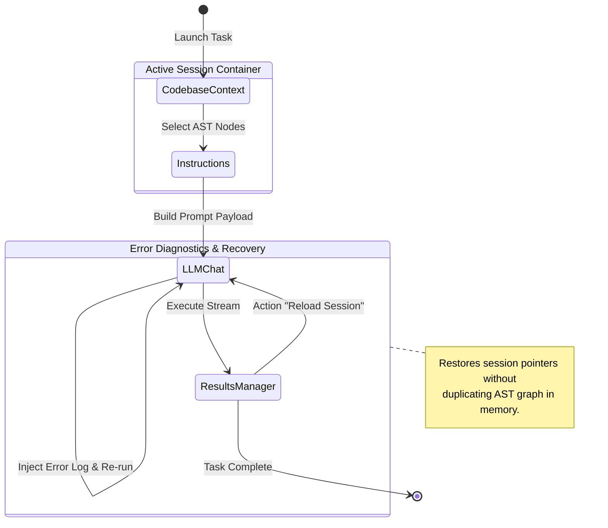

# Token Razor SDLC — Comprehensive Technical Documentation

## 1. System Architecture & Hexagonal RPC Bridge

The application enforces a strict separation between the React Webview UI (`webview/`), the shared contract boundary (`shared/`), and the VS Code extension backend host (`backend/`).

```text
+---------------------------------------------------------------------------------------+
| WEBVIEW LAYER (webview/src/features/sdlc/)                                            |
| React Components + Zustand Stores (useSdlcSessionStore, useCodebaseCache)             |
+---------------------------------------------------------------------------------------+
                                           |
                                           v
+---------------------------------------------------------------------------------------+
| WEBVIEW API SERVICES (webview/src/services/api/)                                      |
| Extends AbstractApiService -> Calls RpcProtocol.call(RpcMethodEnum.*)                 |
+---------------------------------------------------------------------------------------+
                                           | (postMessage RPC Protocol over Webview)
                                           v
+---------------------------------------------------------------------------------------+
| SHARED CONTRACT LAYER (shared/)                                                       |
| Enums (ServiceEnum, RpcMethodEnum), DTOs, and Port Interfaces (ISdlcSessionService)   |
+---------------------------------------------------------------------------------------+
                                           |
                                           v
+---------------------------------------------------------------------------------------+
| BACKEND ADAPTER LAYER (backend/src/services/)                                         |
| Extends AbstractServiceAdapter -> Implements Port Interfaces & Handles Disk I/O       |
+---------------------------------------------------------------------------------------+
```

---

## 2. Memory-Safe Zustand State Architecture

To prevent Out-Of-Memory (OOM) crashes inside the VS Code Webview host process during large codebase scans, state is strictly normalized:

```typescript
// 1. Singleton Heavy AST Cache (webview/src/features/sdlc/core/store/useCodebaseCache.ts)
export interface CodebaseCacheState {
  currentAst: CodebaseData | null; // Single shared AST tree
  lastUpdated: number;
  setAst: (data: CodebaseData) => void;
  clearAst: () => void;
}

// 2. Lightweight Multi-Session Store (webview/src/features/sdlc/core/store/useSdlcSessionStore.ts)
export interface SdlcSession {
  sessionId: string;
  createdAt: number;
  updatedAt: number;
  status: 'draft' | 'running' | 'error' | 'success';
  errorMessage?: string;
  activeStepId: string;
  contextPointers: {
    selectedEntityId: string | null;
    impactedNodeIds: string[];
    callersDepth: number;
    calleesDepth: number;
  };
  instructionsPayload: {
    strategy: 'vibe' | 'bmad' | 'speckit';
    promptText: string;
  };
  llmChat: {
    provider: LlmProvider;
    selectedModel: string;
    temperature: number;
    messages: IChatMessageDto[];
  };
}

// 3. Global Workspace Store (webview/src/features/sdlc/core/store/useGlobalConfigStore.ts)
export interface GlobalConfigState {
  globalConfig: GraphRagExplorerConfig;
  anonymizationRules: AnonymizationRule[];
  updateGlobalConfig: (partial: Partial<GraphRagExplorerConfig>) => void;
  updateAnonymizationRules: (rules: AnonymizationRule[]) => void;
}

// 4. Headless Workflow State Machine (webview/src/features/sdlc/core/workflow/useSdlcWorkflowMachine.ts)
export type SdlcStep = 'CODEBASE_CONTEXT' | 'INSTRUCTIONS' | 'LLM_CHAT' | 'RESULTS_MANAGER' | 'CONFIGURATION';
export interface SdlcWorkflowMachineState {
  currentStep: SdlcStep;
  transitionTo: (step: SdlcStep) => void;
}
```

---

## 3. Neo4j Cypher Traversal Queries

The `GraphRagExplorerAdapter` queries Neo4j to retrieve change impacts using `apoc.path.expandConfig`:

```cypher
// Upstream and Downstream Impact Traversal Pattern
CALL () {
  MATCH (target:File)
  WHERE target.absolute_path = $targetPath
     OR target.fileName = $targetPath
     OR apoc.convert.toMap(target)['absoluteFileName'] = $targetPath
  CALL apoc.path.expandConfig(target, {
    relationshipFilter: "<DEPENDS_ON",
    labelFilter: "+File",
    minLevel: 0,
    maxLevel: $upstreamDepth,
    uniqueness: "NODE_GLOBAL"
  }) YIELD path
  RETURN path

  UNION

  MATCH (target:File)
  WHERE target.absolute_path = $targetPath
     OR target.fileName = $targetPath
     OR apoc.convert.toMap(target)['absoluteFileName'] = $targetPath
  CALL apoc.path.expandConfig(target, {
    relationshipFilter: "DEPENDS_ON>",
    labelFilter: "+File",
    minLevel: 0,
    maxLevel: $downstreamDepth,
    uniqueness: "NODE_GLOBAL"
  }) YIELD path
  RETURN path
}
WITH collect(path) AS allPaths
UNWIND allPaths AS p
UNWIND nodes(p) AS sfNode
WITH collect(DISTINCT sfNode) AS impactedFiles,
     [pathItem IN allPaths | relationships(pathItem)] AS relArrays
WITH impactedFiles, [r IN apoc.coll.flatten(relArrays) WHERE r IS NOT NULL] AS traversedRels
UNWIND impactedFiles AS sf
WITH sf, traversedRels,
     [(sf)<-[:WITH_SOURCE]-(tJava:Type) WHERE NOT tJava.name CONTAINS '$' | tJava] AS javaTypes,
     [(sf)-[rTS]->(tTS) WHERE type(rTS) IN ['DECLARES', 'EXPORTS'] AND ANY(lbl IN labels(tTS) WHERE lbl IN ['Class', 'Interface', 'TypeAlias', 'Enum']) | tTS] AS tsTypes
WITH sf, coalesce(head(javaTypes), head(tsTypes), sf) AS t, traversedRels
RETURN sf.fileName AS fileName, sf.absolute_path AS path, t.fqn AS fqn
```

---

## 4. Workflow State Diagram


