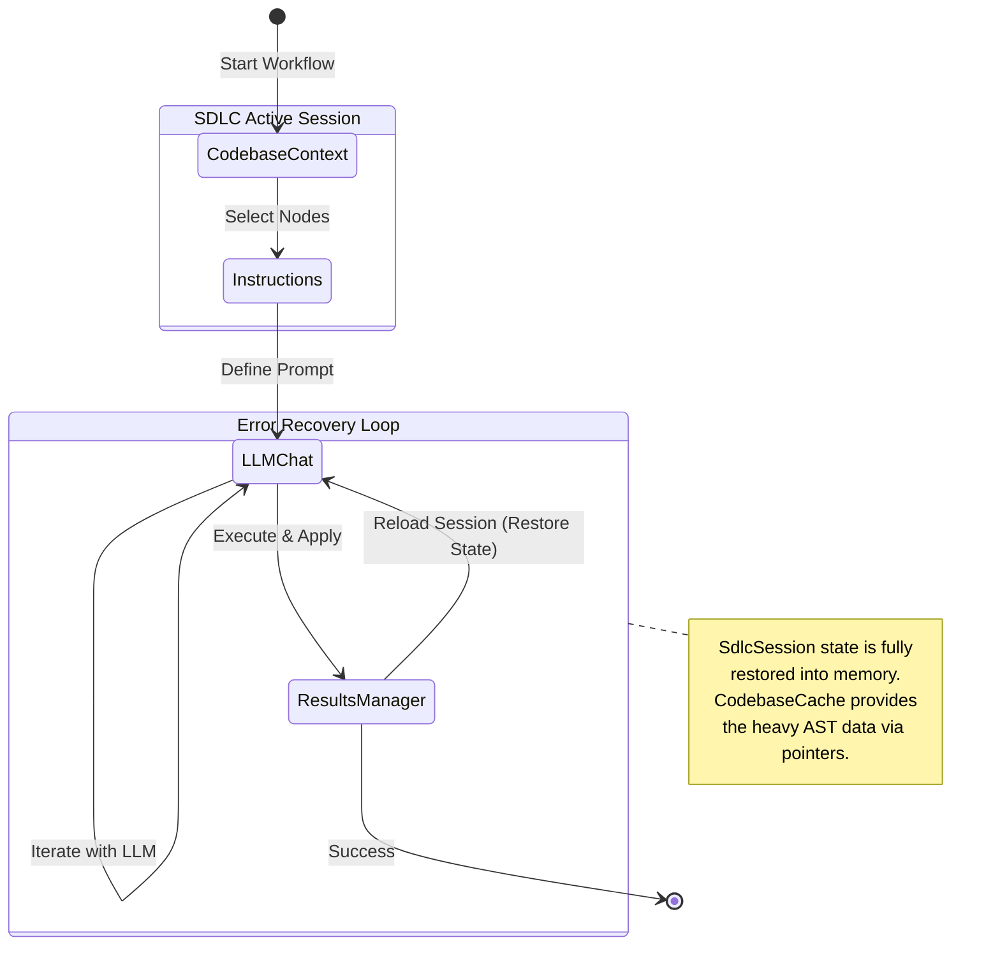

# Token Razor SDLC - Technical Documentation

## Domain-Driven Design (DDD) & Hexagonal Architecture
The refactored architecture isolates UI rendering from state management and backend communication:
* **`webview/src/features/sdlc/domains`**: Contains the React UI and domain-specific logic.
* **`shared/services/`**: The immutable boundary containing Domain Objects (DTOs) and RPC Interface Ports.
* **`backend/src/services/`**: Adapters implementing the RPC Ports (e.g., reading/writing sessions to disk).

## Memory-Safe State Management (Zustand)
To prevent Out-Of-Memory (OOM) crashes in the VS Code Webview:
1. **`useCodebaseCache.ts`**: Holds the massive `CodebaseData` AST JSON. It is a singleton.
2. **`useSdlcSessionStore.ts`**: Holds lightweight metadata (`sessionId`, selected node IDs, chat history). It NEVER duplicates the AST.
3. **`useGlobalConfigStore.ts`**: Holds user preferences and anonymization rules.

## Orchestration Flow

## Backend RPC Extensions
To support persistent sessions across VS Code restarts, a new RPC service will be introduced in future batches:
* **Domain:** `SdlcSession`
* **Port:** `ISdlcSessionServicePort` (save, load, list, delete)
