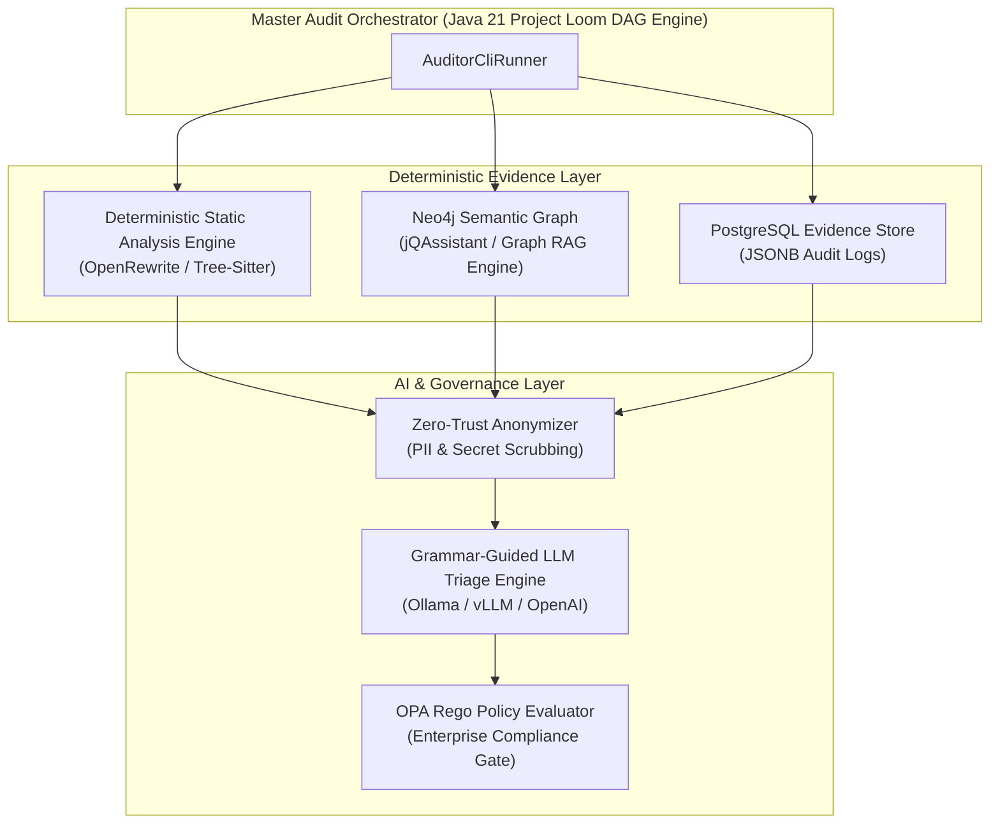
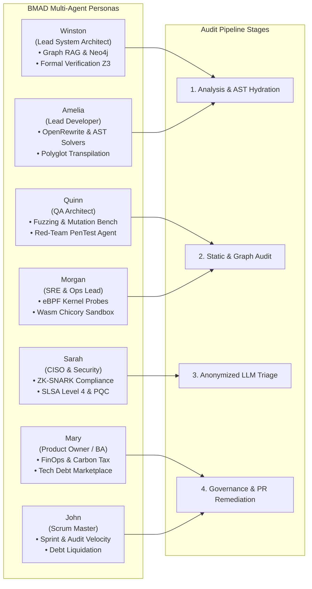
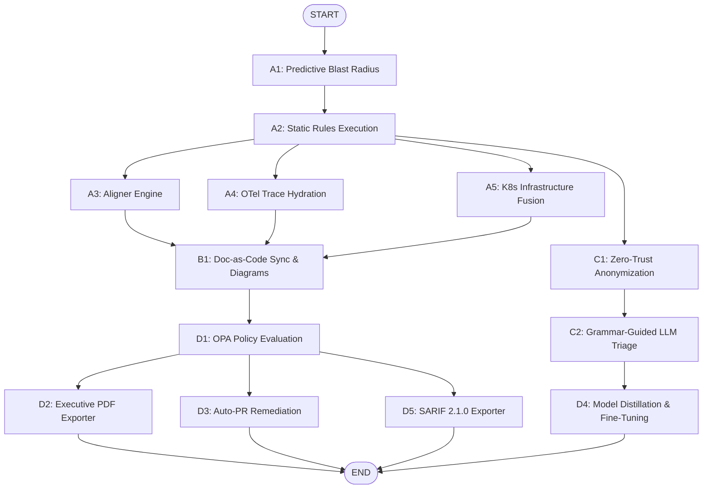
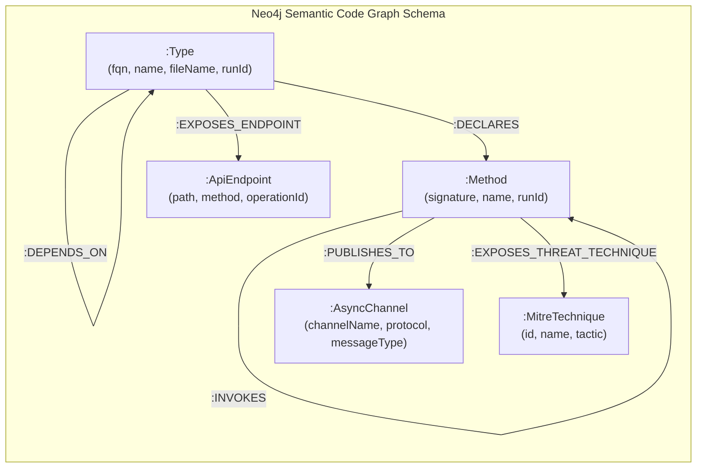
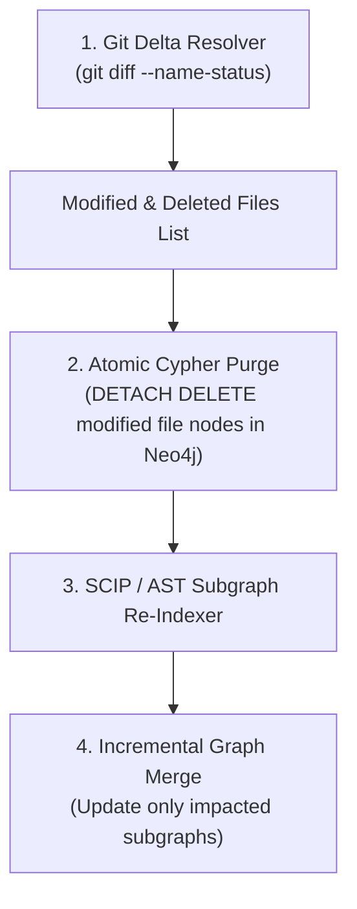
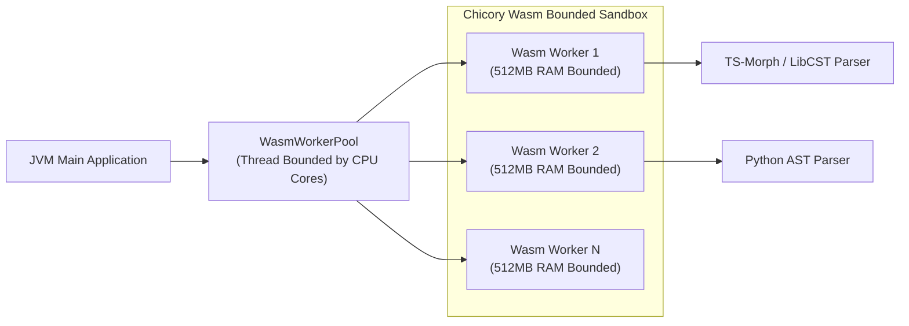
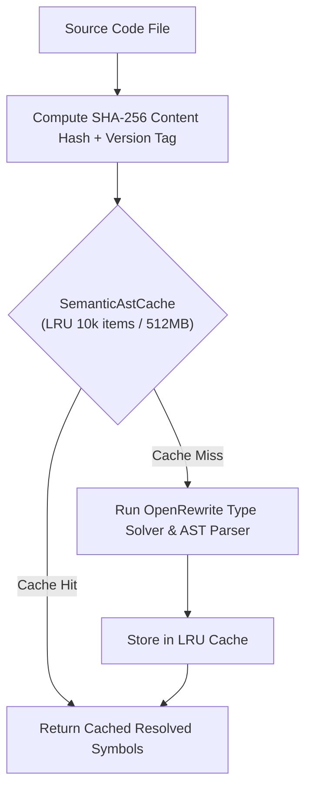
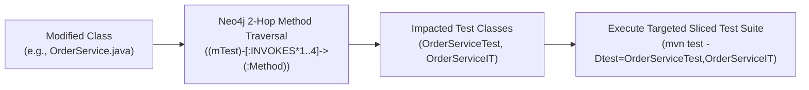
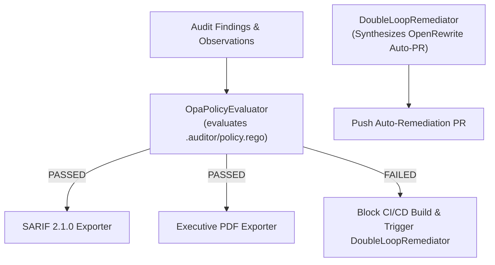

# 🏛️ Enterprise Architecture & System Blueprint — AI Architecture Auditor V6.0 (BMAD Multi-Agent Edition)

## 🎯 Executive Summary & Foundational Paradigm

The **Evidence-Driven AI Software Architecture Auditor V6.0** is an enterprise-grade platform designed to automate technical governance, architectural auditing, and documentation-as-code across large-scale software systems.

The core doctrine of the system is **"Deterministic First, SCIP-Guided Cross-Stack Lineage, LLM Second"**. Rather than relying on ungrounded AI heuristics that risk hallucinations, the platform evaluates deterministic static analysis rules, graph database traversals, and abstract syntax tree (AST) parsers before invoking Artificial Intelligence for higher-level triage or synthesis.



---

## 👥 BMAD Multi-Agent Team Orchestration Model

The platform architecture is fully orchestrated using the **BMAD Agentic Multi-Agent Framework** (BMad Builder V6 Alpha). Each architectural domain and audit phase is governed by dedicated BMAD agent personas:



---

## 🧱 Core System Components & Sub-Processes

The architecture is partitioned into four major sub-processes managed by the `AuditorCliRunner` main orchestrator:

| Sub-Process | Primary Components | Key Responsibilities | Lead Persona |
| :--- | :--- | :--- | :--- |
| **AnalysisSubProcess** | `GitDeltaResolver`, `ScipIndexer`, `OpenRewriteTypeSolver`, `Neo4jSemanticGraphClient` | Resolves AST topology, incremental Git diffs, and executes deterministic static analysis rules. | **Winston** & **Amelia** |
| **DocumentationAndGreenItSubProcess** | `C4DiagramExtractor`, `WorkflowStateRenderer`, `GreenItProfiler`, `BusinessRuleInverter` | Generates PlantUML/Mermaid C4 diagrams, renders workflow execution DAGs, and profiles carbon footprints. | **Mary** & **Morgan** |
| **LlmTriageSubProcess** | `ZeroTrustAnonymizer`, `GraphRAGContextFetcher`, `LlmTriageEngine` | Scrubs sensitive data, extracts minified 2-hop graph context, and performs grammar-guided LLM evaluation. | **Sarah** & **Winston** |
| **GovernanceAndRemediationSubProcess** | `OpaPolicyEvaluator`, `ExecutiveReportExporter`, `SarifReportExporter`, `DoubleLoopRemediator` | Evaluates OPA Rego governance policies, produces SARIF 2.1.0 reports, and applies OpenRewrite auto-remediations. | **Quinn** & **John** |

---

## 🔀 Master DAG Workflow Execution Architecture

The core runtime uses **Java 21 Virtual Threads (`Executors.newVirtualThreadPerTaskExecutor()`)** to execute a Directed Acyclic Graph (DAG) of non-blocking audit steps.



---

## 📊 Dual-Graph Acceleration & Neo4j Cypher Data Model

The platform integrates **jQAssistant** to automatically ingest bytecode, AST nodes, and package structures into **Neo4j 5.18+**. All graph nodes are isolated by audit `runId`.



### Key Graph Schema Elements
* `:Type`: Represents Java classes, interfaces, TypeScript components, or Python modules.
* `:Method`: Represents declared functions and methods with signature parameters.
* `:ApiEndpoint`: Represents OpenAPI REST endpoints (`path`, `method`, `operationId`).
* `:AsyncChannel`: Represents AsyncAPI Kafka/RabbitMQ message channels.
* `:MitreTechnique`: Represents mapped MITRE ATT&CK cybersecurity threat nodes.

---

## ⚡ Incremental SCIP Subgraph Diffing (Epic 13)

For large repositories (100k+ LOC), full graph re-indexing is cost-prohibitive. The `IncrementalAuditEngine` delegates to `GitDeltaResolver` and `ScipIndexer`:



```cypher
UNWIND $files AS fileName
MATCH (t:Type {fileName: fileName})
DETACH DELETE t;
```

---

## 🛡️ Sandboxed Execution & Wasm Worker Pools (Epic 14)

Non-Java language parsing (e.g. TypeScript via `ts-morph`, Python via `LibCST`) runs in a **pure JVM-native WebAssembly (Wasm) sandbox** powered by **Chicory Wasm** (`com.dylibso.chicory:wasm`).



* **Memory Bounding**: The `WasmWorkerPool` enforces a strict **512MB RAM memory limit per worker** to prevent heap exhaustion.
* **Worker Allocation**: Worker threads are capped dynamically based on available CPU cores (`Math.max(2, Runtime.getRuntime().availableProcessors())`).

---

## 🧠 Semantic AST & Symbol Caching Engine (Epic 15)

To maximize performance across iterative audit runs, `SemanticAstCache` implements a thread-safe, access-ordered LRU caching layer:



---

## 🎯 Call-Graph Test Slicing (Epic 16)

The `CallGraphTestSlicer` analyzes Neo4j call graphs to run only the tests impacted by code changes:



```cypher
UNWIND $classes AS modifiedClass
MATCH (target:Type {fqn: modifiedClass})
MATCH (test:Type)-[:DECLARES]->(mTest:Method)
WHERE (test.name ENDS WITH 'Test' OR test.name ENDS WITH 'IT')
  AND (mTest)-[:INVOKES*1..4]->(:Method)<-[:DECLARES]-(target)
RETURN DISTINCT test.fqn AS testClass, mTest.name AS testMethod
```

---

## 📜 OpenAPI & AsyncAPI Schema Graph Alignment (Epic 17)

The `ApiContractIndexer` parses `openapi.yaml` and `asyncapi.yaml` specifications and binds REST/async contract definitions directly to Spring Controller classes (`:EXPOSES_ENDPOINT` edges) and Kafka listeners (`:PUBLISHES_TO` / `:SUBSCRIBES_TO` edges) in Neo4j, detecting broken API contracts or unmapped endpoints automatically.

---

## ⚖️ Evidence Store & Double-Loop Governance

Audit findings are stored immutably in **PostgreSQL 16** using JSONB columns (`audit_observation` and `audit_finding` tables). Liquibase manages database schema evolution.



Governance rules are evaluated via the Open Policy Agent (`OpaPolicyEvaluator`), verifying compliance against corporate security standards before exporting standardized **SARIF 2.1.0** reports or auto-generating GitHub remediation Pull Requests.
