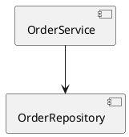

# 📘 Guide d'Utilisation — Phase 4 : Doc-as-Code, Green IT, FinOps & IDE Temps Réel

Ce volet du guide d'utilisation détaille le fonctionnement, les exemples de code non conformes et la structure exacte des rapports générés pour les analyseurs de la **Phase 4**.

---

## 1. LivingDocGenerator (`DOC-001`) — Synchronisation Doc-as-Code & Alignement C4

### 📌 Description
L'analyseur `LivingDocGenerator` compare la structure réelle du code (annotations `@Service`, `@Repository`, `@RestController`, liens d'injection) avec les diagrammes C4 sous forme de code PlantUML ou Mermaid (`architecture.puml`). Il détecte tout décalage (*doc drift*) et met à jour automatiquement le schéma de documentation.

### ❌ Exemple de Code Non Conforme (Java & PlantUML)

**Code Java révisé (`OrderService.java`)** :
```java
package com.company.auditor.service;

import com.company.auditor.repository.InventoryRepository;
import org.springframework.stereotype.Service;

@Service
public class OrderService {
    // Nouveau composant ajouté dans le code mais absent du diagramme C4
    private final InventoryRepository inventoryRepository;

    public OrderService(InventoryRepository inventoryRepository) {
        this.inventoryRepository = inventoryRepository;
    }
}
```

**Fichier de documentation décalé (`architecture.puml`)** :


### 📊 Résultat dans le Rapport (`audit-report.json`)

```json
{
  "findingId": "find-doc-001",
  "ruleId": "DOC-001",
  "severity": "MEDIUM",
  "status": "DETERMINISTIC_VERIFIED",
  "title": "Documentation Drift: Composant ou lien C4 manquant dans architecture.puml",
  "component": "com.company.auditor.service.OrderService",
  "location": {
    "filePath": "architecture.puml",
    "startLine": 2,
    "endLine": 5,
    "snippet": "[OrderService] --> [InventoryRepository] (MISSING_LINK)"
  },
  "message": "Le composant OrderService dépend de InventoryRepository dans l'AST Java, mais cette relation est absente du diagramme C4.",
  "remediation": {
    "autoFixAvailable": true,
    "action": "SYNC_PLANTUML_DIAGRAM",
    "suggestedPatch": "+ [OrderService] --> [InventoryRepository] : uses"
  }
}
```

---

## 2. GreenItProfiler (`ECO-001`) — Profilage d'Empreinte Carbone & Éco-Conception

### 📌 Description
L'analyseur `GreenItProfiler` évalue la consommation énergétique et l'efficience algorithmique du code. Il repère les boucles d'allocation mémoire inefficaces et propose des réécritures réactives ou par flux (*streaming*) pour minimiser l'empreinte carbone (gCO2e/requête).

### ❌ Exemple de Code Non Conforme (`ReportBatchProcessor.java`)

```java
package com.company.auditor.batch;

import org.springframework.stereotype.Service;
import java.util.*;

@Service
public class ReportBatchProcessor {

    public List<String> processLargeDataset(List<byte[]> rawRecords) {
        List<String> results = new ArrayList<>();
        // ERREUR ECO-001: Boucle bloquante créant de nombreuses allocations d'objets temporaires et chargeant tout en RAM
        for (byte[] record : rawRecords) {
            String str = new String(record); // Allocation mémoire massive répété
            if (str.contains("CRITICAL")) {
                results.add(str.toUpperCase());
            }
        }
        return results;
    }
}
```

### 📊 Résultat dans le Rapport (`audit-report.json`)

```json
{
  "findingId": "find-eco-001",
  "ruleId": "ECO-001",
  "severity": "MEDIUM",
  "status": "DETERMINISTIC_VERIFIED",
  "title": "Green IT Violation: Surconsommation mémoire et CPU dans le traitement de données",
  "component": "com.company.auditor.batch.ReportBatchProcessor",
  "location": {
    "filePath": "src/main/java/com/company/auditor/batch/ReportBatchProcessor.java",
    "startLine": 10,
    "endLine": 16,
    "snippet": "for (byte[] record : rawRecords) { String str = new String(record); ... }"
  },
  "metrics": {
    "estimatedEnergyKwhPer1kReq": 0.042,
    "estimatedGramsCo2e": 17.43,
    "memoryChurnMb": 1024.0
  },
  "message": "Allocation répétitive en mémoire dans une boucle synchrone. Risque de surconsommation CPU/RAM.",
  "remediation": {
    "recommendation": "Refactoriser vers une approche par Flux réactif (Java Stream / Reactor) avec bufferisation réutilisable."
  }
}
```

---

## 3. CloudCostAttributor (`FIN-001`) — Attribution de Coût Cloud FinOps & Analyse d'Impact I/O

### 📌 Description
L'analyseur `CloudCostAttributor` associe les requêtes de base de données ou les appels d'API distants aux modèles de facturation des fournisseurs cloud (AWS/GCP/Azure). Il signale les requêtes inefficaces générant des surcoûts d'IOPs ou de bande passante.

### ❌ Exemple de Code Non Conforme (`CustomerAnalyticsRepository.java`)

```java
package com.company.auditor.repository;

import org.springframework.data.jpa.repository.Query;
import org.springframework.data.jpa.repository.JpaRepository;

public interface CustomerAnalyticsRepository extends JpaRepository<CustomerEntity, Long> {

    // ERREUR FIN-001: Balayage complet de table (Full Table Scan) sans index sur un champ non filtré
    @Query("SELECT c FROM CustomerEntity c WHERE LOWER(c.notes) LIKE %:keyword%")
    List<CustomerEntity> findByNotesUnindexed(String keyword);
}
```

### 📊 Résultat dans the Rapport (`audit-report.json`)

```json
{
  "findingId": "find-fin-001",
  "ruleId": "FIN-001",
  "severity": "HIGH",
  "status": "DETERMINISTIC_VERIFIED",
  "title": "FinOps Cloud Penalty: Full Table Scan entraînant un surcoût d'IOPs BDD",
  "component": "com.company.auditor.repository.CustomerAnalyticsRepository",
  "location": {
    "filePath": "src/main/java/com/company/auditor/repository/CustomerAnalyticsRepository.java",
    "startLine": 9,
    "endLine": 10,
    "snippet": "@Query("SELECT c FROM CustomerEntity c WHERE LOWER(c.notes) LIKE %:keyword%")"
  },
  "metrics": {
    "estimatedMonthlyCostPenaltyUsd": 245.50,
    "cloudResource": "AWS Aurora PostgreSQL (Read IOPs)"
  },
  "message": "Recherche wildcard non indexée provoquera un Full Table Scan répétitif sur la BDD cloud managée.",
  "remediation": {
    "recommendation": "Utiliser un index de recherche textuelle PostgreSQL (pg_trgm / GIN) ou déporter sur un moteur de recherche type Elasticsearch/OpenSearch."
  }
}
```

---

## 4. ArchitectureLspServer (`IDE-001`) — Serveur LSP & Diagnostic d'Architecture Temps Réel

### 📌 Description
Le composant `ArchitectureLspServer` s'intègre directement aux éditeurs des développeurs (VS Code, IntelliJ) via le protocole **LSP (Language Server Protocol)**. Il fournit des diagnostics instantanés dès la saisie du code (*as-you-type*) pour empêcher l'introduction de violations d'isolation.

### ❌ Exemple de Saisie en Temps Réel dans l'Éditeur (`OrderController.java`)

```java
package com.company.auditor.web;

// ERREUR IDE-001: Import direct d'un composant de persistance interne dans un contrôleur REST
import com.company.auditor.infrastructure.entity.OrderJpaEntity; 

import org.springframework.web.bind.annotation.RestController;

@RestController
public class OrderController {
    // Le serveur LSP souligne cet import en rouge directement dans l'IDE
}
```

### 📊 Diagnostic LSP Transmis à l'IDE (`LSP Protocol JSON-RPC`)

```json
{
  "jsonrpc": "2.0",
  "method": "textDocument/publishDiagnostics",
  "params": {
    "uri": "file:///workspace/src/main/java/com/company/auditor/web/OrderController.java",
    "diagnostics": [
      {
        "range": {
          "start": { "line": 3, "character": 0 },
          "end": { "line": 3, "character": 62 }
        },
        "severity": 1,
        "code": "IDE-001",
        "source": "AI-Architecture-Auditor-LSP",
        "message": "Violation d'Architecture Hexagonale: Un contrôleur REST ne doit pas importer directement une entité JPA d'infrastructure (OrderJpaEntity). Utilisez un DTO/Port.",
        "relatedInformation": [
          {
            "location": {
              "uri": "file:///workspace/docs/architecture-rules.md",
              "range": { "start": { "line": 10, "character": 0 }, "end": { "line": 10, "character": 20 } }
            },
            "message": "Règle HEX-001: Isolation des couches web et persistance."
          }
        ]
      }
    ]
  }
}
```

---

## 5. TechDebtInterestCalculator (`DEBT-001`) — Intérêt Composé & Indice de Risque d'Obsolescence

### 📌 Description
L'analyseur `TechDebtInterestCalculator` croise les violations d'architecture accumulées avec l'historique de fréquences de modifications (*Git churn*). Il calcule un score de risque composé et projette le coût d'intérêt technique futur.

### ❌ Exemple de Fichier à Forte Dette et Fort Churn (`LegacyPaymentGateway.java`)

```java
package com.company.auditor.legacy;

import java.sql.*;

public class LegacyPaymentGateway {
    // ERREUR DEBT-001: Code legacy fréquemment modifié (>45 commits/mois) accumulant 8 violations critiques
    public void executeRawSql(String query) throws Exception {
        Connection conn = DriverManager.getConnection("jdbc:postgresql://localhost/db");
        Statement stmt = conn.createStatement();
        stmt.execute(query); // Risque SQL Injection + Absence de pool de connexions
    }
}
```

### 📊 Résultat dans le Rapport (`audit-report.json`)

```json
{
  "findingId": "find-debt-001",
  "ruleId": "DEBT-001",
  "severity": "CRITICAL",
  "status": "DETERMINISTIC_VERIFIED",
  "title": "Dette Technique Critique: Accumulation d'intérêts sur module à fort Churn",
  "component": "com.company.auditor.legacy.LegacyPaymentGateway",
  "metrics": {
    "gitChurnCommitsLast90Days": 52,
    "accumulatedDebtHours": 85.0,
    "projectedDebtInterest6MonthsHours": 210.0,
    "compoundRiskScore": 9.2
  },
  "message": "Ce module est le plus modifié du projet tout en contenant des failles critiques non résolues. Priorité absolue de refactoring.",
  "remediation": {
    "action": "SCHEDULE_REFACTORING_SPRINT",
    "bountyTokens": 850
  }
}
```
