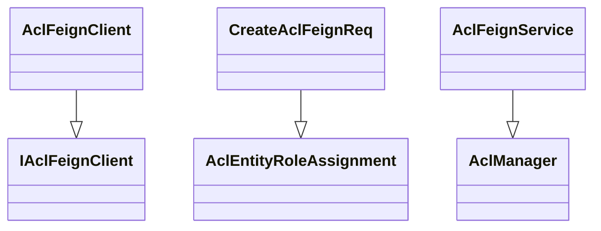
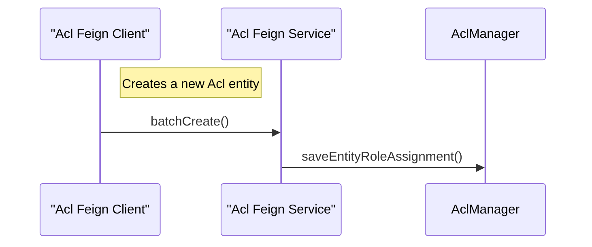

## Technical Analysis

### Class Diagram

```mermaid
classDiagram
    AclFeignClient --|> IAclFeignClient
    CreateAclFeignReq --|> AclEntityRoleAssignment
    AclFeignService --|> AclManager
```

### Sequence Diagram

```mermaid
sequenceDiagram
    participant AclFeignClient as "Acl Feign Client"
    participant AclFeignService as "Acl Feign Service"
    note right of AclFeignClient: Creates a new Acl entity
    AclFeignClient->>AclFeignService: batchCreate()
    AclFeignService->>AclManager: saveEntityRoleAssignment()
```

