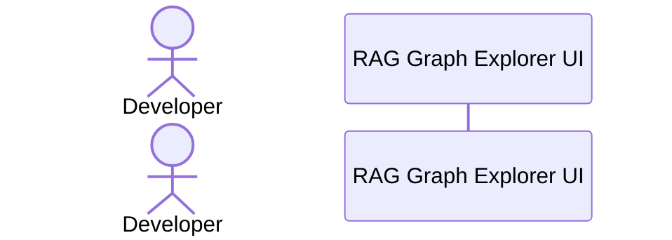

# 🎬 AI-Driven Development Use Case & Prompt Engineering Manual

This comprehensive guide shows you how to use **RAG Graph Explorer** to compile its own code, feed it to an external AI model (like Google Gemini, Claude, or ChatGPT), and instruct the AI to write a brand new feature for your extension—specifically, a new **"Tokens Estimation" Tab**.

## 📊 Feature Lifecycle Workflow

---

## 🛠️ Step-by-Step Implementation Guide
