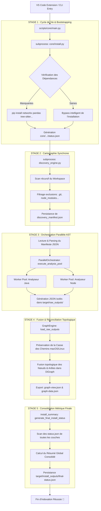

# Audit Complet et Spécifications du Pipeline Python (Graph-RAG Explorer)

Ce document fournit une cartographie technique exhaustive de l'architecture, du cycle de vie et de la gestion des erreurs du pipeline d'indexation topologique du projet **Graph-RAG Explorer**.

---

## 1. Architecture Globale et Workflow

Le pipeline s'exécute de façon strictement séquentielle au niveau de ses grandes phases (Cycle de vie -> Découverte -> Analyse -> Consolidation) afin d'éliminer toute condition de concurrence (*Race Condition*), tout en exploitant un parallélisme multi-processus lors de la phase lourde de parsing AST.

---

## 2. Description Détaillée des Blocs de Traitement

### A. main.py (Le Cœur Directionnel)
Point d'entrée central du processus. Il intercepte les arguments fournis par l'extension VS Code ou la CLI, sécurise les chemins absolus et pilote les étapes dans un ordre immuable (Barrière synchrone stricte avant de libérer les analyses parallèles).

### B. install.py & install_check.py (Sécurisation d'Infrastructure)
Vérifie la présence des dépendances Python requises. En cas d'absence, déclenche un provisionnement automatique sans intervention utilisateur, puis s'auto-désactive lors des exécutions suivantes via un déclencheur d'optimisation (*Healthy Bypass*).

### C. discovery_engine.py (Moteur Topologique JIT)
Cartographie instantanée de la structure du projet. Parcourt récursivement le répertoire, exclut les dossiers lourds, isole les fichiers par extensions autorisées et fige la topologie dans discovery_manifest.json. S'exécute dans un sous-processus isolé pour garantir l'intégrité de la signature de l'API.

### D. orchestrator.py (ParallelOrchestrator)
Gestionnaire du pool d'exécution parallèle. Ingère le dictionnaire JSON du manifeste, identifie dynamiquement le point d'entrée valide via introspection (execute_analysis_pool), et dispatche la charge vers les analyseurs Java et Node.

### E. graph_engine.py (Moteur de Réconciliation NetworkX)
Fusionne les graphes isolés. Balaye les raw_outputs, normalise les séparateurs, fusionne les entités tout en préservant scrupuleusement la casse d'origine pour macOS, puis exporte les données pour l'UI.

### F. install_summary.py (Agrégateur Métrique Consolidé)
Parcourt dynamiquement l'arborescence ascendante (Bubble Search) pour trouver la racine .graph-rag-explorer/target/install_outputs/ et y compiler un résumé final-status.json fiable basé sur les rapports locaux des sous-couches.

---

## 3. État des Lieux Exhaustif des Problèmes et Solutions

| # | Incident Rencontré | Racine du Problème | Solution Appliquée |
|---|---|---|---|
| **1** | Absence des logs de [CoreInstall]. | main.py ignorait le script d'installation du cœur. | Ajout d'un appel subprocess.run bloquant exécutant core/install.py en priorité absolue. |
| **2** | Erreur bad interpreter: /bash/bin | Faute de frappe dans le shebang du script d'update. | Remplacement par le shebang universel unix #!/bin/bash. |
| **3** | Crash [Errno 21] Is a directory (Racine). | L'extension envoyait des arguments optionnels comme --output interceptés comme des chemins. | Création d'un parseur intelligent ignorant tous les flags de type - ou --. |
| **4** | Graphe et TreeView vides sur l'UI (macOS). | Une méthode .lower() écrasait la casse des chemins, rendant la résolution des fichiers impossible. | Rétraction du .lower() dans graph_engine.py pour préserver la sensibilité à la casse. |
| **5** | final-status.json introuvable ou mal placé. | L'écriture ciblait le dossier dynamique d'affichage au lieu de la build target. | Implémentation d'un "Bubble Search" pour remonter l'arborescence et trouver le vrai chemin immuable install_outputs/. |
| **6** | Crash au 1er lancement (Manifeste absent). | Condition de concurrence (Race Condition) avec l'installation PIP. | Instanciation d'une barrière séquentielle absolue bloquant sur discovery_engine.py. |
| **7** | Erreur 'str' object has no attribute 'get'. | La classe DiscoveryEngine attendait un dictionnaire de configuration, pas des chaînes sys.argv. | Isolation par sous-processus (subprocess) pour passer par le parser CLI natif. |
| **8** | Échec lancement de l'arbre parallèle. | L'appel vers run_parallel_analysis visait une méthode inexistante. | Injection d'un radar d'introspection Python listant en temps réel les méthodes disponibles sur l'objet. |
| **9** | Récidive 'str' object has no attribute 'get'. | L'orchestrateur attendait le JSON parsé (dictionnaire) mais recevait le chemin du fichier. | Ajout du parsing json.load() sur le manifeste avant l'injection dans le constructeur. |
| **10** | Crash Is a directory: discovery_manifest.json | Une vieille tentative de fix système avait accidentellement créé un DOSSIER au lieu d'un fichier. | Déploiement d'une routine d'exorcisme (shutil.rmtree) supprimant les dossiers fantômes à vue. |
