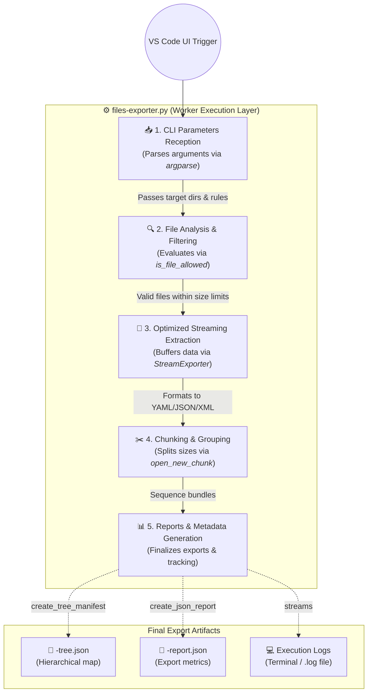

# 🐍 Python script workflow
Here is the Mermaid flowchart visualizing the step-by-step workflow of the `files-exporter.py` script:

## Overview

### 🧩 Flowchart Breakdown:

*   **1. CLI Parameters Reception**: The script operates independently as a standalone command-line tool, collecting settings like `--src`, `--dest`, and `--max-file` through the `argparse` module.
*   **2. File Analysis & Filtering**: It uses the strict **`is_file_allowed`** function to run regex validation (for paths and extensions) while enforcing the `MAX_SIZE_BYTES` limit to prevent AI context bloat.
*   **3. Optimized Streaming**: Instead of exhausting system RAM, the tool pipelines data using **`StreamExporter`**, wrapping it safely into your requested layout (e.g., YAML, XML, JSON).
*   **4. Chunking & Grouping**: To respect strict AI token limits, it dynamically slices outputs via the **`open_new_chunk`** function and regroups them by file extensions if the `--group-ext` flag is enabled.
*   **5. Reports Generation**: The execution completes by invoking **`create_tree_manifest`** (for the directory hierarchy) and **`create_json_report`** (for detailed metrics), while the custom `log` function streams real-time data back to VS Code.
