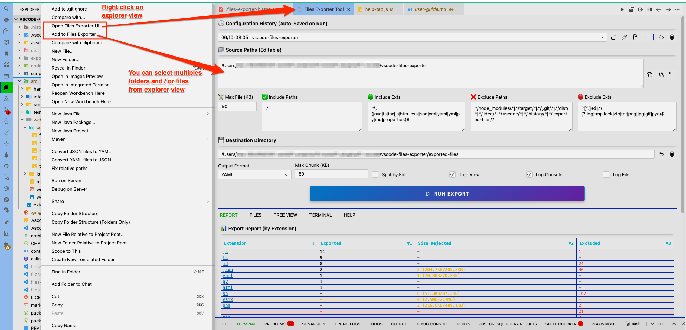

# 📖 Extension Interface User Guide for Beginners

Welcome to the RAG Graph Explorer interface! This reference guide explains every button, setting, and dashboard tab so you can start preparing context packages for AI development like a pro.

## 🎛️
